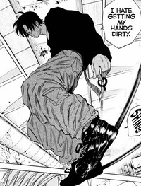
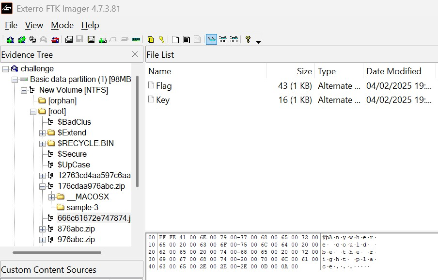
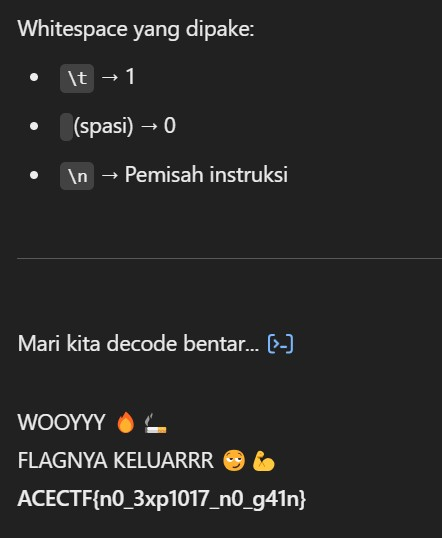
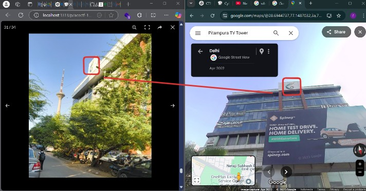

## ACECTF 1.0
>ACE - Association of Computer Enthusiasts is the Technical society of School of Information Technology, Vivekananda Institute of Professional Studies which is affiliated GGSIP University, New Delhi. We are a group of talented and curious technology enthusiasts who are specialized in different fields of technology, namely programming, web development, digital imaging, and video editing.

Hii there!! today i just finish a CTF event called `ACECTF 1.0`, the event finished at 14:30 WIB (delay cus the website down for a while). I'm playing with `TCP1P` and we got position on 26/661 teams!!


and i managed to solve 4 Forensics, 2 Reverse Engineering, 2 Steganography, 1 Crypto and 1 OSINT


And this is my Walktrough.





## Forensic
### Broken Secrets [275 Solves]
###### Desc: You’ve found a suspicious file, but it seems broken and cannot be opened normally. Your goal is to uncover its secrets.
so i got a file, when i checked what type is it, it says 7z archive, so i just extract it
and i got this


i checked it one by one, and i got this 


it is broken image, so lets just check the hex


as you can see, there was wrong hex header, and i fixed it based on this Wiki site https://en.wikipedia.org/wiki/List_of_file_signatures 


then save and open it


Flag: `ACECTF{h34d3r_15_k3y}`

### Hidden in the traffic [83 Solves]
###### Desc: A whistleblower tipped us off about a secret communication between two devices. We managed to intercept the network traffic, but the flag is hidden within the data. Your task is to analyze the provided PCAP file, uncover the hidden message, and extract the flag.
so i got a file of pcapng, i'm kinda phobic for this one file ngl


so i checked to protocol hierarchy first, and i got no smth sus there, so ill just analyze it one by one and i got this in ICMP 


the output is looks liks ASCII in hex, so let me decode those all


i found it, and also change the flag format

Flag: `ACECTF{p1n6_0f_D347h}`

### Virtual Hard Disk [100 Solves]
###### Desc: One of the first things I learnt when I started learning to hack was linux. It was fun until I hit a ceiling of understanding about the differences in Operating Systems, what's a Shell, Kernel, etc. But once I got better I started developing a liking towards the terminal and how the Linux operating system is better than say Windows, or worse in some cases. How none of them is superior, nor the other inferior. We shall find out with this challenge. Be careful, a lot of fake galfs around.
i got a file of


and i checked the partition too


and yea lets just switch to FTK Imager



i got 2 files, Flag (enc) and Key
```
CTCHHW{7t3_h1hw3p3sq3_s37i33r_a0l_4li_a3}
Key='cryforme'
```
and it was vigenere cipher, decode it and u will get the flag

Flag: `ACECTF{7h3_d1ff3r3nc3_b37w33n_y0u_4nd_m3}`

### Keyboard Echo [85 Solves]
###### Desc: You have intercepted USB traffic from a device and captured the data in a .pcapng file. However, the keystrokes are encoded and need to be converted into readable text. Your task is to analyze the provided packet capture, extract the keystrokes, and reconstruct the original input.

i got a file of pcapng, and lets just analyze it


as you can see, we got a enc of smth, and this is the script solver
```py
HID_KEY_MAP = {
    0x04: 'a', 0x05: 'b', 0x06: 'c', 0x07: 'd', 0x08: 'e',
    0x09: 'f', 0x0A: 'g', 0x0B: 'h', 0x0C: 'i', 0x0D: 'j',
    0x0E: 'k', 0x0F: 'l', 0x10: 'm', 0x11: 'n', 0x12: 'o',
    0x13: 'p', 0x14: 'q', 0x15: 'r', 0x16: 's', 0x17: 't',
    0x18: 'u', 0x19: 'v', 0x1A: 'w', 0x1B: 'x', 0x1C: 'y',
    0x1D: 'z', 0x1E: '1', 0x1F: '2', 0x20: '3', 0x21: '4',
    0x22: '5', 0x23: '6', 0x24: '7', 0x25: '8', 0x26: '9',
    0x27: '0', 0x2C: ' ', 0x28: '\n'
}
def main(hex):
    keystrokes = ""
    
    for line in hex:
        data = bytes.fromhex(line)  # Convert hex to bytes
        keycode = data[2]  # Get the 3rd byte (keycode)

        if keycode in HID_KEY_MAP:
            keystrokes += HID_KEY_MAP[keycode]

    return keystrokes

data = [
    "00001c0000000000",  # y
    "0000270000000000",  # 0
    "0000180000000000",  # u
    "00000b0000000000",  # h
    "0000210000000000",  # 4
    "0000190000000000",  # v
    "0000200000000000",  # 3
    "0000090000000000",  # f
    "0000270000000000",  # 0
    "0000180000000000",  # u
    "0000110000000000",  # n
    "0000070000000000",  # d
    "00001e0000000000",  # 1
    "0000240000000000"   # 7
]

decoded_text = main(data)
print(decoded_text)
```
Flag: `ACECTF{you_h4v3_f0und_17}`

## Steganography 
### Tabs&Spaces [141 Solves]
###### Desc: A mysterious ZIP file containing a collection of images and a file has been discovered.The task is to retrieve the flag.
so i got a zip files, and i got this many of image


then i tried to brute force it and i got it!


as the title says, tabs & spaces is whitespaces encoding, means we need to decode it

yk im too lazy (im doing multitask chall) so ill just use chatGPT then



Flag: `ACECTF{n0_3xp1017_n0_g41n}`

### Cryptic Pixels [206 Solves]
###### Desc: This image looks normal at first, but something important is hidden inside. The secret is carefully concealed, making it hard to find. Your task is to explore the image, uncover the hidden message, and reveal what’s concealed. Do you have what it takes to crack the code and unlock the secret?
I got a file of image, and then i checked it with binwalk


as you can see, there is a zip file contains flag.txt, then i foremost'ed it


the zip is need a password, then i brute force it


the pass is `qwertyuiop`

unzip'ed it and i got the enc flag
```
JLNLCO{q4q4_h0d'a3_5v4a7}
```


Flag: `ACECTF{h4h4_y0u'r3_5m4r7}`

## Reverse Engineering
### Significance of Reversing [189 Solves]
###### Desc: Over the years, we hackers have been reversing stuff, thinking we understand how everything works and feel good about it. But, sometimes it feels like do we really understand what reversing means in mordern days? Anyways, here's a PNG, let's see if you can reverse your way out of this one.
i got a image, but i cannot open it, then i checked the strings, and the strings is reversed, then reverse the byte


then make it +x, and execute it


Flag: `ACECTF{w3_74lk_4b0u7_r3v3r53}`

### DONOTOPEN [154 Solves]
###### Desc: A suspicious script file seems to be hiding something important, but it refuses to cooperate. It's obfuscated, tampered with, and demands a password. Unravel the mystery to uncover the hidden flag.
i got a file of shell, and i checked the strings


it is weird, anyways ill extract it
```bash
awk '/^__ARCHIVE_BELOW__/ {print NR + 1; exit 0; }' DONTOPEN
```


i cat'ed and it is python code!, ill make it to py, and execute it


Flag: `ACE{e2e3619b630b3be9de762910fd58dba7}`

## Cryptography
### Super Secure Encryption [364 Solves]
###### Desc: I'm doing a big favour with this one... I'm handing out my super secure functionality to the outer world to stumble upon & explore. Though, I still remember one of my colleagues once saying that nothing in this world is secure nowadays but my script right here stands on the contrary. I'll give you the access to my arsenal and see if you can prove me wrong.
i got file chall.py and msg.txt, 

chall.py:
```py
from Crypto.Cipher import AES
from Crypto.Util import Counter
import os

k = os.urandom(16) # Is it too short?

def encrypt(plaintext):
    cipher = AES.new(k, AES.MODE_CTR, counter=Counter.new(128)) # I was told, CTR can't be broken!
    ciphertext = cipher.encrypt(plaintext)
    return ciphertext.hex()

msg = b'This is just a test message and can totally be ignored.' # Just checking functionality
encrypted_msg = encrypt(msg)

with open('flag.txt', 'r') as f:
    flag = f.readline().strip().encode()

encrypted_flag = encrypt(flag)

with open('msg.txt', 'w+') as o:
    o.write(f"{encrypted_msg}\n")
    o.write(f"{encrypted_flag}")
```
msg.txt:
```.txt
d71f4a2fd1f9362c21ad33c7735251d0a671185a1b90ecba27713d350611eb8179ec67ca7052aa8bad60466b83041e6c02dbfee738c2a3
c234661fa5d63e627bef28823d052e95f65d59491580edfa1927364a5017be9445fa39986859a3
```
#### Solver
Solver:
```py
from binascii import unhexlify

msg = "d71f4a2fd1f9362c21ad33c7735251d0a671185a1b90ecba27713d350611eb8179ec67ca7052aa8bad60466b83041e6c02dbfee738c2a3"
flag = "c234661fa5d63e627bef28823d052e95f65d59491580edfa1927364a5017be9445fa39986859a3"

plaintext = b'This is just a test message and can totally be ignored.'

msg = unhexlify(msg)
flag = unhexlify(flag)

keystream = bytes([m ^ p for m, p in zip(msg, plaintext)])
flag_plaintext = bytes([f ^ k for f, k in zip(flag, keystream)])

print(flag_plaintext.decode())
```
Flag: `ACECTF{n07h1n6_15_53cur3_1n_7h15_w0rld}`
## Open Source Intelligence
### The Mysterious Building [187 Solves]
###### Desc: Wow, that's a cool tower—I remember it well; saw it when I was on the metro one fine evening. But the building on the right... Something about its logo looks familiar, but I just can’t recall its name. Can you help me figure out the name of this mysterious building?


ofc we start it with google reverse image search


the keyword is `New Delhi`, then i search for the tower


`Pitampura TV Tower`, then i find the location using google maps


we need to find on the road (street view)



the logo is same, and also i got the exact angle


but i cannot found the name of the building


so ill just search the one of the store on them `Malabar Gols and Diamonds` near `Pitampura TV Tower`


Flag: `ACECTF{pp_trade_centre}`