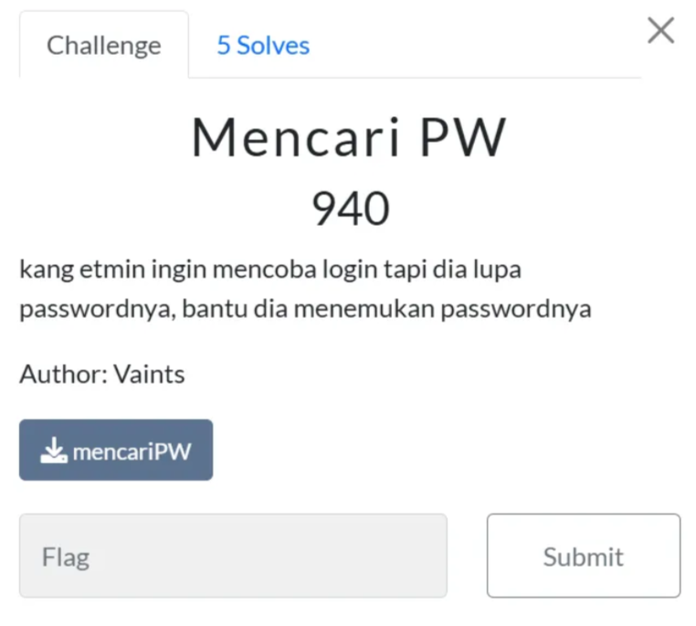
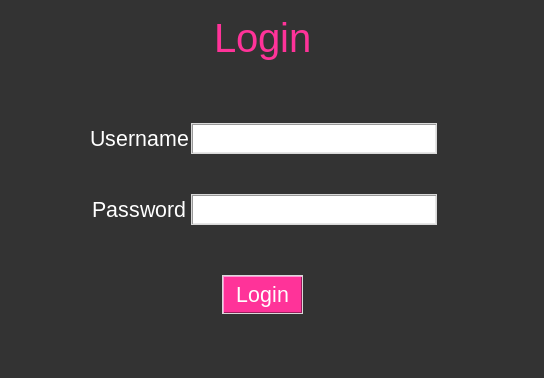
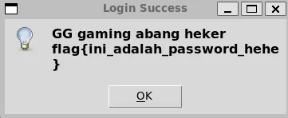
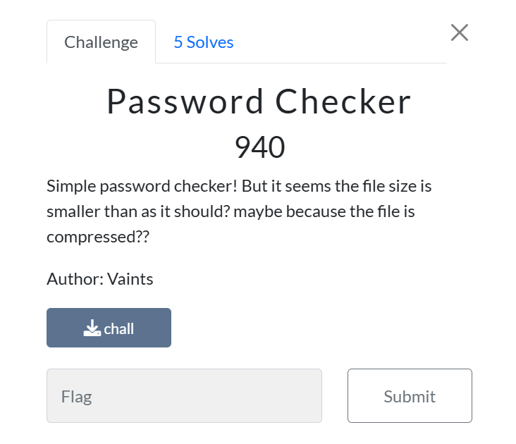
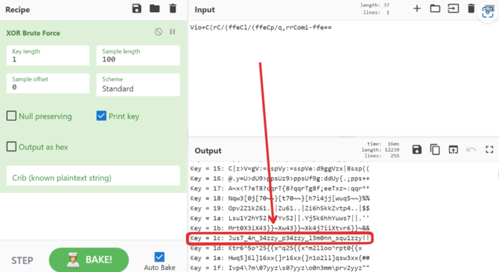
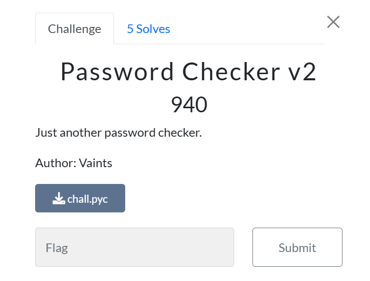
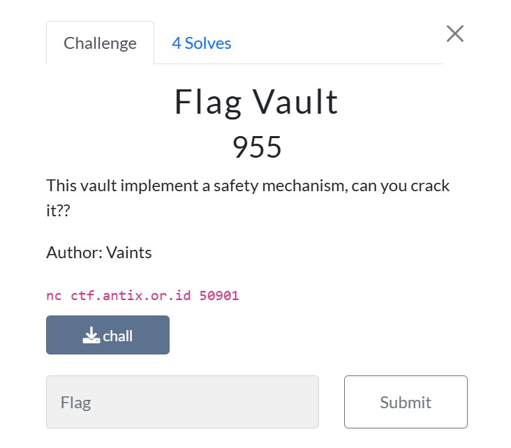

Hi everyone! today i will share Reversing CTF Walktrough in Antix CTF Challenges, i solved it all btw, i'll introduce first about "what is Antix CTF?"

Antix CTF is CTF event organized by Cybersecurity club in SMKN 22 Jakarta, the Event is no longer update (idk what the reason is) but there still have some good (not broken) chall, and the category whre is the chall none broken is Reverse Engineering, so just lets begun!!

## **Mencari PW**

we got a exe file, and when i run it, it shows GUI Login


so i just open IDA, and this is the main function contains:
```c
// attributes: thunk
int __fastcall main(int a1, char **a2, char **a3)
{
  return sub_403DF0(a1, a2, a3);
}
```
its return to sub_403DF0, so just get into it
```c
__int64 __fastcall sub_403DF0(int a1, char **a2)
{
  __int64 v2; // rax
  __int64 v3; // rbp
  _BOOL4 v4; // ebx
  const char *v5; // r12
  _BYTE *v6; // rax
  int v7; // ecx
  int v8; // r8d
  int v9; // r9d
  void *v10; // r14
  int v11; // edx
  int v12; // ecx
  int v13; // r8d
  int v14; // r9d
  unsigned int v15; // r12d
  char *v17; // rsi
  FILE *v18; // rax
  int v19; // ecx
  int v20; // r8d
  int v21; // r9d
  int v22; // edx
  FILE *v23; // r14
  __int64 v24; // [rsp+8h] [rbp-3050h] BYREF
  __int64 s2[2]; // [rsp+10h] [rbp-3048h] BYREF
  char filename[4096]; // [rsp+20h] [rbp-3038h] BYREF
  char s1[4096]; // [rsp+1020h] [rbp-2038h] BYREF
  char v28[4152]; // [rsp+2020h] [rbp-1038h] BYREF

  v24 = 0LL;
  v2 = sub_4030D0();
  if ( !v2 )
    return (unsigned int)-1;
  v3 = v2;
  if ( !(unsigned int)sub_4045B0(filename, *a2)
    || !(unsigned int)sub_4047B0(v28, filename)
    || !(unsigned int)sub_4047A0(s1) )
  {
    return (unsigned int)-1;
  }
  v4 = 0;
  v5 = (const char *)sub_4070E0("_MEIPASS2", filename);
  if ( v5 )
  {
    v4 = 1;
    v6 = (_BYTE *)sub_4070E0("_PYI_ONEDIR_MODE", filename);
    if ( v6 )
    {
      if ( *v6 == 49 )
        v4 = v6[1] != 0;
      free(v6);
      j__unsetenv("_PYI_ONEDIR_MODE");
    }
  }
  j__unsetenv("_MEIPASS2");
  if ( (unsigned int)sub_402FD0(v3, filename) )
  {
    v10 = (void *)sub_4070E0("_PYI_PROCNAME", filename);
    if ( !v10 )
      goto LABEL_16;
    goto LABEL_14;
  }
  if ( !(unsigned int)sub_402FD0(v3, v28) )
  {
    sub_403350(
      (unsigned int)"Cannot open PyInstaller archive from executable (%s) or external archive (%s)\n",
      (unsigned int)filename,
      (unsigned int)v28,
      v7,
      v8,
      v9);
    return (unsigned int)-1;
  }
  if ( v5 )
  {
    v10 = (void *)sub_4070E0("_PYI_PROCNAME", v28);
    if ( !v10 )
    {
      j__unsetenv("_PYI_PROCNAME");
      *(_DWORD *)(v3 + 20608) = a1;
      *(_QWORD *)(v3 + 20616) = a2;
      goto LABEL_17;
    }
    goto LABEL_14;
  }
  v18 = fopen(filename, "rb");
  v22 = -1;
  v23 = v18;
  if ( !v18 )
  {
LABEL_50:
    v15 = -1;
    sub_403350((unsigned int)"Cannot side-load external archive %s (code %d)!\n", (unsigned int)v28, v22, v19, v20, v21);
    return v15;
  }
  s2[0] = 0xE0B0A0B0D49454DLL;
  if ( !sub_407C20(v18, s2, 8uLL) )
  {
    fclose(v23);
    v22 = 1;
    goto LABEL_50;
  }
  v10 = (void *)sub_4070E0("_PYI_PROCNAME", s2);
  if ( v10 )
  {
LABEL_14:
    if ( prctl(15, v10, 0LL, 0LL) )
    {
      v15 = -1;
      sub_403350((unsigned int)"LOADER: failed to set linux process name!\n", (_DWORD)v10, v11, v12, v13, v14);
      return v15;
    }
    free(v10);
LABEL_16:
    j__unsetenv("_PYI_PROCNAME");
    *(_DWORD *)(v3 + 20608) = a1;
    *(_QWORD *)(v3 + 20616) = a2;
    if ( v5 )
      goto LABEL_17;
    goto LABEL_44;
  }
  j__unsetenv("_PYI_PROCNAME");
  *(_DWORD *)(v3 + 20608) = a1;
  *(_QWORD *)(v3 + 20616) = a2;
LABEL_44:
  if ( !(unsigned int)sub_4039C0(v3) )
  {
    sub_407110("_MEIPASS2", s1);
    sub_407110("_PYI_ONEDIR_MODE", "1");
    if ( (unsigned int)sub_407710(v3) == -1 || (unsigned int)sub_4078B0(filename) == -1 )
      return (unsigned int)-1;
  }
LABEL_17:
  v24 = sub_4063E0();
  if ( v4 || (unsigned int)sub_405EF0(v24, v3, 0LL) )
  {
    sub_406420(&v24);
  }
  else
  {
    if ( (unsigned int)sub_406120(v3, v24) || (unsigned int)sub_406360(v24) )
    {
      sub_406560(v24);
      sub_406420(&v24);
      if ( !v5 )
        goto LABEL_31;
      goto LABEL_20;
    }
    sub_406650(v24, filename);
  }
  if ( v5 )
  {
LABEL_20:
    if ( !strcmp(s1, v5) )
    {
LABEL_23:
      nullsub_1(v3);
      v15 = sub_403D00(v3);
      sub_403DD0(v3);
      sub_406560(v24);
      sub_406420(&v24);
      return v15;
    }
    if ( snprintf((char *)(v3 + 12408), 0x1000uLL, "%s", v5) <= 4095 )
    {
      *(_DWORD *)(v3 + 20600) = 1;
      __strcpy_chk(v3 + 16504, v3 + 12408, 4096LL);
      goto LABEL_23;
    }
    return (unsigned int)-1;
  }
LABEL_31:
  if ( (unsigned int)sub_403A20(v3, v24) )
    return (unsigned int)-1;
  v17 = s1;
  if ( *(_BYTE *)(v3 + 12408) )
    v17 = (char *)(v3 + 12408);
  sub_407110("_MEIPASS2", v17);
  if ( !prctl(16, s2, 0LL, 0LL) )
    sub_407110("_PYI_PROCNAME", s2);
  if ( (unsigned int)sub_407710(v3) == -1 )
    return (unsigned int)-1;
  nullsub_2();
  v15 = sub_4078E0(filename);
  sub_406560(v24);
  sub_406420(&v24);
  if ( *(_DWORD *)(v3 + 20600) == 1 )
    sub_407290(v3 + 12408, v3);
  sub_403110((void *)v3);
  sub_4077C0(v3, v3);
  return v15;
}
```
its says about about PyInstaller, PyInstaller is Python code Compiler, means this program using Python, and thats why the source code its not appear in IDA/other compiler (i think), so just lets decompile it
```diff
[+] Please stand by...
[+] Processing mencariPW
[+] Pyinstaller version: 2.1+
[+] Python library file: libpython3.10.so.1.0
[+] Python version: 3.10
[+] Length of package: 11166901 bytes
[+] Found 366 files in CArchive
[+] Beginning extraction...please standby
[+] Possible entry point: pyiboot01_bootstrap.pyc
[+] Possible entry point: pyi_rth_inspect.pyc
[+] Possible entry point: pyi_rth__tkinter.pyc
[+] Possible entry point: mencariPW.pyc
```
got a mencariPW.pyc, if we check it with file command, its shows Python Compile, means it still compiled, and we need to decompile it again

this is the source code after double decompile
```py
# Decompiled with PyLingual (https://pylingual.io)
# Internal filename: mencariPW.py
# Bytecode version: 3.10.0rc2 (3439)
# Source timestamp: 1970-01-01 00:00:00 UTC (0)

import tkinter
import string
from tkinter import messagebox
window = tkinter.Tk()
window.title('Login form')
window.geometry('340x440')
window.configure(bg='#333333')

def login():
    username = 'ngademin'
    password = ['qswaefrdthy_gukojplzcxvbmn', 'pkolihu_jyftgrsedwaqmzbxvc', 'mlnkbjvhcgxfzdsapqowueyr_t', 'plokijuhygtfrdeswaqmnbvcxz', 'qswdefrgthyjukilopmnbzvcx_', 'qswaefrgthyjukilpom_znxbcv', 'zqwsedrftgyhuji_kolpxcvbnm', 'qaedwsrf_tgujyhikpomznxbcv', 'mxnzbcvqsplokwdij_efuhrgyt', 'plokmnzbxvcijuygtfrdeswa_q', 'plmoknijbuhvygctfxrdzeswaq', 'qazwsxedcrfvtgbyhnujmikol_', 'wqzsxedcrfvt_gbyhnujmikolp', 'qazwxedcrf_vtgbyhnplmokiju', 'okmplijnuhbygvtfcrdxewqaz_', 'ygvtfcrd_xeszqaplmoknijbuh', 'ijnkmpluhbygvtfc_rdxeszwqa', 'tyuioplkjhgfdsaqwezxcvb_nm', 'mkolpijnuhbygv_tfcrxeszwaq', 'hubijnmkoplygvtfcrdxeszwaq', 'swxedcr_fvtgbynujmikolpqaz', 'trqwyuioplkjhgfdsazxcvbn_m', 'klopmijn_ubygvtfcrdxeszaqw', 'bvnmczxlaksjdhfgp_qowiruty']
    entered_username = username_entry.get()
    entered_password = password_entry.get()
    if entered_username != username or len(entered_password) != len(password):
        messagebox.showerror(title='Error', message='Invalid Login')
        return
    for char, pw_string in zip(entered_password, password):
        if char in pw_string or char not in string.ascii_lowercase + '_':
            messagebox.showerror(title='Error', message='masih salah, coba lagi bestie')
            return
    else:
        messagebox.showinfo(title='Login Success', message='GG gaming abang heker \nflag{%s}' % entered_password)
frame = tkinter.Frame(bg='#333333')
login_label = tkinter.Label(frame, text='Login', bg='#333333', fg='#FF3399', font=('Arial', 30))
username_label = tkinter.Label(frame, text='Username', bg='#333333', fg='#FFFFFF', font=('Arial', 16))
username_entry = tkinter.Entry(frame, font=('Arial', 16))
password_entry = tkinter.Entry(frame, show='*', font=('Arial', 16))
password_label = tkinter.Label(frame, text='Password', bg='#333333', fg='#FFFFFF', font=('Arial', 16))
login_button = tkinter.Button(frame, text='Login', bg='#FF3399', fg='#FFFFFF', font=('Arial', 16), command=login)
login_label.grid(row=0, column=0, columnspan=2, sticky='news', pady=40)
username_label.grid(row=1, column=0)
username_entry.grid(row=1, column=1, pady=20)
password_label.grid(row=2, column=0)
password_entry.grid(row=2, column=1, pady=20)
login_button.grid(row=3, column=0, columnspan=2, pady=30)
frame.pack()
window.mainloop()
```
You can see that the username and password are listed there, but here the strange thing is that the password, in the form of an array, which has a hole, after I analyzed it for a long time, it turns out that the letter of each word in the array is a word from A-Z and the hole is a word that is used, so we just make a solver,  And this is the solver
### Solver
```py
password = [
    'qswaefrdthy_gukojplzcxvbmn', 'pkolihu_jyftgrsedwaqmzbxvc', 
    'mlnkbjvhcgxfzdsapqowueyr_t', 'plokijuhygtfrdeswaqmnbvcxz', 
    'qswdefrgthyjukilopmnbzvcx_', 'qswaefrgthyjukilpom_znxbcv', 
    'zqwsedrftgyhuji_kolpxcvbnm', 'qaedwsrf_tgujyhikpomznxbcv', 
    'mxnzbcvqsplokwdij_efuhrgyt', 'plokmnzbxvcijuygtfrdeswa_q', 
    'plmoknijbuhvygctfxrdzeswaq', 'qazwsxedcrfvtgbyhnujmikol_', 
    'wqzsxedcrfvt_gbyhnujmikolp', 'qazwxedcrf_vtgbyhnplmokiju', 
    'okmplijnuhbygvtfcrdxewqaz_', 'ygvtfcrd_xeszqaplmoknijbuh', 
    'ijnkmpluhbygvtfc_rdxeszwqa', 'tyuioplkjhgfdsaqwezxcvb_nm', 
    'mkolpijnuhbygv_tfcrxeszwaq', 'hubijnmkoplygvtfcrdxeszwaq', 
    'swxedcr_fvtgbynujmikolpqaz', 'trqwyuioplkjhgfdsazxcvbn_m', 
    'klopmijn_ubygvtfcrdxeszaqw', 'bvnmczxlaksjdhfgp_qowiruty'
]
alphabet = set("abcdefghijklmnopqrstuvwxyz")
result = ""
for word in password:
    used_chars = set(word.replace("_", ""))  
    missing_chars = list(alphabet - used_chars)  
    missing_chars.sort()  
    if "_" in word:
        result += missing_chars[0]  
print(result)
```
but its still incorrect, but when i add underscore between sentences, it work



```flag: flag{ini_adalah_password_hehe}```
## **Password Checker**


we got a file, and the format is exe,so i just run it
```bash
❯ ./chall
=========================
| Password Checker v2.0 |
=========================
Input Password :


[!] Incorrect Password!
```
i think we need to decompile it with IDA first.

but there is something weird, there is no main function, so let me just see the string representation
```bash
❯ strings chall
UPX!
#[7h
4o4Qv
/lib64
nux-x86-
so.2
mgUaF
__cxa_f
fgets
strcspnk
art_ma$
ncmp
pu&le
r       tf
LIBC_2.
ITM_deregi=
CloneTa
bOtgmon_*
H`(5
i       u`
PTE1
u+UH
Vio+C(rC/(ffeCl
/q,r
omi-
| Password Checker v2.0 |
[!] Acce
ranted!
H2e i
you;flm
{%s}0Hc@
m#cL4
:*3$"W\{H
,f8ot
USQRH
W^YH
PROT_EXEC|PROT_WRITE failed.
$Info: This file is packed with the UPX executable packer http://upx.sf.net $
$Id: UPX 4.10 Copyright (C) 1996-2023 the UPX Team. All Rights Reserved. $
_j<X
_RPWQM)
j"AZR^j
PZS^
/proc/self/exe
IuDSWH
s2V^
XAVAWPH
YT_j
   =>
AY^_X
D$ [I
UPX!u`
slIT$}
t .u
m[y3u
([]A\A]
0LG(L   "c
tL      G
+xHf
p(E1W?
jFf{
Go/l
k(Ag
uC^I
h k1(
L6AI[u
A^A_)F
m@S
AZ,}
JAPC
Jn{C
RY?WV|YX
GCC: (Ubuntu 11.4.0-1u
>6Iw
\   r!
 @GH
_l!C
4!yd
Scrt/o
bi_tag
sMff.c
deregi
m_clones)do_g
bal     tors9ux5ompl>
e)dy!_fin
`array_e
me ummy2
NXt*chJl
&Fwyk
RAME_END
DYNIC
vGNU
GLOBA
L_OFFSET_TABL
(libc_
\`mag@&IBC_%ko/834
50ITM_
CVx+<
pu(,
!dQ>
tfDrcspk!
&fgej
gmon
 bss_
dcpt3dY
n.sym
trh
_n]Np
no.gnu.
build-id
K       dynb
vEsi
la(
ecmx
88C2$
2$hh$$C2$
?Hsr
v(9x
?H0
UPX!
UPX!
```
as you can see, on line 39 we got information that the file got packed, so just unpack it,

```bash
❯ upx -d chall
                       Ultimate Packer for eXecutables
                          Copyright (C) 1996 - 2024
UPX 4.2.4       Markus Oberhumer, Laszlo Molnar & John Reiser    May 9th 2024

        File size         Ratio      Format      Name
   --------------------   ------   -----------   -----------
     24671 <-      6560   26.59%   linux/amd64   chall

Unpacked 1 file.
```
lets see the strings representation again after unpacking
```bash
❯ strings chall
/lib64/ld-linux-x86-64.so.2
mgUa
__cxa_finalize
fgets
strcspn
__libc_start_main
strncmp
puts
strlen
stdin
exit
printf
libc.so.6
GLIBC_2.2.5
GLIBC_2.34
_ITM_deregisterTMCloneTable
__gmon_start__
_ITM_registerTMCloneTable
PTE1
u+UH
Vio+C(rC/(ffeCl/(ffeCp/q,rrComi-ffe==
=========================
| Password Checker v2.0 |
Input Password :
[!] Access Granted!
Here is your flag: flag{%s}
[!] Incorrect Password!
:*3$"
GCC: (Ubuntu 11.4.0-1ubuntu1~22.04) 11.4.0
Scrt1.o
__abi_tag
crtstuff.c
deregister_tm_clones
__do_global_dtors_aux
completed.0
__do_global_dtors_aux_fini_array_entry
frame_dummy
__frame_dummy_init_array_entry
chall.c
__FRAME_END__
_DYNAMIC
__GNU_EH_FRAME_HDR
_GLOBAL_OFFSET_TABLE_
__libc_start_main@GLIBC_2.34
strncmp@GLIBC_2.2.5
_ITM_deregisterTMCloneTable
puts@GLIBC_2.2.5
stdin@GLIBC_2.2.5
_edata
_fini
strlen@GLIBC_2.2.5
printf@GLIBC_2.2.5
strcspn@GLIBC_2.2.5
fgets@GLIBC_2.2.5
__data_start
__gmon_start__
__dso_handle
_IO_stdin_used
_end
__bss_start
main
encrypt3d_s3cr3t
exit@GLIBC_2.2.5
__TMC_END__
_ITM_registerTMCloneTable
__cxa_finalize@GLIBC_2.2.5
_init
.symtab
.strtab
.shstrtab
.interp
.note.gnu.property
.note.gnu.build-id
.note.ABI-tag
.gnu.hash
.dynsym
.dynstr
.gnu.version
.gnu.version_r
.rela.dyn
.rela.plt
.init
.plt.got
.plt.sec
.text
.fini
.rodata
.eh_frame_hdr
.eh_frame
.init_array
.fini_array
.dynamic
.data
.bss
.comment
```
you can see on line 22, there is weird strings, so i tried it with many kind of encryption, and i got the flag on XOR with key 1c (i use cyberchef to bruteforce it) 
### Solver

``` bash
❯ ./chall
=========================
| Password Checker v2.0 |
=========================
Input Password : Jus7_4n_34zzy_p34zzy_l3m0nn_squ1zzy!!


[!] Access Granted!
Here is your flag: flag{Jus7_4n_34zzy_p34zzy_l3m0nn_squ1zzy!!}
```
```flag: flag{Jus7_4n_34zzy_p34zzy_l3m0nn_squ1zzy!!}```
## Password Checker v2


we got file of pyc, we already solve kind this of chall (the previous chall) so we know what to do.

we need to decompile it to python code, and this is the source code after decompile

```py
# Decompiled with PyLingual (https://pylingual.io)
# Internal filename: /home/stnaive/Documents/ctf/latihan/myctf-challenge/rev/04Password_Checker_V4/template_chall.py
# Bytecode version: 3.10.0rc2 (3439)
# Source timestamp: 2023-10-12 01:52:46 UTC (1697075566)

print('=========================')
print('|    Password Checker   |')
print('=========================')
user_input = input('Input Password : ')
print(user_input)
print('\n')
if len(user_input) != 52:
    print('[!] Incorrect Password!')
    exit()
if user_input[0] != chr(121) or user_input[15] != chr(121) or user_input[27] != chr(121) or (user_input[35] != chr(121)) or (user_input[41] != chr(121)):
    print('[!] Incorrect Password!')
    exit()
if user_input[1] != chr(48) or user_input[11] != chr(48) or user_input[19] != chr(48) or (user_input[24] != chr(48)) or (user_input[32] != chr(48)) or (user_input[44] != chr(48)) or (user_input[49] != chr(48)):
    print('[!] Incorrect Password!')
    exit()
if user_input[2] != chr(95) or user_input[7] != chr(95) or user_input[17] != chr(95) or (user_input[20] != chr(95)) or (user_input[30] != chr(95)) or (user_input[39] != chr(95)) or (user_input[47] != chr(95)):
    print('[!] Incorrect Password!')
    exit()
if user_input[3] != chr(100) or user_input[21] != chr(100) or user_input[38] != chr(100) or (user_input[50] != chr(100)):
    print('[!] Incorrect Password!')
    exit()
if user_input[4] != chr(52):
    print('[!] Incorrect Password!')
    exit()
if user_input[5] != chr(119):
    print('[!] Incorrect Password!')
    exit()
if user_input[6] != chr(103):
    print('[!] Incorrect Password!')
    exit()
if user_input[8] != chr(117):
    print('[!] Incorrect Password!')
    exit()
if user_input[9] != chr(110) or user_input[45] != chr(110):
    print('[!] Incorrect Password!')
    exit()
if user_input[10] != chr(99) or user_input[23] != chr(99) or user_input[31] != chr(99) or (user_input[48] != chr(99)):
    print('[!] Incorrect Password!')
    exit()
if user_input[12] != chr(109) or user_input[25] != chr(109) or user_input[33] != chr(109):
    print('[!] Incorrect Password!')
    exit()
if user_input[13] != chr(112) or user_input[26] != chr(112) or user_input[34] != chr(112) or (user_input[40] != chr(112)):
    print('[!] Incorrect Password!')
    exit()
if user_input[14] != chr(108) or user_input[28] != chr(108) or user_input[36] != chr(108):
    print('[!] Incorrect Password!')
    exit()
if user_input[16] != chr(51) or user_input[29] != chr(51) or user_input[37] != chr(51) or (user_input[46] != chr(51)) or (user_input[51] != chr(51)):
    print('[!] Incorrect Password!')
    exit()
if user_input[18] != chr(116) or user_input[42] != chr(116):
    print('[!] Incorrect Password!')
    exit()
if user_input[22] != chr(101):
    print('[!] Incorrect Password!')
    exit()
if user_input[43] != chr(104):
    print('[!] Incorrect Password!')
    exit()
print('[!] Access Granted!')
print('Here is your flag: flag{%s}' % user_input)
```
this is easier chall than the previous one, but it has lower solver (it weird lol), and ye this is the solver
### Solver
```py
def solve_password():
    password = ["" for _ in range(52)]
    password[0] = chr(121)
    password[15] = chr(121)
    password[27] = chr(121) 
    password[35] = chr(121)
    password[41] = chr(121) 
    password[1] = chr(48)  
    password[11] = chr(48)  
    password[19] = chr(48)  
    password[24] = chr(48) 
    password[32] = chr(48)  
    password[44] = chr(48) 
    password[49] = chr(48)  
    password[2] = chr(95) 
    password[7] = chr(95)  
    password[17] = chr(95)  
    password[20] = chr(95)  
    password[30] = chr(95)  
    password[39] = chr(95)  
    password[47] = chr(95)  
    password[3] = chr(100)  
    password[21] = chr(100)  
    password[38] = chr(100)  
    password[50] = chr(100)  
    password[4] = chr(52)  
    password[5] = chr(119) 
    password[6] = chr(103)  
    password[8] = chr(117) 
    password[9] = chr(110) 
    password[45] = chr(110)
    password[10] = chr(99)
    password[23] = chr(99)  
    password[31] = chr(99) 
    password[48] = chr(99) 
    password[12] = chr(109) 
    password[25] = chr(109) 
    password[33] = chr(109) 
    password[13] = chr(112) 
    password[26] = chr(112) 
    password[34] = chr(112) 
    password[40] = chr(112)
    password[14] = chr(108) 
    password[28] = chr(108) 
    password[36] = chr(108) 
    password[16] = chr(51) 
    password[29] = chr(51)  
    password[37] = chr(51) 
    password[46] = chr(51) 
    password[51] = chr(51) 
    password[18] = chr(116)
    password[42] = chr(116)
    password[22] = chr(101) 
    password[43] = chr(104) 
    return "".join(password)
solved_password = solve_password()
print(solved_password)
```
the output (flag)
```bash
❯ python3 r.py
y0_d4wg_unc0mply3_t0_dec0mpyl3_c0mpyl3d_pyth0n3_c0d3
```
```flag: flag{y0_d4wg_unc0mply3_t0_dec0mpyl3_c0mpyl3d_pyth0n3_c0d3}```

## Flag Vault

we got a file and netcat address server, and is exe, so just decompile it with IDA
```C
int __cdecl main(int argc, const char **argv, const char **envp)
{
  unsigned int v3; // eax
  int i; // [rsp+4h] [rbp-5Ch]
  __int64 v6; // [rsp+8h] [rbp-58h] BYREF
  char v7[72]; // [rsp+10h] [rbp-50h] BYREF
  unsigned __int64 v8; // [rsp+58h] [rbp-8h]

  v8 = __readfsqword(0x28u);
  v6 = 0LL;
  setup(argc, argv, envp);
  v3 = time(0LL);
  srand(v3);
  puts("==== Flag Vault ====");
  printf("Please enter your username: ");
  __isoc99_scanf("%20s", v7);
  for ( i = 1; i <= 100; ++i )
  {
    printf("Please enter the %d PIN: ", (unsigned int)i);
    __isoc99_scanf("%lld", &v6);
    if ( rand() % 100000 != v6 )
    {
      puts("PIN Incorrect!");
      exit(0);
    }
  }
  printf("Welcome back, %s\n", v7);
  print_flag();
  return 0;
}
```
after we know the source code of main function, we know the program has 100 PIN with five random digit, and we need to validate it all right (0-9999), after the all pins right, we got the flag, and also when u reconnect, the PIN is resetting, means we cant using the same pin again. we can use rand and srand, rand for processing five random digit, and srand for processing random seed, this is the solver

### Solver
```py
from pwn import *
import ctypes
import time

def main():
    libc = ctypes.CDLL("libc.so.6")
    current_time = int(time.time())
    
    for offset in range(-5, 5):
        test_time = current_time + offset
        libc.srand(test_time)
        pins = [libc.rand() % 100000 for _ in range(100)]
        
        io = remote("ctf.antix.or.id", 50901)
        io.recvuntil(b"Please enter your username: ")
        io.sendline(b"exploiter")
        
        try:
            for i, pin in enumerate(pins, start=1):
                prompt = io.recvuntil(f"Please enter the {i} PIN: ".encode())
                print(f"[Offset {offset}] PIN {i}: {pin}")
                io.sendline(str(pin).encode())
            
            result = io.recvall(timeout=2).decode(errors="ignore")
            print(f"[Offset {offset}] Result: {result}")
            if "FLAG" in result:
                print(f"[!] FLAG FOUND: {result}")
                break
        except EOFError:
            print(f"[Offset {offset}] Connection closed early")
        finally:
            io.close()

if __name__ == "__main__":
    main()
```
result:
```bash
❯ python3 x.py
[+] Opening connection to ctf.antix.or.id on port 50901: Done
[Offset -5] PIN 1: 79851
[Offset -5] Connection closed early
[*] Closed connection to ctf.antix.or.id port 50901
[+] Opening connection to ctf.antix.or.id on port 50901: Done
[Offset -4] PIN 1: 15968
[Offset -4] Connection closed early
[*] Closed connection to ctf.antix.or.id port 50901
[+] Opening connection to ctf.antix.or.id on port 50901: Done
[Offset -3] PIN 1: 67737
[Offset -3] Connection closed early
[*] Closed connection to ctf.antix.or.id port 50901
[+] Opening connection to ctf.antix.or.id on port 50901: Done
[Offset -2] PIN 1: 4267
[Offset -2] Connection closed early
[*] Closed connection to ctf.antix.or.id port 50901
[+] Opening connection to ctf.antix.or.id on port 50901: Done
[Offset -1] PIN 1: 97457
[Offset -1] Connection closed early
[*] Closed connection to ctf.antix.or.id port 50901
[+] Opening connection to ctf.antix.or.id on port 50901: Done
[Offset 0] PIN 1: 28970
[Offset 0] Connection closed early
[*] Closed connection to ctf.antix.or.id port 50901
[+] Opening connection to ctf.antix.or.id on port 50901: Done
[Offset 1] PIN 1: 80653
[Offset 1] Connection closed early
[*] Closed connection to ctf.antix.or.id port 50901
[+] Opening connection to ctf.antix.or.id on port 50901: Done
[Offset 2] PIN 1: 39649
[Offset 2] Connection closed early
[*] Closed connection to ctf.antix.or.id port 50901
[+] Opening connection to ctf.antix.or.id on port 50901: Done
[Offset 3] PIN 1: 56530
[Offset 3] Connection closed early
[*] Closed connection to ctf.antix.or.id port 50901
[+] Opening connection to ctf.antix.or.id on port 50901: Done
[Offset 4] PIN 1: 92667
[Offset 4] PIN 2: 96414
[Offset 4] PIN 3: 82643
[Offset 4] PIN 4: 75515
[Offset 4] PIN 5: 37174
[Offset 4] PIN 6: 58548
[Offset 4] PIN 7: 33197
[Offset 4] PIN 8: 95502
[Offset 4] PIN 9: 95392
[Offset 4] PIN 10: 90147
[Offset 4] PIN 11: 35507
[Offset 4] PIN 12: 89936
[Offset 4] PIN 13: 63442
[Offset 4] PIN 14: 93616
[Offset 4] PIN 15: 42702
[Offset 4] PIN 16: 82966
[Offset 4] PIN 17: 47969
[Offset 4] PIN 18: 45283
[Offset 4] PIN 19: 69058
[Offset 4] PIN 20: 7429
[Offset 4] PIN 21: 15341
[Offset 4] PIN 22: 84917
[Offset 4] PIN 23: 38313
[Offset 4] PIN 24: 79321
[Offset 4] PIN 25: 17969
[Offset 4] PIN 26: 78412
[Offset 4] PIN 27: 8154
[Offset 4] PIN 28: 11600
[Offset 4] PIN 29: 54949
[Offset 4] PIN 30: 13079
[Offset 4] PIN 31: 22992
[Offset 4] PIN 32: 63969
[Offset 4] PIN 33: 9493
[Offset 4] PIN 34: 21987
[Offset 4] PIN 35: 55836
[Offset 4] PIN 36: 46667
[Offset 4] PIN 37: 80535
[Offset 4] PIN 38: 89033
[Offset 4] PIN 39: 58521
[Offset 4] PIN 40: 92279
[Offset 4] PIN 41: 79180
[Offset 4] PIN 42: 10381
[Offset 4] PIN 43: 82215
[Offset 4] PIN 44: 42623
[Offset 4] PIN 45: 3997
[Offset 4] PIN 46: 24917
[Offset 4] PIN 47: 25589
[Offset 4] PIN 48: 51966
[Offset 4] PIN 49: 86552
[Offset 4] PIN 50: 10999
[Offset 4] PIN 51: 75748
[Offset 4] PIN 52: 18245
[Offset 4] PIN 53: 95916
[Offset 4] PIN 54: 30413
[Offset 4] PIN 55: 97567
[Offset 4] PIN 56: 30238
[Offset 4] PIN 57: 8826
[Offset 4] PIN 58: 5721
[Offset 4] PIN 59: 58190
[Offset 4] PIN 60: 80127
[Offset 4] PIN 61: 18800
[Offset 4] PIN 62: 81182
[Offset 4] PIN 63: 44096
[Offset 4] PIN 64: 28294
[Offset 4] PIN 65: 19521
[Offset 4] PIN 66: 99932
[Offset 4] PIN 67: 91313
[Offset 4] PIN 68: 16409
[Offset 4] PIN 69: 88965
[Offset 4] PIN 70: 49835
[Offset 4] PIN 71: 8688
[Offset 4] PIN 72: 68146
[Offset 4] PIN 73: 60216
[Offset 4] PIN 74: 90904
[Offset 4] PIN 75: 27121
[Offset 4] PIN 76: 80565
[Offset 4] PIN 77: 32173
[Offset 4] PIN 78: 69062
[Offset 4] PIN 79: 48884
[Offset 4] PIN 80: 35078
[Offset 4] PIN 81: 80061
[Offset 4] PIN 82: 24632
[Offset 4] PIN 83: 53323
[Offset 4] PIN 84: 75978
[Offset 4] PIN 85: 71397
[Offset 4] PIN 86: 50890
[Offset 4] PIN 87: 6216
[Offset 4] PIN 88: 80223
[Offset 4] PIN 89: 72964
[Offset 4] PIN 90: 64406
[Offset 4] PIN 91: 60351
[Offset 4] PIN 92: 91764
[Offset 4] PIN 93: 61940
[Offset 4] PIN 94: 20799
[Offset 4] PIN 95: 36410
[Offset 4] PIN 96: 81461
[Offset 4] PIN 97: 20732
[Offset 4] PIN 98: 27724
[Offset 4] PIN 99: 97870
[Offset 4] PIN 100: 9697
[+] Receiving all data: Done (92B)
[*] Closed connection to ctf.antix.or.id port 50901
[Offset 4] Result: Welcome back, exploiter
flag{w3ll_n0w_you_know_h0w_to_defeat_srand_C_in_python_414243_pain}
```
```flag: flag{w3ll_n0w_you_know_h0w_to_defeat_srand_C_in_python_414243_pain}```

thats it about my Reverse Engineering CTF Walktrough on Antix CTF, im still learning tho, hope this is useful ❤️❤️❤️