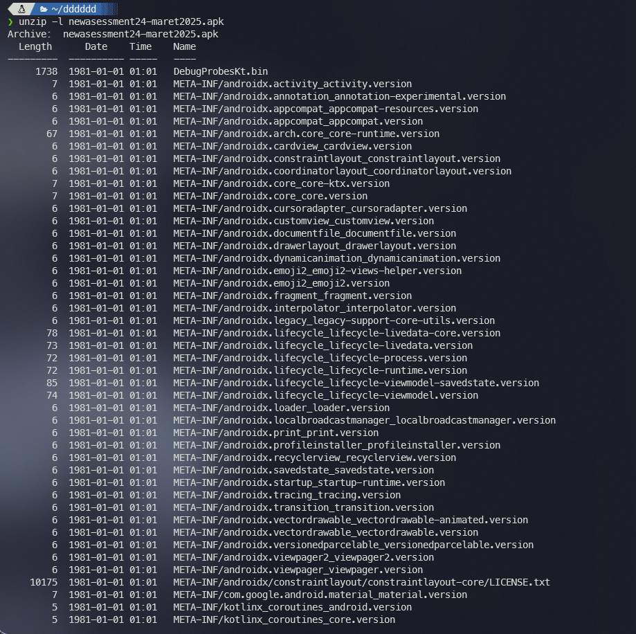
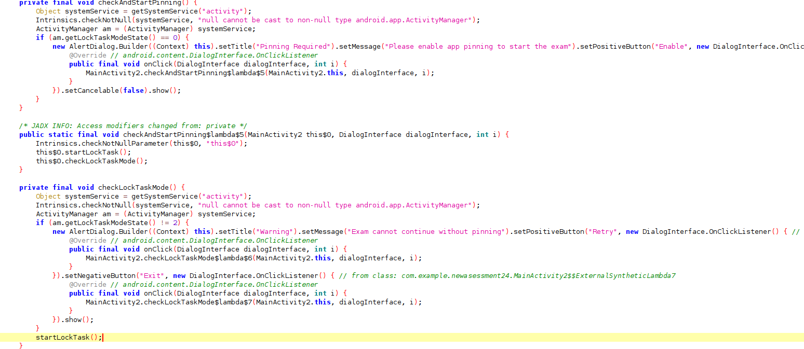
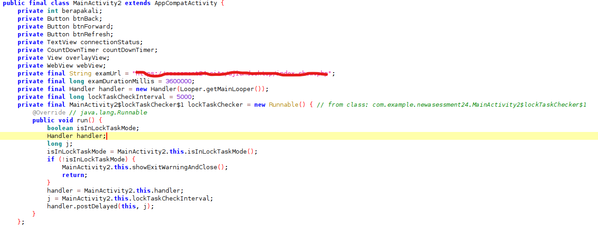
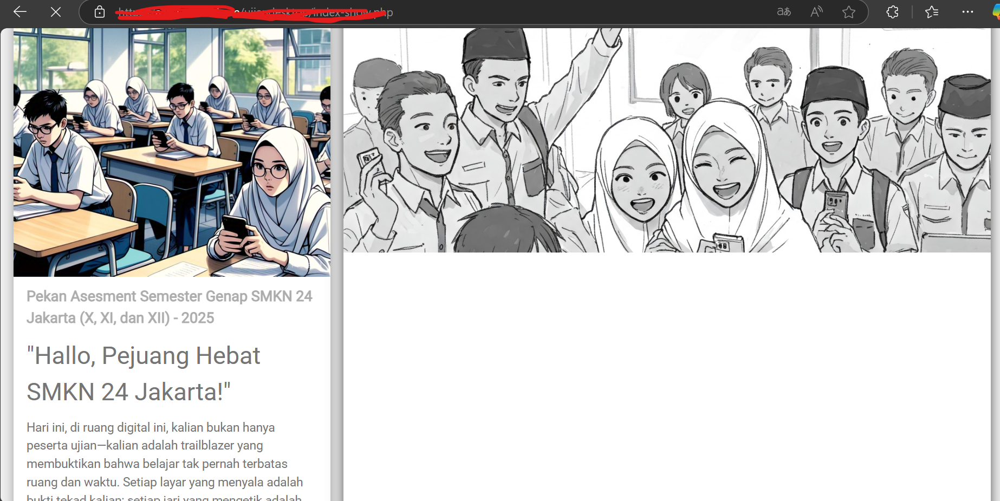
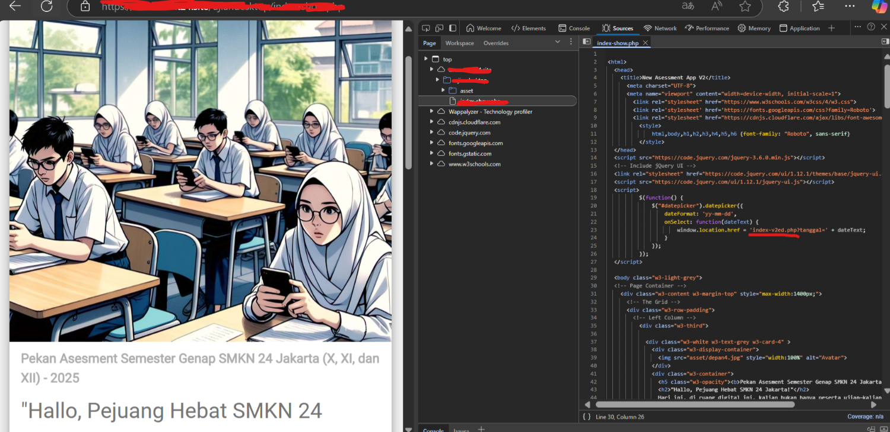
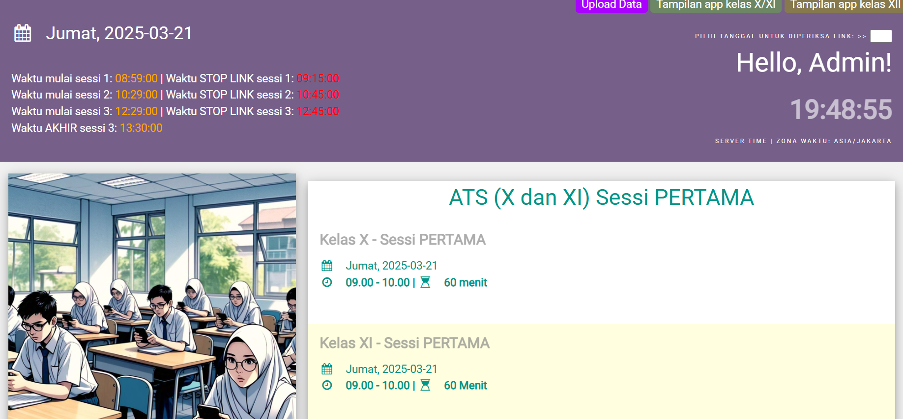
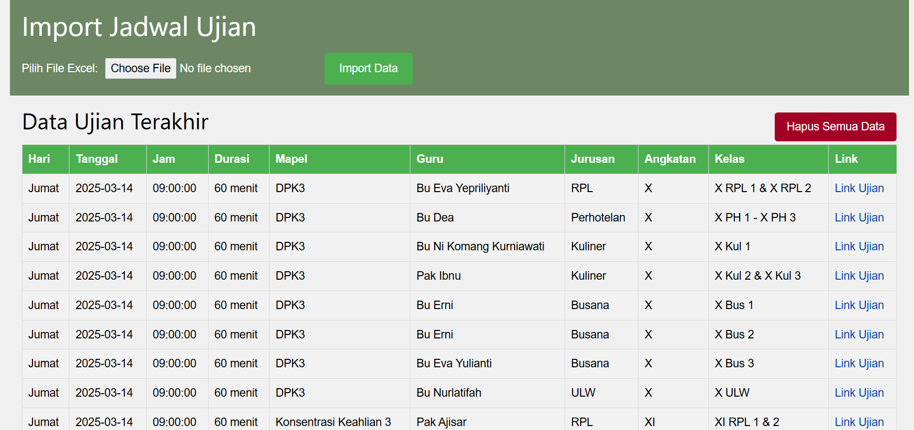

Ahmmmm, so today, i will share my PoC (Proof of Concept) about Vuln in My beloved (no, this is just satire) exam APK.

##### **Desclaimer: i'm doin it ethically, you know dawg, i'm in Cybersecurity Team, of course they (the teacher) have negative thinking (or smth like that) about my team, so they always like monitoring our activity**

so yea, first, they improve the APK, and that so much annoying, cus they added **Pin Lock Feature** to lock our screen when we alr get in the exams form, but yea, this is just **Wrapped App** so isnt secure as you think.... (HAHAHAHA)

oke, first try to unzip it, why we need to unzip it? **FYI** APK is literally zip files, if u try to unzip it, u will got the file in the APK

we got a tons of file, but all we need is just `.dex` file to get the source code of the APK

and we got 3 files of `.dex`, so lets just decompile it those three file with **jadx**

and i got **PIN** function in `classes3.dex`

based on that source code, we can bypass the **PIN** function just with `return;`, secure right? (HAHAHAHA)

but im not doin it, again, ethical.

so just ignore those function, and start to get smth more interesting

as i said, this APK is just a **Wrapped App**, so the server is on website, and as you can see on the source, there is examUrl variable fill with the school exam website, so lets just get into it

ofc there is no smth interesting here, let see the source code

there is javascript function which fetch another endpoint to get the data about date (NAH ITS NOT, THEY FETCHING THE EXAM SCHEDULE AND THERE IS LINK THERE)

NAH THIS IS OVERRRR, THEY DONT HAVE ANY FILTERING and, i'm an `ADMIN` now...

as you can see there is upload page, and this the page looks like

there is a schedule and link, and there is upload thing there (its filtered, we can only upload excel file) but i dont know if it vuln of upload file vuln or nah, and im not take that risk....

AND YEAH, thanks for reading, once again, i'm doing any abusive thing here, i just want to share how this **APK** looks secure (it is, but not for our team)