>b01lers CTF is the public competitive CTF hosted by the b01lers CTF team at Purdue University

Haii, kali ini gw mau share write-up gw terkait challs di `b01lersCTF` kemarin yang gw ikutin bareng `TCP1P`, btw gw pake bahasa indo soalnya lagi ga ikut `Write-up Competition` wkwkwk, jadi pure mau share aja, dan juga gw cuma bisa ikut di hari pertama (ctf nya 3 hari jir) dikarnakan suatu alasan.

Gw solve 5 challs disini, include sanity/welcome chall :v

gw solve 1 web, 1 misc (welcome), 1 crypto, dan 2 rev.

## Web Exploitation
### When
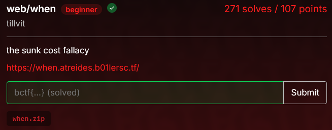

Diberikan sebuah web service dan file zip (untuk run it locally) dan ini isi zip nya
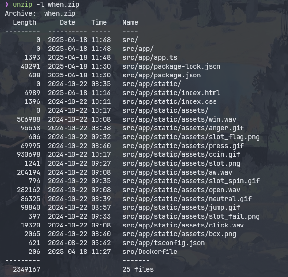

langsung gw buka, dan gw nemu ini di `app.ts`
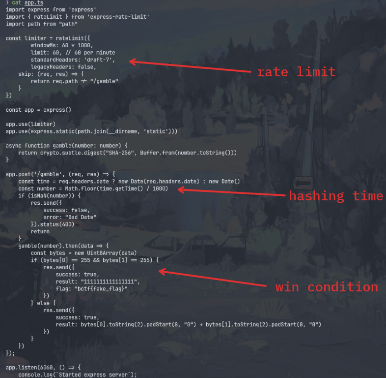

jadi pokoknya, web service yang diberikan adalah sebuah web untuk gamble, tapi endpoint `/gamble` ngebatesin 60 requests per menit, tapi karna hash `SHA256(timestamp)` dapat dimanip lewat header date, server akan ngasi flag jika dua byte awal hash adalah `0xff 0xff`

untuk solve, caranya adalah dengan kita ambil timestamp saat ini, dan hitung `SHA-256(str(ts))` untuk rentang [now, now+100_000] sampai ditemukan hash yang diawali `0xff 0xff`, karna pake range, jadi ini kita brute force, berikut solver nya

```py
import hashlib, requests, time
from datetime import datetime, timezone
from multiprocessing import Pool, Manager

URL = "https://when.atreides.b01lersc.tf/gamble"

def check(ts, stop_evt):
    if stop_evt.is_set():
        return None
    h = hashlib.sha256(str(ts).encode()).digest()
    if h[:2] == b'\xff\xff':
        stop_evt.set()
        return ts
    return None

def worker(args):
    return check(*args)

def find_ts(window=100_000):
    now = int(time.time())
    mgr   = Manager()
    stop  = mgr.Event()
    tasks = [(ts, stop) for ts in range(now, now + window)]

    with Pool() as pool:
        for ts in pool.imap_unordered(worker, tasks, chunksize=1_000):
            if ts:
                pool.terminate()
                return ts

def send(ts):
    hdr = datetime.fromtimestamp(ts, timezone.utc) \
            .strftime('%a, %d %b %Y %H:%M:%S GMT')
    r = requests.post(URL, headers={"Date": hdr})
    print(r.status_code, r.json())

if __name__ == "__main__":
    ts = find_ts()
    if ts:
        print(f"[+] Found ts = {ts}")
        send(ts)
    else:
        print("[-] No valid timestamp in window.")
```
dan ini outputnya
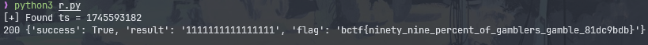

Flag: `bctf{ninety_nine_percent_of_gamblers_gamble_81dc9bdb}`

## Reverse Engineering
### class-struggle
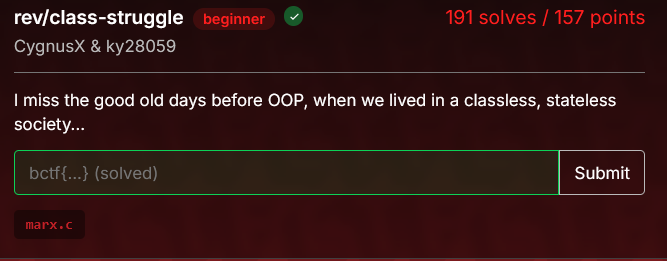

Diberikan sebuah file dalam bahasa C,
```c
#include <stdio.h>
#include <string.h>

#define The
#define history
#define of
#define all
#define hitherto       struct tbnlw{int srlpn;}tbnlw_o;
#define existing       unsigned char tfkysf(unsigned char j,int
#define society
#define is             vfluhzftxror){vfluhzftxror&=7;
#define the
#define class
#define struggles      (void)tbnlw_o
#define Freeman        srlpn;
#define and
#define slave          (void)((void)0
#define patrician      0);
#define plebeian       (void)((void)0
#define lord           0);
#define serf           (void)((void)0
#define guild
#define master         0);
#define journeyman     (void)((void)0
#define in
#define a
#define word           0);(void)((void)0
#define oppressor      0);
#define oppressed      (void)((void)0
#define stood          0);
#define constant       return (j<<vfluhzftxror)|
#define opposition     (j>>(8-vfluhzftxror));}
#define to             unsigned char b(unsigned
#define one            char j,int vfluhzftxror){
#define another        (void)((void)0
#define carried        0);
#define on             vfluhzftxror&=7;return(j
#define an             >>vfluhzftxror)|(j<<(8-vfluhzftxror));
#define uninterrupted  (void)((void)0
#define now
#define hidden         0);(void)((void)0
#define open           0);(void)((void)0
#define fight
#define that
#define each           0);}
#define time           unsigned char jistcuazjdma(unsigned char jistcuazjdma,int mpnvtqeqmsgc){
#define ended          (void)((void)0
#define either         0);
#define revolutionary  jistcuazjdma^=(
#define reconstitution mpnvtqeqmsgc *
#define at             37);
#define large          (void)((void)0
#define or             0);
#define common         jistcuazjdma=
#define ruin           tfkysf(jistcuazjdma,(mpnvtqeqmsgc+3)%7);
#define contending     (void)tbnlw_o
#define classes
#define In
#define earlier        srlpn;
#define epochs         (void)((void)0
#define we
#define find           0);
#define almost
#define everywhere     jistcuazjdma+=42;
#define complicated    return jistcuazjdma;}int
#define arrangement    evhmllcbyoqu(const
#define into           char
#define various        *g){
#define orders         (void)((void)0
#define manifold       0);
#define gradation      const unsigned char gnmupmhiaosg[]={0x32,0xc0,0xbf,0x6c,0x61,0x85,0x5c,0xe4,0x40,0xd0,0x8f,0xa2,0xef,0x7c,0x4a,0x2,0x4,0x9f,0x37,0x18,0x68,0x97,0x39,0x33,0xbe,0xf1,0x20,0xf1,0x40,0x83,0x6,0x7e,0xf1,0x46,0xa6,0x47,0xfe,0xc3,0xc8,0x67,0x4,0x4d,0xba,0x10,0x9b,0x33};int
#define social         guxytjuvaljn=strlen(g);
#define rank           (void)tbnlw_o
#define ancient        srlpn;
#define Rome           if(guxytjuvaljn!=sizeof
#define have           (gnmupmhiaosg)){
#define patricians     (void)((void)0
#define knights        0);(void)((void)0
#define plebeians      0);(void)((void)0
#define slaves         0);(void)(0?0
#define Middle         0);
#define Ages           (void)((void)0
#define feudal
#define lords          0);(void)((void)0
#define vassals        0);(void)((void)0
#define masters        0);(void)((void)0
#define journeymen     0);(void)((void)0
#define apprentices    0);(void)((void)0
#define serfs          0);(void)(0?0
#define these          0);(void)((void)0
#define again          0);(void)((void)0
#define subordinate    0);
#define gradations     (void)tbnlw_o
#define modern         srlpn;
#define bourgeois      return  0;}for(int mpnvtqeqmsgc=0;mpnvtqeqmsgc<guxytjuvaljn;mpnvtqeqmsgc++){
#define has
#define sprouted       unsigned char z=jistcuazjdma(g[mpnvtqeqmsgc],
#define from           mpnvtqeqmsgc);unsigned
#define ruins          char e=b((z&0xF0)|((~z)&0x0F),
#define not            mpnvtqeqmsgc%8);if(e!=gnmupmhiaosg
#define done           [mpnvtqeqmsgc]){
#define away           return 0;}}
#define with           return 1;
#define antagonisms    (void)tbnlw_o
#define It             srlpn;
#define but            }int main(void){
#define established    (void)((void)0
#define new
#define conditions     0);
#define oppression     (void)((void)0
#define forms          0);
#define struggle       char cmdcnwrnjxlp[64];printf("Please input the flag: ");fgets(cmdcnwrnjxlp,sizeof(cmdcnwrnjxlp),stdin);
#define place          char*nl=strchr(cmdcnwrnjxlp,'\n');if(nl){*nl=0;}if(evhmllcbyoqu(cmdcnwrnjxlp)){puts("Correct!");}else{
#define old            puts("No.");}
#define ones           return 0;}
```
jadi, chall ini adalah kombinasi dari C obfuscation + custom encryption, logic enc nya itu `XOR -> ROTATE -> ADD -> NOTNIBBBLE -> ROTATE` dan `XOR + ROT`, dengan enc flag nya yaitu 
```c
gnmupmhiaosg[]={0x32,0xc0,0xbf,0x6c,0x61,0x85,0x5c,0xe4,0x40,0xd0,0x8f,0xa2,0xef,0x7c,0x4a,0x2,0x4,0x9f,0x37,0x18,0x68,0x97,0x39,0x33,0xbe,0xf1,0x20,0xf1,0x40,0x83,0x6,0x7e,0xf1,0x46,0xa6,0x47,0xfe,0xc3,0xc8,0x67,0x4,0x4d,0xba,0x10,0x9b,0x33}
```
dan berikut solvernya:
```py
def rotate_left(byte, shift):
    shift %= 8
    return ((byte << shift) | (byte >> (8 - shift))) & 0xff

def rotate_right(byte, shift):
    shift %= 8
    return ((byte >> shift) | (byte << (8 - shift))) & 0xff

gnmupmhiaosg = [
    0x32, 0xc0, 0xbf, 0x6c, 0x61, 0x85, 0x5c, 0xe4,
    0x40, 0xd0, 0x8f, 0xa2, 0xef, 0x7c, 0x4a, 0x02,
    0x04, 0x9f, 0x37, 0x18, 0x68, 0x97, 0x39, 0x33,
    0xbe, 0xf1, 0x20, 0xf1, 0x40, 0x83, 0x06, 0x7e,
    0xf1, 0x46, 0xa6, 0x47, 0xfe, 0xc3, 0xc8, 0x67,
    0x04, 0x4d, 0xba, 0x10, 0x9b, 0x33
]

flag = []

for i in range(len(gnmupmhiaosg)):
    e = gnmupmhiaosg[i]
    s = i % 8
    pre_rotate = rotate_left(e, s)
    pre_upper = (pre_rotate & 0xF0) >> 4
    pre_lower = pre_rotate & 0x0F
    z_lower = (~pre_lower) & 0x0F
    z = (pre_upper << 4) | z_lower
    rotated_left_value = (z - 42) % 256
    rotation_amount = (i + 3) % 7
    original_xor = rotate_right(rotated_left_value, rotation_amount)
    c = original_xor ^ (i * 37) % 256
    flag.append(c)

flag_bytes = bytes(flag)
print(flag_bytes.decode())
```
Flag: `bctf{seizing_the_m3m3s_0f_pr0ducti0n_32187ea8}`

### What
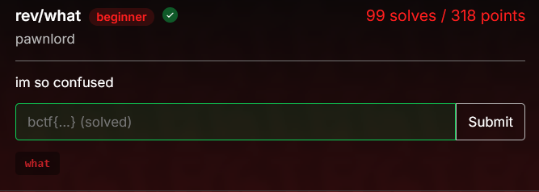

Diberikan sebuah file .exe, langsung gw decompile

hasil decompile main function:
```c
int __cdecl main(int argc, const char **argv, const char **envp)
{
  int v3; // eax
  unsigned __int64 len; // [rsp+8h] [rbp-28h]
  int i; // [rsp+18h] [rbp-18h]
  int what_idx; // [rsp+1Ch] [rbp-14h]
  int acc_idx; // [rsp+20h] [rbp-10h]
  char correct; // [rsp+27h] [rbp-9h]
  __int64 in; // [rsp+28h] [rbp-8h]

  len = strlen(
          "?WAWWHT?WAAWWAHHWAWAAAT?WAAHAAHHAAT?WHAAAHAHAWWHT?WHAAHHAHAWHT?WWHHWWHAAAHHWHT?WHHHHHHHAAT?WHHHHHHWWAHHT?WHAAA"
          "HAHAWHHHHHAAHT?WHHWHHAHHAAAHAAHHHT?WHHHAHWHHHAHHHAHAAT?WAAHHAHHHAHHWHHHHHT?WHHHHAHHAHAHWHHHHHT?WHHHHHHHWAHHAHH"
          "HHHT?WAWT?WHAAAAAAAWT?WHAAHAAAWAWWT?WAAAHAWAWHHT?WAAAHHHHAT?WAHHWHAHAHT?WAHHHHWWHWHAT?WAHWHHHWHHHT?WAHHAAAHHAA"
          "HHAHHT?WHHHAHWWHAHAHAWHHAAT?WAHWHHHWAAHHHWAHHHAWT?WAHHHHHAAHHHWHAHHT?WHHHHHAHHAHHHHHAT?WHHHHHHWWHAHWHHHAHHT?WH"
          "HHHHHWHHWHWHWHHHAHT?WAAWAAAAAT?WHAAAAAWWAT?WAWWHWWHAAAAT?WAAAAWWHHHWT?WHAHHAAHWT?WHWHWAHHAHT?WHAHHWWWHWHHT?WHH"
          "AHHHHAAAWHAAWAWT?WWAWHAHHHAHHAWHAAHT?WHHAHHHHWAAHAWHHAWT?WAHHAHWAHHWHHAHWHHT?WHAHHHHWHHAWHHHWAHT?WWHWAHHHHHHHA"
          "HHHHWT?WHHWWHHWHAHHHHHHHHT?WHWHHHHHAAHWAHHHHAAHAHWHAT?WAAAAAAT?WWAAWHAWAWAT?WAAAWAHWHT?WHAHWAHAWWT?WHHHHAAT?WW"
          "HAHHHHWWWT?WHHWAWAAAHAHAHHAT?WHAAHHAHAAHAHHT?WWAHHHHHAHHHAAAT?WAHAHHHWHHAHHHWWAT?WHHHHHAWHAHHHWAHT?WHHHHHAHAHH"
          "HHHT?WHHHWHHAHHHHHHHT?WHHAHHHWAHAHAWHHAHAAHHHWT?WHAHAHWHHWHAHAAHHHHWHWHAHT?WAAAWAAT?WAAAAHT!");
  printf("What did you say? ");
  in = 0LL;
  correct = 1;
  acc_idx = 0;
  what_idx = 0;
  for ( i = 0; i < len; ++i )
  {
    switch ( aWawwhtWaawwahh[i] )
    {
      case '?':
        in = (char)getchar() * correct;
        break;
      case 'W':
        in = what[what_idx] ^ (unsigned __int64)in;
        what_idx = (what_idx + 1) % 4;
        break;
      case 'H':
        in += what[what_idx];
        what_idx = (what_idx + 1) % 4;
        break;
      case 'A':
        in *= what[what_idx];
        what_idx = (what_idx + 1) % 4;
        break;
      case 'T':
        v3 = acc_idx++;
        correct &= in == solution[v3];
        break;
      case '!':
        if ( correct == 1 )
          puts("oh, that makes sense.");
        else
          puts("I don't get it.");
        break;
    }
  }
  return 0;
}
```
berdasarkan function main nya, program ini nerima input satu satu, lalu untuk setiap input karakter di `XOR`, `+`, `*` berdasarkan pola `'W'`, `'H'`, `'A'`, kemudian hasilnya dibandingin dengan nilai target di array solution

ini isi dari array solution:
```c
.data:0000000000004060 54 0F 00 00 00 00 00 00 70 05+solution dq 0F54h, 16F4A5E260570h, 9BD5485C77Ch, 523E921C64h, 131A573ADh, 8F0366Ah, 31923Ch, 8045h, 7BDD4F2F841E4h
.data:0000000000004060 26 5E 4A 6F 01 00 7C C7 85 54+                                        ; DATA XREF: main+19F↑o
.data:0000000000004060 BD 09 00 00 64 1C 92 3E 52 00+dq 95916508BFE9h, 8BE32212F8h, 96A96236h, 8F505CCh, 2BA72Fh, 0D79h, 67F100A7FE057h, 165F086E2AFBh, 0E629B2305h
.data:0000000000004060 00 00 AD 73 A5 31 01 00 00 00+dq 4759F2CCh, 1067699h, 15E23h, 0FEDh, 0A58A6FF5E80C3h, 420719F56D10h, 0DE2C53AF7h, 869BF143h, 0DA18D18h
.data:0000000000004060 6A 36 F0 08 00 00 00 00 3C 92+dq 3B669Bh, 10197h, 2F5FF57445D00h, 2D028A7A55F4h, 16D07CE160h, 5DC6247Dh, 2B0A9CDh, 1EE163h, 442Ch
.data:0000000000004060 31 00 00 00 00 00 45 80 00 00+dq 10DEB1377A1730h, 15288F08A6D8h, 769FFA893Bh, 16C9A3FCh, 42356FEh, 1CA845h, 0AE04h, 2ACBC4C1348CA7h
.data:0000000000004060 00 00 00 00 E4 41 F8 F2 D4 BD+dq 156652F56900h, 141A6B0269h, 85044CA1h, 4233D6Bh, 27CF3Ch, 3279h, 11AB80FCED20E4h, 1D631A31A393h, 414D72A784h
.data:0000000000004060 07 00 E9 BF 08 65 91 95 00 00+dq 5E787F58h, 13497804h, 260B58h, 9A54h, 0A5D9DFC502EAAh, 135AC1BC1242h, 18D84F7478h, 5394C6B7h
.data:0000000000004060 F8 12 22 E3 8B 00 00 00 36 62+_data ends
```

dan berikut solvernya:
```py
big_str = "?WAWWHT?WAAWWAHHWAWAAAT?WAAHAAHHAAT?WHAAAHAHAWWHT?WHAAHHAHAWHT?WWHHWWHAAAHHWHT?WHHHHHHHAAT?WHHHHHHWWAHHT?WHAAAHAHAWHHHHHAAHT?WHHWHHAHHAAAHAAHHHT?WHHHAHWHHHAHHHAHAAT?WAAHHAHHHAHHWHHHHHT?WHHHHAHHAHAHWHHHHHT?WHHHHHHHWAHHAHHHHHT?WAWT?WHAAAAAAAWT?WHAAHAAAWAWWT?WAAAHAWAWHHT?WAAAHHHHAT?WAHHWHAHAHT?WAHHHHWWHWHAT?WAHWHHHWHHHT?WAHHAAAHHAAHHAHHT?WHHHAHWWHAHAHAWHHAAT?WAHWHHHWAAHHHWAHHHAWT?WAHHHHHAAHHHWHAHHT?WHHHHHAHHAHHHHHAT?WHHHHHHWWHAHWHHHAHHT?WHHHHHHWHHWHWHWHHHAHT?WAAWAAAAAT?WHAAAAAWWAT?WAWWHWWHAAAAT?WAAAAWWHHHWT?WHAHHAAHWT?WHWHWAHHAHT?WHAHHWWWHWHHT?WHHAHHHHAAAWHAAWAWT?WWAWHAHHHAHHAWHAAHT?WHHAHHHHWAAHAWHHAWT?WAHHAHWAHHWHHAHWHHT?WHAHHHHWHHAWHHHWAHT?WWHWAHHHHHHHAHHHHWT?WHHWWHHWHAHHHHHHHHT?WHWHHHHHAAHWAHHHHAAHAHWHAT?WAAAAAAT?WWAAWHAWAWAT?WAAAWAHWHT?WHAHWAHAWWT?WHHHHAAT?WWHAHHHHWWWT?WHHWAWAAAHAHAHHAT?WHAAHHAHAAHAHHT?WWAHHHHHAHHHAAAT?WAHAHHHWHHAHHHWWAT?WHHHHHAWHAHHHWAHT?WHHHHHAHAHHHHHT?WHHHWHHAHHHHHHHT?WHHAHHHWAHAHAWHHAHAAHHHWT?WHAHAHWHHWHAHAAHHHHWHWHAHT?WAAAWAAT?WAAAAHT!"
split = big_str.split('?')[1:]
groups = []
for part in split:
    t_index = part.find('T')
    if t_index == -1:
        continue
    group_str = part[:t_index]
    groups.append(group_str)

solution = [
    0x0000000000000F54,
    0x016F4A5E260570,
    0x0009BD5485C77C,
    0x00000523E921C64,
    0x000000131A573AD,
    0x0000000008F0366A,
    0x000000000031923C,
    0x0000000000008045,
    0x7BDD4F2F841E4,
    0x00095916508BFE9,
    0x000000008BE32212F8,
    0x000000000096A96236,
    0x000000000008F505CC,
    0x0000000000002BA72F,
    0x00000000000000D79,
    0x067F100A7FE057,
    0x0000165F086E2AFB,
    0x0000000E629B2305,
    0x000000004759F2CC,
    0x00000000001067699,
    0x00000000000015E23,
    0x00000000000000FED,
    0x0A58A6FF5E80C3,
    0x0420719F56D10,
    0x0000000DE2C53AF7,
    0x00000000869BF143,
    0x0000000000DA18D18,
    0x000000000003B669B,
    0x00000000000010197,
    0x02F5FF57445D00,
    0x0002D028A7A55F4,
    0x0000016D07CE160,
    0x000000005DC6247D,
    0x00000000002B0A9CD,
    0x0000000000001EE163,
    0x0000000000000442C,
    0x10DEB1377A1730,
    0x000015288F08A6D8,
    0x000000769FFA893B,
    0x000000016C9A3FC,
    0x00000000042356FE,
    0x000000000001CA845,
    0x0000000000000AE04,
    0x2ACBC4C1348CA7,
    0x0000156652F56900,
    0x000000141A6B0269,
    0x0000000085044CA1,
    0x0000000004233D6B,
    0x000000000027CF3C,
    0x00000000000003279,
    0x11AB80FCED20E4,
    0x0001D631A31A393,
    0x000000414D72A784,
    0x000000005E787F58,
    0x0000000013497804,
    0x0000000000260B58,
    0x00000000000009A54,
    0x0A5D9DFC502EAA,
    0x0000135AC1BC1242,
    0x00000018D84F7478,
    0x000000005394C6B7,
]

what = [0x57, 0x48, 0x41, 0x54]
what_idx_global = 0
flag = []

for i, group_str in enumerate(groups):
    group_ops = list(group_str)
    target = solution[i]
    initial_what_idx = what_idx_global
    what_values = []
    current_what_idx = initial_what_idx
    for op in group_ops:
        what_val = what[current_what_idx % 4]
        what_values.append(what_val)
        current_what_idx += 1
    found = False
    for c in range(256):
        in_val = c
        for op, w in zip(group_ops, what_values):
            if op == 'W':
                in_val ^= w
            elif op == 'H':
                in_val += w
            elif op == 'A':
                in_val *= w
            in_val &= 0xFFFFFFFFFFFFFFFF
        if in_val == target:
            flag.append(chr(c))
            found = True
            break
    if not found:
        print(f"Failed to find input for group {i}")
        exit(1)
    what_idx_global = (initial_what_idx + len(group_ops)) % 4

print(''.join(flag))
```
Flag: `bctf{1m_p3rplexed_to_s4y_th3_v3ry_l34st_rzr664k1p5v2qe4qdkym}`

## Cryptography
### ASSS
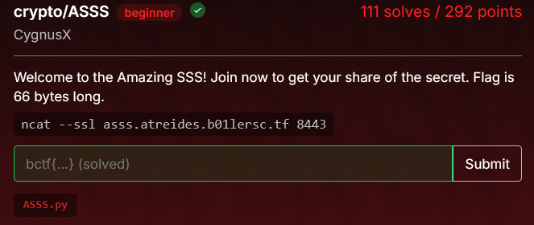

Diberikan sebuah netcat service, dan `ASSS.py`
```py
from Crypto.Util.number import getPrime, bytes_to_long

def evaluate_poly(poly:list, x:int, s:int):
    return s + sum(co*x**(i+1) for i, co in enumerate(poly))

s = bytes_to_long(open("./flag.txt", "rb").read())
a = getPrime(64)
poly = [a*getPrime(64) for _ in range(1, 20)]
share = getPrime(64)

print(f"Here is a ^_^: {a}")
print(f"Here is your share ^_^: ({share}, {evaluate_poly(poly, share, s)})")%
```
Tujuan nya adalah untuk recover `s`, flag yang telah diconvert ke integer, dari fungsi 

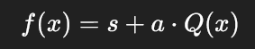

`a` adalah bilangan prime 64-bit, dari semua coeffs polynomial adalah kelipatan `a`, jadi:

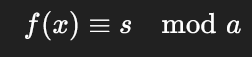

dan server netcat tersebut memberikan nilai `a` (modulus), sebuah `x` acak (ga terlalu penting), dan `f(x)` (hasil eval polynomial)

jadi kurang lebih kek gini

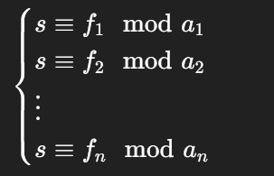

dan berikut adalah solvernya:
```py
import re
import socket
import ssl
from functools import reduce
from Crypto.Util.number import long_to_bytes, inverse

HOST = "asss.atreides.b01lersc.tf"
PORT = 8443

def get_share():
    ctx = ssl.create_default_context()
    with socket.create_connection((HOST, PORT)) as sock:
        with ctx.wrap_socket(sock, server_hostname=HOST) as ssock:
            data = ssock.recv(10_000).decode()
    a = int(re.search(r"Here is a \^_\^\: (\d+)", data).group(1))
    x, y = map(int, re.search(
        r"Here is your share \^_\^\: \((\d+), (\d+)\)", data
    ).groups())
    return a, x, y

def crt(remainders):
    N = reduce(lambda a,b: a*b, (m for m,_ in remainders))
    total = 0
    for m, r in remainders:
        Ni = N // m
        total += r * inverse(Ni, m) * Ni
    return total % N

def looks_like_flag(b: bytes) -> bool:
    return all(32 <= c < 127 for c in b) and (b'{' in b) and (b'}' in b)

def main(max_shares=20):
    rems = []
    bit_sum = 0

    for i in range(1, max_shares+1):
        a, x, y = get_share()
        rems.append((a, y % a))
        bit_sum += a.bit_length()
        print(f"[+] share {i}: a=~{a.bit_length()} bits   total bits≈{bit_sum}")

        if bit_sum > 8*64:
            s = crt(rems)
            candidate = long_to_bytes(s)
            if looks_like_flag(candidate):
                print(candidate.decode())
                return

if __name__ == "__main__":
    main()
```
dan ini outputnya:
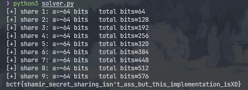

Flag: `bctf{shamir_secret_sharing_isn't_ass_but_this_implementation_isXD}`

