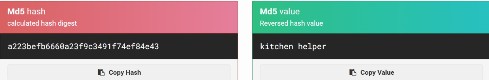
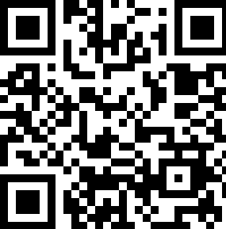

## Bronco CTF 2025
BroncoCTF is a CTF hosted by BroncoSec, Santa Clara University's cybersecurity club.

It is aimed at undergraduate and graduate students with challenges ranging from beginner to advanced. That being said, it is open to all.

Well, i know this by TCP1P Mabar event (lol), and yea i solved 3 Cryptography, 1 Web, and 1 Forensic
so happy READING!!

## Cryptography
#### Across the Tracks
##### Desc: I've been working on the railroad, all my live long day. We really should put up a fence, a deer just ran onto the tracks in a zig-zag pattern. After crossing my tenth track tracing the deer, I have found this message! What could it mean?

```diff
Samddre··ath·dhf@_oesoere·ebun·yhot·no··oso·i·a·lr1rcm·iS·aruf·toibadhn·nadpikudynea{l_oeee·ch·oide·f·n·aoe·sae·aonbdhgo_so·rr.i·tYnl·s·tdot·xs·hdtyy'·.t·cfrlca·epeo·iufiyi.t·yaaf·.a.·ts··tn33}i·tvhr·.tooho···rlmwuI·h·e·iHshonppsoleaseecrtudIdet.·n·BtIpdheiorcihr·or·ovl·c··i·acn·t·su··ootr·:b3cesslyedheIath·e·_
```
In the desc says is using zig-zag pattern encryption, so let me guess, its **Rail Fence**!!!
so i just using Cyberchef to solve this
##### Solver

flag : ``bronco{r@1l_f3nc3_cip3rs_r_cool}``

#### Rahhh-SA
##### Desc: Behold! A modern take on an old crypto classic! I call it RAHHH-SA! That's because with just a simple numerical inversion of RSA's rules, it's now unbreakable! RAHHH! Y'know what? I'm so confident in this new system I'll even share one of my deepest secrets! ```p = -811```
```py
e = 65537
n = 3429719
c = [-53102, -3390264, -2864697, -3111409, -2002688, -2864697, -1695722, -1957072, -1821648, -1268305, -3362005, -712024, -1957072, -1821648, -1268305, -732380, -2002688, -967579, -271768, -3390264, -712024, -1821648, -3069724, -732380, -892709, -271768, -732380, -2062187, -271768, -292609, -1599740, -732380, -1268305, -712024, -271768, -1957072, -1821648, -3418677, -732380, -2002688, -1821648, -3069724, -271768, -3390264, -1847282, -2267004, -3362005, -1764589, -293906, -1607693]
```
As you can see this is RSA challenge, so we know that,
RSA Key Generation involves two prime numbers, p and q, and a modulus **n = p*q**. The **public key** is **(e, n)**, where e is the exponent, and the private key d is the modular inverse of **e** modulo, where **n = (p-1) * (q-1)**

and here is step to solve
* Given Values:
    * Public exponent e = <mark>65537</mark>
    * Modulus n = <mark>3429719</mark>
    * Ciphertext 
    * Prime p = <mark>-811</mark>, which is an unusual negative number, but it can still be used to calucate **q**

* Calculate <mark>q</mark>:
    * Since **n = p x q**, we can compute q as **q = n/p**
    * In this case, since **p** is negative we will treat **p** as <mark>-811</mark> and calculate **q** using **q = 3429719/-811**

* Calculate the Totient Function(φ):
    * Is calculated using the formula φ(n) = (p-1)*(q-1)
    * Using the values **p** and **q**, compute φ(n)

* Calculate the Private Key <mark>d</mark>:
    * The private key <mark>d</mark> is the modular inverse of e modulo φ(n). This is calculated using the **Extended Euclidean Algorithm.**
    * In Python, this can be done using **sympy.mod_inverse(e, phi)

* Decrypt the Ciphertext:
    * Each encrypted message block in **c** needs to be decrypted by raising it to the power of **d** modulo **n**, i,e., *m = c * d mod n*
    * After obtaining **m**, the result should be converted to bytes and then decode into a string

##### Solver
```py
from Crypto.Util.number import long_to_bytes
from sympy import mod_inverse

e = 65537
n = 3429719
c = [-53102, -3390264, -2864697, -3111409, -2002688, -2864697, -1695722, -1957072, -1821648, -1268305, -3362005, -712024, -1957072, -1821648, -1268305, -732380, -2002688, -967579, -271768, -3390264, -712024, -1821648, -3069724, -732380, -892709, -271768, -732380, -2062187, -271768, -292609, -1599740, -732380, -1268305, -712024, -271768, -1957072, -1821648, -3418677, -732380, -2002688, -1821648, -3069724, -271768, -3390264, -1847282, -2267004, -3362005, -1764589, -293906, -1607693]

p = 811
q = n // p
assert p * q == n

phi = (p - 1) * (q - 1)

d = mod_inverse(e, phi)

flag = ""
for i in c:
    if i < 0:
        i = n + i
    m = pow(i, d, n)
    flag += long_to_bytes(m).decode(errors='ignore')

print(f"Flag: {flag}")
```
Flag: ``bronco{m4th3m4t1c5_r34l1y_1s_qu1t3_m4g1c4l_raAhH!}``
#### Mid PRNG
##### Desc: It's an age old dilemma: do you take the time to set up slow, perfectly random numbers or use potentially predictable pseudorandom ones? Until now! I've developed a fast, unbreakable random number system.I'm so confident in the security of this system that I've decided to use it to broadcast the flag for all to see. Not that anyone will ever really know what it is... nc bad-prng.nc.broncoctf.xyz 8000
In this one, i will just on the point, so when u get into the nc address, u will get output ciphertext 
```
39635cf7a80e585950ee224dd85e6d396f0e94abb89597d4
```
then we convert it to binary

```
b'9c\\\xf7\xa8\x0eXYP\xee"M\xd8^m9o\x0e\x94\xab\xb8\x95\x97\xd4'
```
identif the flag length, cus the byte is result of c ^ rand_word(), and rand_word() is 1/4 byte, so we need to identif the length first, and we got the flag length is 24 bytes and then decode using next_byte = (next_byte * 3) % 256, and applying XOR to get the flag 

##### Solver
```py
 from pwn import *
r = remote('bad-prng.nc.broncoctf.xyz', 8000)
c = bytes.fromhex(r.recvall().strip().decode())
r.close()
next = c[0] ^ ord("b")
flag = "b"
for el in c[1:]:
    next = (next*3)%256
    flag += chr(next ^ el)
print(flag)
```
Flag: ```bronco{0k_1ts_n0t_gr34t}```

## Web Exploitation
#### Grandma's Secret Recipe
##### Desc: Grandma has been baking her world-famous cookies for decades, but she’s always kept her secret recipe locked away. Nobody—not even her most trusted kitchen helpers—knows the full list of ingredients. She insists it’s all about "the perfect balance of love and a pinch of mystery", but deep down, you know there’s more to it. Rumors say only Grandma herself is allowed to see the recipe, hidden somewhere in her kitchen. But, you were hired by Grandpa, who divorced her because she refused to share the recipe. Can you figure out the true secret behind her legendary cookies? 🍪👵https://grandma.web.broncoctf.xyz
We got a web service, then i checked the cookie, and i got 2 cookie
```
checksum: a223befb6660a23f9c3491f74ef84e43
```
and
```
role: "kitchen helper"
```
the checksum is kind of hash, and yea its MD5, so we can crack it, if u reverse the md5 checksum, it will return to string "kitchen helper"

then just use MD5 hash generator


change the checksum cookie with the new one and also change the role and get into Grandma's Pantry

Flag: ```bronco{grandma-makes-b3tter-cookies-than-girl-scouts-and-i-w1ll-fight-you-over-th@t-fact}```
## Forensic
#### QR Coded
##### Desc: This one should be really easy. All you have to do is scan a QR code!


we got a image file that contains QR, when u scan it, it will give u fake flag **bracco{thi5_1sn7_r34l}**

to solve it, we can use **stegsolve** and set it gray bits



scan it and u will get the flag.

Flag: **bronco{th1s_0n3_i5}**

dang u finish reading it, thanksss mate!!
