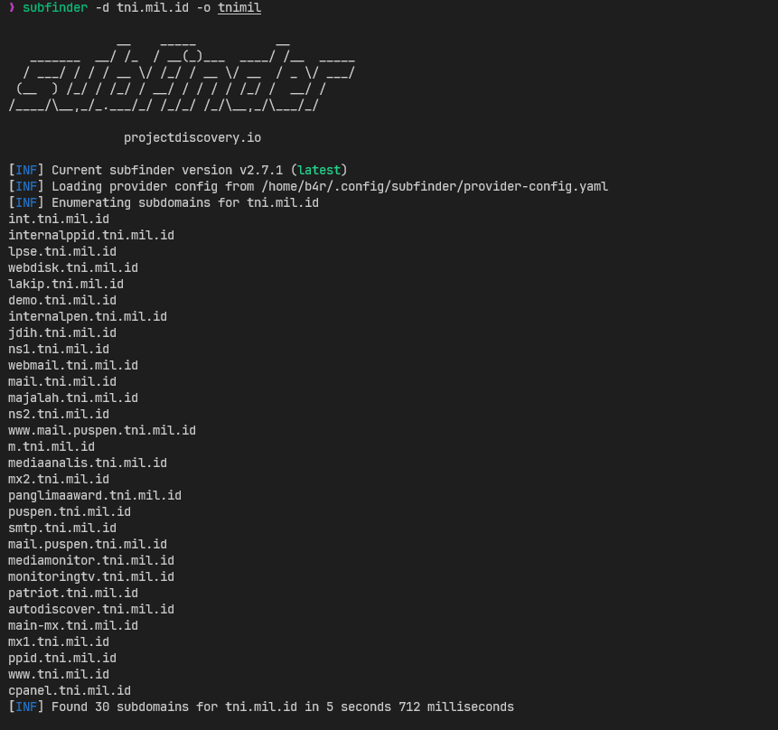
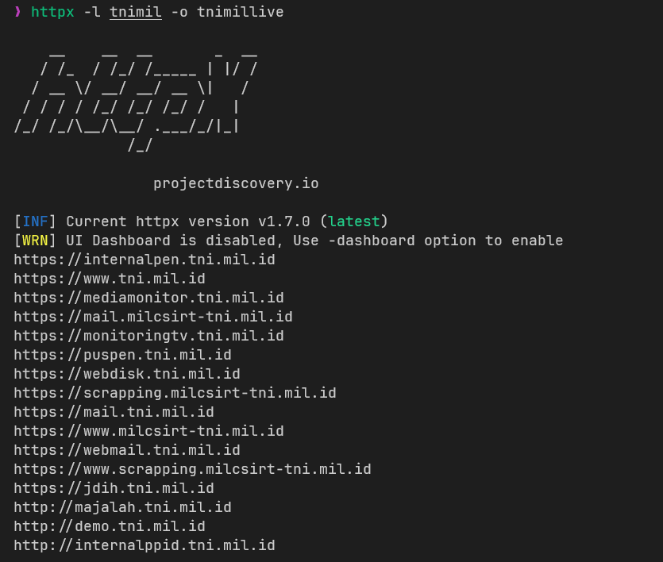
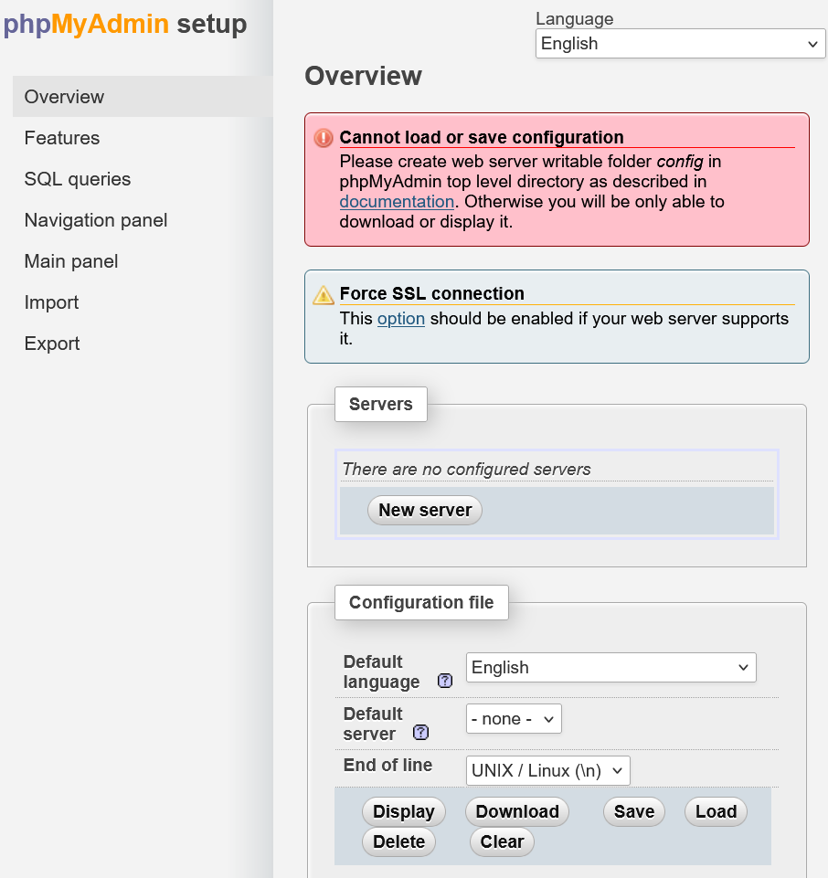
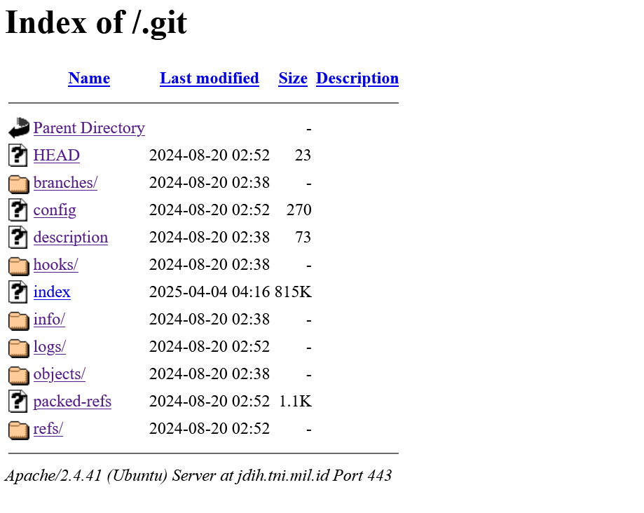
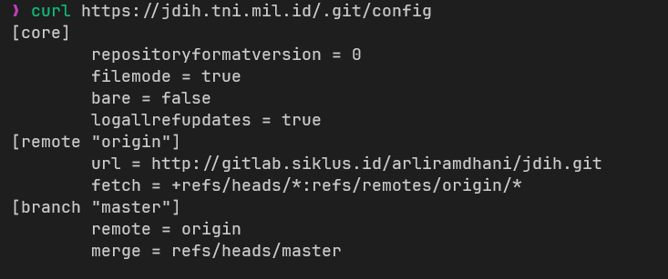
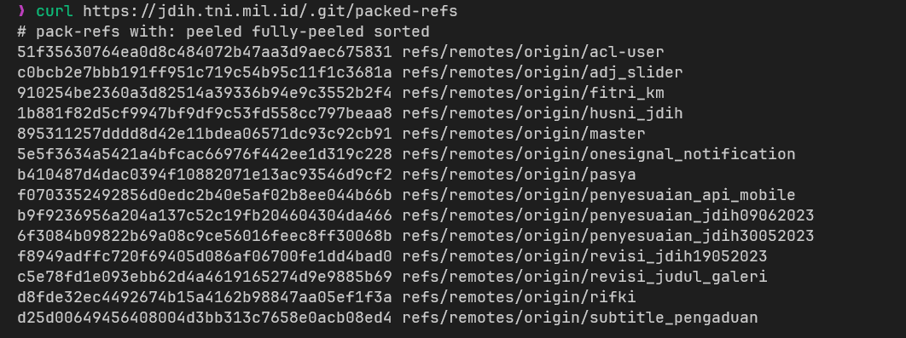
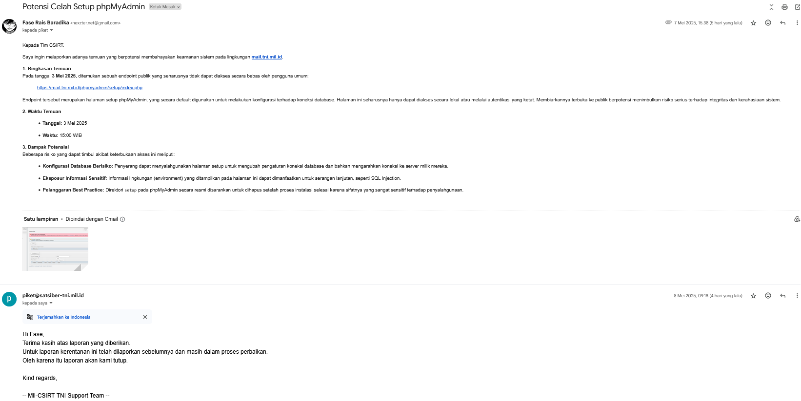
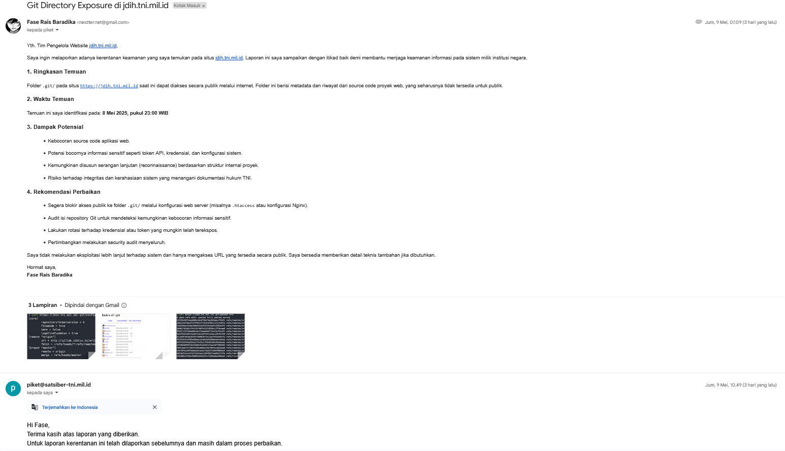

So a week ago, i just found some posts in Instagram about CSIRT TNI, they made like bug bounty program (smth like that), and i feel intereseted, so i just find out about the website target (TNI domain)

first, i'm using `Subfinder` tool, to give me the all subdomains in TNI domain

and there is 30 subdomains, then i use `httpX` to filtering the live subdomains

and there is 16 subdomains, so i just start bug hunting, and after half day of hunting, i found 1 `medium` and 1 `high` vuln ranking (atleast thats what afrog said)

### medium vuln
i found `/phpmyadmin/setup/` in `mail` subdomain, its medium cus u can set the connection of the server database to your own, 

### high vuln
for the `high` vuln, i found it in `jdih` subdomain, i found the git direcotry (git leak/git exposure), 

this is the config,

and this the packed-refs

it is high, cus.... (i guess you dont need to ask) this is as same as saying this website is open source, u can leak the website source code, and it is dangerous if there was API key, some login creds, and system configuration

### conclusion
both vuln is about miss configuration of the website, the `medium` one is violates best practices, cus in the documentation is says to delete the `setup` directory after installation, but they dont.

and for the `high` one, as i says before, and it is serious vulnerability if i can access the gitlab ;-;, but i cannot, idk why.

Also i reported both to the `CSIRT`, 

but both got duped (DAWGGGGGGGG 💀💀💀💀), someone before me reported it, but they dont even fix it, like dawg, u just need to delete the `setup` directory and block public access of the `.git` directory

i think cus most of the `CSIRT` member is boomer 💀💀💀, and yea thats it, thanks for reading (its really waste of my time dawg)