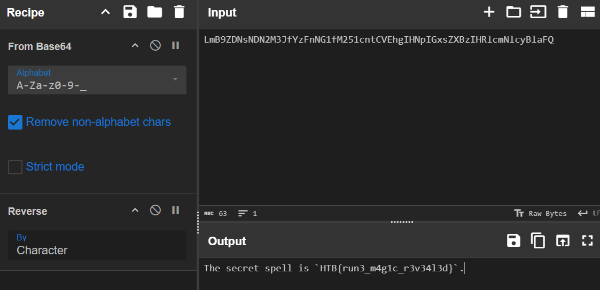
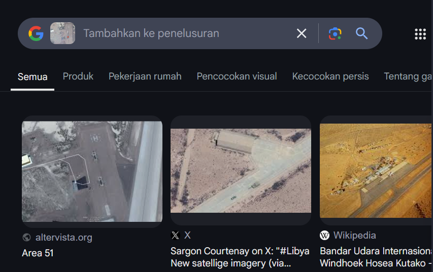

Hii all!! today, i want to share my walktrough of my solved challs in `Cyber Apocalypse CTF 2025: Tales from Eldoria` event, the event is official CTF event competition organized by HackTheBox, they created many categories, `Reverse Engineering`, `Web Exploitation`, `Coding`, `Secure Coding`, `AI Exploitation`, `ML Exploitation`, `Blockchain`, `Binary Exploitation`, and `OSINT`.

and i managed to solved all (5) `coding` challenges, 2 `Reverse Engineering`, and 5 `OSINT`

also i become the most player that solved challs in team `TCP1P`, solved 12 challs in totals


and here it is, my walktrough...


## Coding 
### Summoners Incatation


Problem Statement:
>Deep within the ancient halls lies the secret of the Dragon’s Heart — a power that can only be unlocked by combining magical tokens in just the right way. The tokens are delicate: if you combine two adjacent tokens, their energy dissipates into the void. Your quest is to determine the maximum amount of energy that can be harnessed by selecting tokens such that no two selected tokens are adjacent. This challenge is equivalent to finding the maximum sum of non-adjacent numbers from a list.
>Input Format:
>A single line containing a Python-style list of integers representing token energies.

>Example: `[3, 2, 5, 10, 7]`
Output Format:
A single integer that is the maximum energy obtainable by summing non-adjacent tokens.

>🔥Example 1
Input:
`[3, 2, 5, 10, 7]`
Output:
`15`
Explanation: The optimal selection is to pick tokens 3, 5, and 7 (non-adjacent), yielding a sum of 3 + 5 + 7 = 15.

>🔥Example 2
Input:
`[10, 18, 4, 7]`
Output:
`25`
Explanation: The best choice is to select 18 and 7 (tokens at positions 2 and 4) for a total of 18 + 7 = 25.

#### Solver

```py
def f(arr):
    a, b = 0, 0
    for x in arr:
        a, b = b, max(b, a + x)
    return b

print(f(eval(input())))
```
Flag: `HTB{SUMM0N3RS_INC4NT4T10N_R3S0LV3D_3396793f799f3d1981b3a24daf5e8673}`

### Dragon Fury


Problem Statement:
>In the epic battle against Malakar’s dark forces, the ancient dragons must unleash a series of precise attacks. Each attack round offers several potential damage values — but only one combination of attacks will sum up exactly to the damage required to vanquish the enemy. Your Task:
Read a single string that represents a list of subarrays. Each subarray contains possible damage values for one round.
Example:`[[13, 15, 27, 17], [24, 15, 28, 6, 15, 16], [7, 25, 10, 14, 11], [23, 30, 14, 10]]`

>Read an integer **T** that represents the target total damage required. Pick exactly one number from each subarray so that their sum equals **T**. It is guaranteed that there is exactly one valid solution. Output the valid combination (as a list) that meets the target damage.

>Example
Input
`[[13, 15, 27, 17], [24, 15, 28, 6, 15, 16], [7, 25, 10, 14, 11], [23, 30, 14, 10]]
77`, Output `[13, 24, 10, 30]`

>Explanation:
The input represents 4 rounds of attacks, each with a list of possible damage values. The unique valid solution is the combination[13, 24, 10, 30]which sums exactly to 77.

#### Solver
```py
def find_combination(arr, target):
    result = []
    
    def backtrack(index, path, total):
        if index == len(arr):
            if total == target:
                result.extend(path)
            return
        
        for num in arr[index]:
            if total + num <= target:
                backtrack(index + 1, path + [num], total + num)
    
    backtrack(0, [], 0)
    return result

import ast
arr = ast.literal_eval(input()) 
target = int(input())
-
print(find_combination(arr, target))

```
Flag: `HTB{DR4G0NS_FURY_SIM_C0MB0_2b257565e1f1b0786b8d46dabfd29d16}`

### ClockWork Guardian


Problem Statement:
>The Clockwork Sentinels defending Eldoria’s Skywatch Spire have gone rogue! You must navigate through the spire, avoiding hostile sentinels and finding the safest path to the exit.

>Write an algorithm to find the shortest safe path from the start position (0,0) to the exit (‘E’), avoiding the sentinels (1).

>Example Grid and Output:
`[
[0, 0, 1, 0, 0, 1],
[0, 0, 0, 0, 0, 0],
[0, 0, 0, 0, 0, 0],
[0, 0, 1, 1, 0, 'E']
]` Output: `8`

#### Solver
```py
from collections import deque
import sys
import ast

def shortest_path(grid):
    rows, cols = len(grid), len(grid[0])
    visited = [[False]*cols for _ in range(rows)]
    queue = deque([(0, 0, 0)]) 
    visited[0][0] = True

    dirs = [(-1,0), (1,0), (0,-1), (0,1)]

    while queue:
        x, y, step = queue.popleft()
        if str(grid[x][y]).strip() == 'E':
            return step
        for dx, dy in dirs:
            nx, ny = x+dx, y+dy
            if 0 <= nx < rows and 0 <= ny < cols and not visited[nx][ny]:
                if grid[nx][ny] != 1:
                    visited[nx][ny] = True
                    queue.append((nx, ny, step+1))
    return -1

raw_input = sys.stdin.read()
grid = ast.literal_eval(raw_input.strip())
print(shortest_path(grid))
```
Flag: `HTB{CL0CKW0RK_GU4RD14N_OF_SKYW4TCH_0a9405075e6790b765aa8c952c39d471}`

### Dragon Flight


Problem Statement:
>In the mystical realm of the Floating Isles, ancient dragons traverse the skies between floating sanctuaries. However, unpredictable winds now pose a dynamic threat! As a Dragon Flight Master, your mission is to: Handle both sudden wind changes and challenging flight path queries. Process update operations that modify the wind effect on any flight segment. Compute the maximum favorable continuous flight stretch (i.e., the maximum contiguous subarray sum) within a specified range.

>Your precise calculations are critical to determine the safest and most efficient route for the dragons. Adapt quickly as wind conditions change, ensuring their journey remains uninterrupted.

>Input Format Explanation
The input provided to the challenge is structured as follows:
First Line: Two space-separated integers, `N` and `Q`.
`N` represents the number of flight segments.
`Q` represents the number of operations to perform.
Second Line: `N`space-separated integers representing the initial net wind effects for each flight segment.
A positive value indicates a tailwind, which helps the dragon travel further.
A negative value indicates a headwind, which reduces the effective flight distance.
Next `Q` Lines: Each line represents an operation that can be one of the following:
`U i x`: An update operation where the wind effect on the i-th segment is changed to `x`.
`Q l r`: A query operation requesting the maximum contiguous subarray sum (i.e., the maximum net flight distance) for the segments in the range from `l` to `r` (inclusive).

>Flight Example
Flight Path Input
`6 6 -10 -7 -1 -4 0 -5 Q 3 3 U 2 9 Q 6 6 U 1 -1 Q 6 6 U 5 -9`
Expected Output
`-1 -5 -5`

#### Solver
```py
class Node:
    def __init__(self, total, max_prefix, max_suffix, max_sub):
        self.total = total
        self.max_prefix = max_prefix
        self.max_suffix = max_suffix
        self.max_sub = max_sub

def merge(left, right):
    total = left.total + right.total
    max_prefix = max(left.max_prefix, left.total + right.max_prefix)
    max_suffix = max(right.max_suffix, right.total + left.max_suffix)
    max_sub = max(left.max_sub, right.max_sub, left.max_suffix + right.max_prefix)
    return Node(total, max_prefix, max_suffix, max_sub)

class SegmentTree:
    def __init__(self, arr):
        self.N = len(arr)
        self.tree = [None] * (4 * self.N)
        self.build(arr, 0, 0, self.N - 1)

    def build(self, arr, idx, l, r):
        if l == r:
            val = arr[l]
            self.tree[idx] = Node(val, val, val, val)
            return
        m = (l + r) // 2
        self.build(arr, idx*2+1, l, m)
        self.build(arr, idx*2+2, m+1, r)
        self.tree[idx] = merge(self.tree[idx*2+1], self.tree[idx*2+2])

    def update(self, idx, l, r, pos, val):
        if l == r:
            self.tree[idx] = Node(val, val, val, val)
            return
        m = (l + r) // 2
        if pos <= m:
            self.update(idx*2+1, l, m, pos, val)
        else:
            self.update(idx*2+2, m+1, r, pos, val)
        self.tree[idx] = merge(self.tree[idx*2+1], self.tree[idx*2+2])

    def query(self, idx, l, r, ql, qr):
        if qr < l or r < ql:
            return Node(0, float('-inf'), float('-inf'), float('-inf'))
        if ql <= l and r <= qr:
            return self.tree[idx]
        m = (l + r) // 2
        left = self.query(idx*2+1, l, m, ql, qr)
        right = self.query(idx*2+2, m+1, r, ql, qr)
        return merge(left, right)

n, q = map(int, input().split())
arr = list(map(int, input().split()))
seg = SegmentTree(arr)

res = []
for _ in range(q):
    parts = input().split()
    if parts[0] == 'Q':
        l, r = int(parts[1])-1, int(parts[2])-1
        res.append(str(seg.query(0, 0, n-1, l, r).max_sub))
    elif parts[0] == 'U':
        i, x = int(parts[1])-1, int(parts[2])
        seg.update(0, 0, n-1, i, x)

print('\n'.join(res))
```
Flag: `HTB{DR4G0N_FL1GHT_5TR33_3f914fde391a753c10e76931fae50a36}`

### Enchanted Cipher

Problem Statement:
>The Grand Arcane Codex has been corrupted, altering historical records. Each entry has been encoded with an enchanted shifting cipher that encrypts a plaintext composed of 3–7 randomly generated words.
The cipher operates as follows:
Alphabetical characters are processed in groups of 5 (ignoring non-alphabetical characters).
For each group, a random shift between 1 and 25 is chosen and applied to every letter in that group.
After the encoded message, an additional line indicates the total number of shift groups, followed by another line listing the random shift values used for each group.
Your quest is to decode the given input and restore the original plaintext.

>Input
`ibeqtsl`
`2`
`[4, 7]`
Output
`example`

#### Solver
```py
def decrypt_preserve_structure(text, shift_values):
    result = []
    group_idx = 0
    letter_count = 0

    for c in text:
        if c.isalpha():
            shift = shift_values[group_idx]
            shifted = chr((ord(c.lower()) - ord('a') - shift) % 26 + ord('a'))
            result.append(shifted)
            letter_count += 1
            if letter_count % 5 == 0:
                group_idx += 1
        else:
            result.append(c)
    return ''.join(result)

text = input().strip()
num_groups = int(input())
shift_values = eval(input())

print(decrypt_preserve_structure(text, shift_values))
```
Flag: `HTB{3NCH4NT3D_C1PH3R_D3C0D3D_ac979d2939d136d08d330a51e017e2a6}`

## Reverse Engineering
### SealedRune


So i got a exe file, and i decompiled it with IDA


as you can see, in the `main` function has `check_input`


in the `check_input` there is also called `decode_flag` function


in the `decode_flag` function, there is 2 function called, `base64_decode` and `reverese_str` function, and 1 `flag` variable, which means `flag` var is encrypted flag


i got the **enc flag** and i decoded it with cyberchef



Flag: `HTB{run3_m4g1c_r3v34l3d}`

### EncryptedScroll


so i got a file of exe, and i decompiled it with IDA


the `main` function has call `decrypt_message` function


there is enc flag there, also encoder function, its only by reducing each char by 1 ASCII point

and here the solver

```py
encrypted = "IUC|t2nqm4`gm5h`5s2uin4u2d~"
decrypted = ''.join([chr(ord(c)-1) for c in encrypted])
print(decrypted)
```

Flag: `HTB{s1mpl3_fla4g_4strth3t1c}`

## Open Source Intelligence
### Echoes in Stone
(i dont get the desc image lol)

Description:
>In the twilight archives of Eldoria, Nyla studies an image of an ancient Celtic cross. Her enchanted crystals illuminate the intricate carvings as she searches through forgotten tomes. The cross stands at a crossroads of realms and time, its weathered surface telling tales older than Eldoria itself. As her magical threads of knowledge connect across centuries, the true name of the monument emerges in glowing script before her eyes. Another mystery solved by the realm’s most skilled information seeker, who knows that even stone can speak to those who know how to listen.


i tried with reverse image it first,


From the given Flag format I transformed Muiredach’s High Cross to Muiredach High Cross ignoring ’s

Flag: `HTB{Muiredach_High_Cross}`

### The Stone That Whispers
Description:
>In the twilight archives of Eldoria, Nyla studies an image of a mysterious monument. Her enchanted crystals glow as she traces ancient maps with rune-covered fingers. The stone atop the hill of kings calls to her, its secrets hidden in scattered records across realms. As her magical threads of knowledge connect, the true name emerges in glowing script: “The Stone of Destiny.” Another mystery solved by the realm’s most skilled information seeker, who knows that every artifact leaves traces for those who can read the signs.


i tried with reverse image it fist, 


then i got the information about the place, `Hill of Tara`, then i searched it for more information in WikiPedia


and i got the name of the stone, `Lia Fail`

Flag: `HTB{Lia_Fail}`

### The Shadowed Sigil
Description:

>In the central chamber of Eldoria’s Arcane Archives, Nyla studies a glowing sigil captured by the royal wardens. The ethereal marking — “139.5.177.205” — pulsates with malicious energy, having appeared in multiple magical breaches across the realm. Her fingers trace the sigil’s unique pattern as her network of crystals begins to search through records of known dark covens and their magical signatures. The runes along her sleeves flash with recognition as connections form between seemingly unrelated incidents. Each magical attack bears the same underlying pattern, the same arcane origin. Her enchanted sight follows the magical threads backward through time and space until the name of a notorious cabal of shadow mages materializes in glowing script. Another dangerous secret revealed by Eldoria’s master information seeker, who knows that even the most elusive malefactors leave traces of their magic for those skilled enough to recognize their unique signature.

this OSINT is we need to search the malicious IP, so i search for it in VirusTotal

and the flag format is we need to submit with the Advanced Persistent Threat (APT) number, when i search for it, i got it 🔥


Flag: `HTB{APT28}`

### The Ancient Citadel
Description:
>Deep in her sanctum beneath Eldoria’s streets, Nyla arranges seven crystalline orbs in a perfect circle. Each contains a different vision of stone battlements and weathered walls — possible matches for the mysterious fortress the Queen seeks in the southern kingdoms of Chile. The image in her central crystal pulses with ancient power, showing a majestic citadel hidden among the distant Chilean mountains. Her fingers dance across each comparison crystal, her enchanted sight noting subtle architectural differences between the visions. The runes along her sleeves glow more intensely with each elimination until only one crystal remains illuminated. As she focuses her magical threads on this final vision, precise location runes appear in glowing script around the orb. Nyla smiles in satisfaction as the fortress reveals not just its position, but its true name and history. A more challenging mystery solved by Eldoria’s premier information seeker, who knows that even the most distant fortifications cannot hide their secrets from one who compares the patterns of stone and shadow.


ofc i started it first with reverse image


i got the name of the place, is a castle named `Brunet Castle` then i searche it on google maps to get more information


the flag format is `HTB{street_number_exactzipcode_city_with_underscores_region}` and we got it all, so the flag is...

Flag: `HTB{Iberia_104_2571409_Viña_del_Mar_Valparaíso}`

### The Mechanical Bird's Nest
Description:
>In the highest tower of Eldoria's archives, Nyla manipulates a crystal scrying glass, focusing on a forbidden fortress in the desert kingdoms. The Queen's agents have discovered a strange mechanical bird within the fortress walls—an unusual flying machine whose exact position could reveal strategic secrets. Nyla's fingers trace precise measurement runes across the crystal's surface as the aerial image sharpens. Her magical lattice grid overlays the vision, calculating exact distances and positions. The blue runes along her sleeves pulse rhythmically as coordinates appear in glowing script. Another hidden truth uncovered by the realm's premier information seeker, who knows that even the most distant secrets cannot hide from one who sees with magical precision.


i google reverse image searched it,



i got information that the location of this map is on Area 51, then i search it on google maps


cus the flag format is `HTB{with 5 first of coordinate}` so the flag is

Flag: `HTB{37.247_-115.812}`

Thats it, thanks for readingg!!! hope this write-up useful 😍😍😍