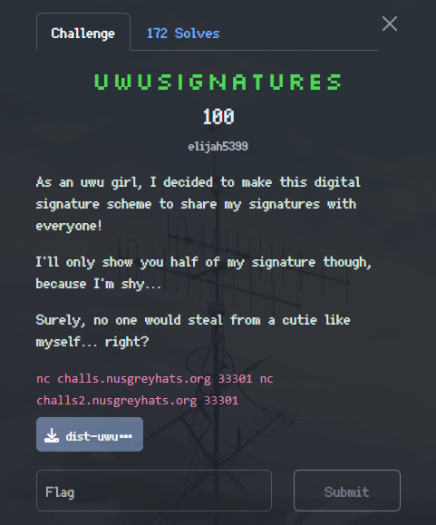
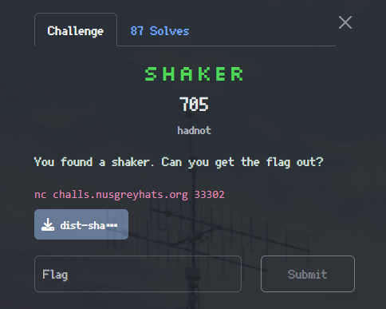

>`GreyCTF 2025 Qualifiers` is a CTF (Capture The Flag) event hosted by an information security student group from the National University of Singapore.

On Saturday, May 31, 2025, I participated in GreyCTF 2025 with TCP1P, and I managed to solve 3 Crypto, 1 Forensic, and 1 Reverse Engineering challenges.

## Cryptography
### Tung Tung Tung Sahur


After unzipping the zip file, we got 2 files, `tung_tung_tung_sahur.py` and `output.txt`

`tung_tung_tung_sahur.py`:
```py
from Crypto.Util.number import getPrime, bytes_to_long

flag = "grey{flag_here}"

e = 3
p, q = getPrime(512), getPrime(512)
N = p * q
m = bytes_to_long(flag.encode())
C = pow(m,e)

assert C < N
while (C < N):
    C *= 2
    print("Tung!")

# now C >= N

while (C >= N):
    C -= N
    print("Sahur!")


print(f"{e = }")
print(f"{N = }")
print(f"{C = }")
```
`output.txt`:
```
Tung!
Tung!
Tung!
Tung!
Tung!
Tung!
Tung!
Tung!
Tung!
Tung!
Tung!
Tung!
Tung!
Tung!
Tung!
Tung!
Tung!
Tung!
Tung!
Tung!
Tung!
Tung!
Tung!
Tung!
Tung!
Tung!
Tung!
Tung!
Tung!
Tung!
Tung!
Tung!
Tung!
Tung!
Tung!
Tung!
Tung!
Tung!
Tung!
Tung!
Tung!
Tung!
Tung!
Tung!
Tung!
Tung!
Tung!
Tung!
Tung!
Tung!
Tung!
Tung!
Tung!
Tung!
Tung!
Tung!
Tung!
Tung!
Tung!
Tung!
Tung!
Tung!
Tung!
Tung!
Tung!
Tung!
Tung!
Tung!
Tung!
Tung!
Tung!
Tung!
Tung!
Tung!
Tung!
Tung!
Tung!
Tung!
Tung!
Tung!
Tung!
Tung!
Tung!
Tung!
Tung!
Tung!
Tung!
Tung!
Tung!
Tung!
Tung!
Tung!
Tung!
Tung!
Tung!
Tung!
Tung!
Tung!
Tung!
Tung!
Tung!
Tung!
Tung!
Tung!
Tung!
Tung!
Tung!
Tung!
Tung!
Tung!
Tung!
Tung!
Tung!
Tung!
Tung!
Tung!
Tung!
Tung!
Tung!
Tung!
Tung!
Tung!
Tung!
Tung!
Tung!
Tung!
Tung!
Tung!
Tung!
Tung!
Tung!
Tung!
Tung!
Tung!
Tung!
Tung!
Tung!
Tung!
Tung!
Tung!
Tung!
Tung!
Tung!
Tung!
Tung!
Tung!
Tung!
Tung!
Tung!
Tung!
Tung!
Tung!
Tung!
Tung!
Tung!
Tung!
Tung!
Tung!
Tung!
Tung!
Tung!
Tung!
Tung!
Tung!
Sahur!
e = 3
N = 140435453730354645791411355194663476189925572822633969369789174462118371271596760636019139860253031574578527741964265651042308868891445943157297334529542262978581980510561588647737777257782808189452048059686839526183098369088517967034275028064545393619471943508597642789736561111876518966375338087811587061841
C = 49352042282005059128581014505726171900605591297613623345867441621895112187636996726631442703018174634451487011943207283077132380966236199654225908444639768747819586037837300977718224328851698492514071424157020166404634418443047079321427635477610768472595631700807761956649004094995037741924081602353532946351
```
### Summary
#### 1. Understanding the Initial Encryption Process
The `tung_tung_tung_sahur.py` performs a slightly modified RSA encryption.

* The flag is converted into an integer `m`: `m = bytes_to_long(flag.encode())`

* The initial ciphertext is calculated as `C_initial = pow(m, e)`, with `e = 3`

* The script then `asserts assert C_initial < N`. This is crucial because it indicates that `m^e` (before the standard RSA modulo `N` operation) is indeed smaller than `N`. The variable `C` in the script is initialized with this `C_initial`

#### 2. Analyzing the "Tung!" Loop
```py
assert C < N
while (C < N):
    C *= 2
    print("Tung!")
```
This loop takes `C` (which was initially `m^e`) and repeatedly multiplies it by 2 until `C >= N`

If "Tung!" is printed `k` times(from `output.txt`, we know `k = 140`), then the value of `C` after this loop is:
$
C aftertung​=(me)⋅2k
$

#### 3. Analyzing the "Sahur!" Loop
```py
# now C >= N
while (C >= N):
    C -= N
    print("Sahur!")
print(f"{C = }") # This is C_final from output.txt
```
This loop essentially performs a modulo operation. `C` is repeatedly reduced by `N` until `C < N`. The value of `C` printed at the end of the script (`C_final` in our solver) is the result of $Caftertung​(mod N)$.

If "Sahur!" is printed `S` times (from `output.txt`, we know `s = 1`), this implies that $Caftertung​$ was in range [$s⋅N,(s+1)⋅N−1$] relative $Cfinal$. More precisely: \
$Caftertung = Cfinal + s⋅N$ \
Since `s = 1` (there's only one "Sahur!"), then:\
$Caftertung = Cfinal + N$

By combining the result from both loops, we get:\
$(m^e)⋅2^k = Cfinal+s⋅N$

### Solve
To find `m`, Let's isolate $m^e$:\
$m^e=\frac{Cfinal​+s⋅N} {2^k}​$ \
Since all values on the right-hand side are int, and $m^e$ must also be an int, this division is an int divison (floor division)

After obtaining the value of $m^e$:

1. Use the values `e = 3`, `N`, and `C_final` provided in `output.txt`.

2. Determine `k = 140` (number of "Tung!" prints) and `s = 1` (number of "Sahur!" prints) from output.txt.

3. Calculate $m^e=(Cfinal​+1⋅N)//(2^{140})$.
    
4. Take the `e`-th root (i.e., cube root) of the resulting $m^e$ to get `m`. The function `gmpy2.iroot(value, root_degree)` is ideal for this as it finds integer roots.
    
5. Convert the integer `m` back into bytes using `long_to_bytes()` to reveal the flag.

`Solver.py`:
```py
from Crypto.Util.number import long_to_bytes
import gmpy2 

e = 3
N = 140435453730354645791411355194663476189925572822633969369789174462118371271596760636019139860253031574578527741964265651042308868891445943157297334529542262978581980510561588647737777257782808189452048059686839526183098369088517967034275028064545393619471943508597642789736561111876518966375338087811587061841
C_final = 49352042282005059128581014505726171900605591297613623345867441621895112187636996726631442703018174634451487011943207283077132380966236199654225908444639768747819586037837300977718224328851698492514071424157020166404634418443047079321427635477610768472595631700807761956649004094995037741924081602353532946351

num_tung = 140
num_sahur = 1
C_after_tung = C_final + num_sahur * N
m_pow_e = C_after_tung // (2**num_tung)
m, is_perfect_root = gmpy2.iroot(m_pow_e, e)
assert is_perfect_root root

flag = long_to_bytes(int(m)) 
print(flag.decode())
```
Flag: `grey{tUn9_t00nG_t0ONg_x7_th3n_s4hUr}`

### UWUSIGNATURES



We got a zip file and 2 netcat server addres, after unzipping the zip file, we got a file named `uwusignatures.py` 

`uwusignatures.py`:
```py
❯ cat uwusignatures.py
from Crypto.Util.number import *
import json
import hashlib

KEY_LENGTH = 2048
FLAG = "grey{fakeflagfornow}"

class Uwu:
    def __init__(self, keylen):
        self.p = getPrime(keylen)
        self.g = getRandomRange(1, self.p)
        self.x = getRandomRange(2, self.p) # x is private key
        self.y = pow(self.g, self.x, self.p) # y is public key
        self.k = getRandomRange(1, self.p)
        while GCD(self.k, self.p - 1) != 1:
            self.k = getRandomRange(1, self.p)
        print(f"{self.p :} {self.g :} {self.y :}")
        print(f"k: {self.k}")
    def hash_m(self, m):
        sha = hashlib.sha256()
        sha.update(long_to_bytes(m))
        return bytes_to_long(sha.digest())
    def sign(self, m):
        assert m > 0
        assert m < self.p
        h = self.hash_m(m)
        r = pow(self.g, self.k, self.p)
        s = ((h - self.x * r) * pow(self.k, -1, self.p - 1)) % (self.p - 1)
        return (r, s)
    def verify(self, m, signature):
        r, s = signature
        assert r >= 1
        assert r < self.p
        h = self.hash_m(m)
        lhs = pow(self.g, h, self.p)
        rhs = (pow(self.y, r, self.p) * pow(r, s, self.p)) % self.p
        return lhs == rhs

def main():
    print("Welcome to my super uwu secure digital signature scheme!")
    uwu = Uwu(KEY_LENGTH)
    sign_count = 0
    while True:
        print("1. Show me some of your cutesy patootie signatures!")
        print("2. Get some of my uwu signatures (max 2)")
        choice = int(input("> "))
        if choice == 1:
            data = json.loads(input("Send me a message and a signature: "))
            m, r, s = data["m"], data["r"], data["s"]
            if m == bytes_to_long(b"gib flag pls uwu"):
                if uwu.verify(m, (r, s)):
                    print("Very cutesy, very mindful, very demure!")
                    print(FLAG)
                    exit()
                else:
                    print("Very cutesy, but not very mindful")
                    exit()
            else:
                print("Not very cutesy")
                exit()
        elif choice == 2:
            if sign_count >= 2:
                print("Y-Y-You'd steal from poor me? U_U")
                exit()
            data = json.loads(input("Send me a message: "))
            m = data["m"]
            if type(m) is not int or m == bytes_to_long(b"gib flag pls uwu"):
                print("Y-Y-You'd trick poor me? U_U")
                exit()
            r, s = uwu.sign(m)
            print(f"Here's your uwu signature! {s :}")
            sign_count += 1
        else:
            print("Not very smart of you OmO")
            exit()

if __name__ == "__main__":
    main()%           cat 
```
### Summary
This challenge, `"UwuSignatures"` involved exploiting a flaw in a custom ElGamal-like digital signature scheme to forge a signature for a specific message and retrieve the flag.

The server implements a signature scheme with the following characteristics:

* Parameters & Keys:
    * `p`: A 2048-bit prime.
    * `g`: A random generator modulo `p`.
    * `x`: The private key, chosen randomly.
    * `y`: The public key, $y≡g^x(modp)$.

* Nonce `k`:
    * A nonce `k` is generated once per Uwu class instance
    * It's chosen such that `GCD(k, p - 1) = 1`, meaning $k−1(modp−1)$ exists

* Signing Process:
    * `h = SHA256(m)` (converted to an integer)
    * `r = pow(g, k, p)`
    * $s = ((h - x \cdot r) \cdot \text{pow}(k, -1, p - 1)) \pmod{p - 1}$

* Verification Process: A signature `(r, s)` for a message `m`(with hash `h`) is valid if $g^h = y^r ⋅ r^s (mod p) $. This is a standard verification equation for ElGamal signatures

### Solve
First, we need receive the public parameters `p`, `g`, `y` and leaked nonce `k`

2. Obtain One Signature on a Chosen Message:
    * Choose an arbitary message `m_0` that isnt the forbidden one(e.g., `m_0 = 42`)
    * Use Option 2 to ask the server to sign `m_0`, the server returns `s_0`
    * Calculate $r_0 = \text{pow}(g, k, p)$ since `k`(and `g`, `p`) are known, we can compute `r_0`. This `r_0` will be the same for any signature generated during this session because `k` is fixed.
    * Calculate the hash $h_0 = \text{SHA256}(m_0)$

3. Recover the Private Key `x`:
    * We have the equation: $s_0​≡(h_0​−x⋅r_0​)k^{−1}(modp−1)$
    * To solve for `x`: $s_0​⋅k≡h_0​−x⋅r_0​(modp−1) x⋅r_0​≡h_0​−s_0​⋅k(modp−1) x ≡(h_0​−s_0​⋅k)⋅r_0^−1​(modp−1)$
    * All values on the right(`h_0`, `s_0`, `k`, `r_0`, `p-1`) are known. Compute $r_0^-1(mod p-1$ and then `x`

4. Forge the Signature for the Target Message:
    * The target message is $m_1 = \text{b"gib flag pls uwu"}$
    * Calculate its hash $h_1 = \text{SHA256}(m_1)$
    * The `r` component for this forged signature (`r_1`) will be the same as `r_0` cus `k` is reused $r_1 = r_0$
    * Using the recovered private key `x`, calculate the corresponding `s_1`: $s_1 \equiv (h_1 - x \cdot r_1)k^{-1} \pmod{p-1}$

5. Submit and win

`Solver.py`:
```py
from pwn import remote
import hashlib
import json

def bytes_to_long(b: bytes) -> int:
    return int.from_bytes(b, byteorder='big')

def modinv(a: int, m: int) -> int:
    return pow(a, -1, m)

def read_until_three_ints(io):
    while True:
        line = io.recvline(timeout=5).decode('utf-8', errors='ignore').strip()
        parts = line.split()
        if len(parts) == 3 and all(p.isdigit() for p in parts):
            return list(map(int, parts))

def read_until_nonce_k(io):
    while True:
        line = io.recvline(timeout=5).decode('utf-8', errors='ignore').strip()
        if line.startswith("k:"):
            try:
                return int(line.split("k:")[1].strip())
            except ValueError:
                continue.

def read_until_menu(io):
    while True:
        line = io.recvline(timeout=5).decode('utf-8', errors='ignore')      
        if line.startswith("2."):
            return

def main():
    io = remote('challs2.nusgreyhats.org', 33301)
    p, g, y = read_until_three_ints(io)
    k = read_until_nonce_k(io)
    read_until_menu(io)
    io.sendline(b'2')
    io.recvuntil(b"Send me a message:", timeout=5)
    m0 = 42
    io.sendline(json.dumps({ "m": m0 }).encode())
    line = io.recvline(timeout=5).decode().strip()
    try:
        s0 = int(line.split()[-1])
    except Exception:
        print("Failed to parse s0 from:", repr(line))
        return
    r = pow(g, k, p)
    h0 = int.from_bytes(
        hashlib.sha256(
            m0.to_bytes((m0.bit_length() + 7)//8, 'big')
        ).digest(),
        'big'
    )

    lhs = (s0 * k) % (p - 1)
    inv_r = modinv(r, p - 1)
    x = ((h0 - lhs) * inv_r) % (p - 1)
    forbidden = b"gib flag pls uwu"
    m1 = bytes_to_long(forbidden)
    h1 = int.from_bytes(hashlib.sha256(forbidden).digest(), 'big')

    inv_k = modinv(k, p - 1)
    s1 = ((h1 - x * r) * inv_k) % (p - 1)

    read_until_menu(io)

    io.sendline(b'1')
    io.recvuntil(b"Send me a message and a signature:", timeout=5)

    sig_payload = { "m": m1, "r": r, "s": s1 }
    io.sendline(json.dumps(sig_payload).encode())
    print(io.recvall(timeout=5).decode('utf-8', errors='ignore'))

if __name__ == '__main__':
    main()
```
Flag: `grey{h_h_H_h0wd_y0u_Do_tH4T_OMO}`

### Shaker


We got a netcat server address and a zip file, extract the zip and i got python code named `shaker.py`


`Shaker.py`:
```py
import random
import hashlib 

class Shaker:

    def __init__(self, state):
        self.state = state
        self.x = random.randbytes(64)
        self.p = [i for i in range(64)]
        random.shuffle(self.p)

    def permute(self):
        self.state = [self.state[_] for _ in self.p]

    def xor(self):
        self.state = [a^b for a,b in zip(self.state, self.x)]

    def shake(self):
        self.xor()
        self.permute()

    def reset(self):
        random.shuffle(self.p)
        self.shake()

    def open(self):
        self.xor()
        return self.state

with open("flag.txt", "r") as f:
    flag = f.read().encode()

assert(len(flag) == 64)
assert(hashlib.md5(flag).hexdigest() == "4839d730994228d53f64f0dca6488f8d")
s = Shaker(flag)

ct = 0
MAX_SHAKES = 200
MENU = """Choose an option:
1. Shake the shaker
2. See inside
3. Exit
> """

while True:
    choice = input(MENU)
    if choice == '1':
        if (ct >= MAX_SHAKES):
            print("The shaker broke...")
            exit(0)
        s.shake()
        ct += 1
        print(f"You have shaken {ct} times.")

    if choice == '2':
        ret = s.open()
        s.reset()
        print(f"Result: {bytes(ret).hex()}")

    if choice == '3':
        exit(0)
```
### Summary 
The `shaker.py` defines a `Shaker` class with the following key components and operations:
* Initialization (`__init__`):
    * The shaker is initialized with the `flag` (64 bytes) as its initial `state`
    * A secret 64-byte random key `self.x` is generated once and remains constant
    * A permutation `self.p` (an array of indices from 0 to 63) is randomly shuffled

* Core Operations:
    * `xor()`: The current `state` is XORed byte-wise with `self.x`. $S_{new}[i] ⊕ x[i]$
    * `permute()`: The current `state` is permuted according to `self.p`. If $P$ is the permutation array, then $S_{new}[i] = S_{current}[P[i]]$

* Main Shaker Actions:
    * `shake()`: Performs an `xor()` followed by a `permute()` on the current state.\
    $S\xrightarrow{xor}S ⊕ x \xrightarrow{permute} (S ⊕ x)_P$
    * `open()`: This is how we get output. It first performs `xor()` on the current state and returns the result. $S_{current} ⊕ x$. The internal state `self.state` is updated to this `output` value
    * `reset()`: This function is called after `open()` when we request to see inside (option 2). It first re-shuffles `self.p`(generating a new permutation $P_{new}$), and then calls `shake()`

* Interaction Loop:\
The server provides two main options:

1. Shake the shaker: Calls `s.shake()`. This modifies the internal state
2. See inside:
    * Calls `s.open()`, which computes $Output = S_{beforeopen} ⊕ x$. This `output` is sent to us. The shaker's internal state `s.state` becomes $S_{beforeopen} ⊕ x$
    * Then, `s.reset()` is called:
        * A new permutation $P_{new}$ is created for `s.p`
        * `s.shake()` is called. The state it operates on is $S_{beforeopen} ⊕ x$
            * `xor` step: $(S_{beforeopen}⊕ x) ⊕ x = S_{beforeopen}$
            * `permute()` step: The state becomes $(S_{beforeopen})P_{new}$. So, after each "See inside" operation, we receive $S_{k-1}  ⊕x$ (where $S_{k-1}$ was the state before this `open` call), and the shaker's internal state for next round becomes $S_k = (S_{k-1})P_{new}$

### Solve 
The first, we must connect to the server and use option 2 (See inside) multiple times (e.g., `NUM_SAMPLES = 100`) to collect a set of outputs $O_1, O_2, ..., O_{100}$. Each $O_i$ is 64 bytes long. Then,

* Recover the XOR Key `x`:
    * For each byte position `j` from 0 to 63 (the length of `x`):
        * Iterate through all 256 possible byte values for `guess_x_byte`(out candidate for $x[j]$)
        * For the current `guess_x_byte`, check its validity: For every collected sample $O_i$ (from $i = 1$ to $100$): Calculate $candidate_flag_byte = O_i[j]$ ⊕ `guess_x_byte`. If `candidate_flag_byte` is __not__ within a predefined set of plausible flag char (e.g., `string.ascii_letters + string.digits + "{}_")`, then `guess_x_byte` is no the correct $x[j]$. Break and try the next `guess_x_byte`
        * If `guess_x_byte` satisfies the condition for all 100 samples (i.e., $O_i[j]$ ⊕ `guess_x_byte`is always a plausible flag char), then its a strong candidate for the true $x[j]$. The script stores the first such candidates found.
    * After iterating through all positions `j`, we will have recovered the full 64 byte key `x`.

* Recover the Flag:
    * Take the first output collected, $O_1$. We know $O_1 = F ⊕ x$
    * Therefore, the original flag $F$ can be recovered by computing $F = O_1 ⊕ x$, using the `recovered_X` from the previous step.

* Verify:
    * Calculate the MD5 hash of the recovered flag
    * Compare it against the target MD5 hash \
    ("4839d730994228d53f64f0dca6488f8d") 

Flag: `grey{kinda_long_flag_but_whatever_65k2n427c61ww064ac3vhzigae2qg}`


----LANJUT BESOK CIK----