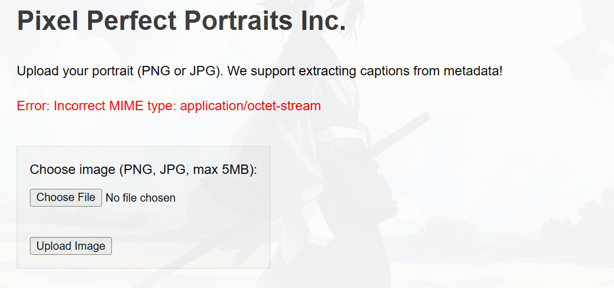

#####
>Write-up ini adalah bagian dari Write-up TJCTF 2025 dengan nama chall "hidden-canvas"

#####
Jadi, disalah satu chall `Web Exploitation` di TJCTF 2025, ada sebuah chall yang `unik` yaitu bernama `hidden-canvas`, singkatnya di web service ini, user dapat mengupload sebuah gambar

awalnya, gw mengira bahwa kita perlu menyisipkan `webshell` dengan segala teknik bypass nya, tetapi ada satu error ini yang menandakan bahwa ini kerentanan pada file upload, tapi tidak pakai `webshell`..

`Incorrect MIME type`, ini menandakan bahwa server melakukan validasi terhadap gambar yang diinputkan oleh user, jadi meskipun disini gw sudah melakukan semua jenis bypass dari menamakan webshell nya `webshell.jpg.php` sampai mengubah magic byte, tetap tidak tembus karna server memvalidasi semua content yang ada pada gambar yang diinputkan oleh user.

Jadi disini gw coba upload aja foto asal dengan penambahan variabel di metadata

lalu gw upload, dan ini response web nya

`[Caption Error: Invalid Base64 data ('utf-8' codec can't decode byte 0x93 in position 2: invalid start byte)]` ini nunjukin, bahwa server selain nge-extract extra metadata pada gambar, juga mendecode nya sebagai base64, jadi caranya adalah dengan kita mengencode dulu payload pada metadata nya dengan base64

nah berhasil, next step nya, gw udh aga firasat dari fitur fitur kaya gini, biasanya import dari modul python, so disini gw langsung nyoba payload `Server Side Template Injection`

dan berhasil, next step nya tinggal bikin payload `SSTI RCE` untuk listing current file directory

tinggal dicat deh,

Flag: `tjctf{H1dd3n_C@nv@s_D3c0d3d_4nd_R3nd3r3d!}`

