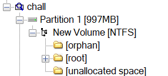

## KashiCTF 2025
So today, i just played CTF event with `TCP1P`, and we play on Kashi CTF.


We got position on 45/709 teams.

KashiCTF is CTF event organized by `IIT(BHU)CyberSec`, it is University from India, Banaras Hindu University. They created many chall categories, Webex, Reversing, Binex, Osint, Forensic, and Crypto. from all those chall, i managed to solved 1 Webex, 3 Foren, 1 Jail, and 1 Crypto.


and this is my write-up
## Web Exploitation
### SuperFastAPI
##### Desc: Made my verty first API! However I have to still integrate it with a frontend so can't do much at this point lol.
we got a web service, and this the looks like

there is no front end/UI literally, pure just fetching from API.
and of course there is no source code, and i decided to find the active directory
#### Solver

we got the endpoint on `/docs`, this is the UI looks like


as you can see, there is '/flag', but we need to make account first, after make account, if u try to get the flag, the output will like this
 

it says "only for admin", how can i get the admin role? yes, by updating ur user


and tried to add role variable, and fill it with admin


then go back to '/flag', and execute


Flag: `KashiCTF{m455_4551gnm3n7_ftw_iYTjzfu4Z}`

## Digital Forensic
### Memories Bring Back
##### Desc: A collection of images, a digital time capsule—preserved in this file. But is every picture really just a picture? A photographer once said, “Every image tells a story, but some stories are meant to stay hidden.” Maybe it’s time to inspect the unseen and find what’s been left behind.
we got a file, when i checked it


then i tried to check the partition


as you can see, then i switch to use FTK Imager



there is 3 directory in partition 1, and when u get into root directory, u will see...


those all files looks so suspicious


there is hidden file .txt in img file, but its fake flag tho, but then i tried the last one, and i got the flag
#### Solver


Flag: `KashiCTF{DF1R_g03555_Brrrr}`

### Corruption
##### Desc: A corrupt drive I see...
this is easy foren, we can just strings it then grep it
#### Solver
```bash
strings image.iso  | grep Kashi
```

Flag `KashiCTF{FSCK_mE_B1T_by_b1t_Byt3_by_byT3}`

### SNOWy Evening
##### Desc: A friend of mine , Aakash has gone missing and the only thing we found is this poem...Weirdly, he had a habit of keeping his name as the password.
so i got a .txt file, but its show nothing interest when i cat'ed it, but then i got it

its hint for stegsnow (is also in the title)
```bash
stegsnow -p Aakash -C poem.txt
```

then open the pastebin

after searching for a hour, i finally i got the decoder, its `COW Esolang`!!

Flag: `KashiCTF{Love_Hurts_5734b5f}`


## Jail
### Easy Jail
##### Desc: I made this calculator. I have a feeling that it's not safe :(
so i got the source code of the netcat service
```py
#!/usr/bin/env python3

print("           _            _       _             ")
print("          | |          | |     | |            ")
print("  ___ __ _| | ___ _   _| | __ _| |_ ___  _ __ ")
print(" / __/ _` | |/ __| | | | |/ _` | __/ _ \| '__|")
print("| (_| (_| | | (__| |_| | | (_| | || (_) | |   ")
print(" \___\__,_|_|\___|\__,_|_|\__,_|\__\___/|_|   ")

def calc(op):
	try : 	
		res = eval(op)
	except :
		return print("Wrong operation")
	return print(f"{op} --> {res}")

def main():
	while True :
		inp = input(">> ")
		calc(inp)

if __name__ == '__main__':
	main()
```
there is function eval(op) that will execute our input, and there is no filtering before, so we can exploit it, and this is the payload
#### Solver
```py
__import__('os').system('cat /flag.txt')
```

Flag: `KashiCTF{3V4L_41NT_54F3_53wQLCc7}`
## Cryptography
### Lost Frequencies
##### Desc: Zeroes, ones, dots and dashes. Data streams in bright flashes. 111 0000 10 111 1000 00 10 01 010 1011 11 111 010 000 0
this is easiest chall, dawg, and ye ofc it was morse code, just decrypt it 
#### Solver

Flag: `KashiCTF{OHNOBINARYMORSE}`
