Uhmm, so yea today ill share yall `KnightCTF` write-up, i want to tell u smth that the ctf is alr end like a month ago (january) but i forgot to post the write up (mb)😿😿

KnightCTF is organized by Knight Squad, a cybersecurity team based in India. The CTF competition is known for being a well-structured Jeopardy-style event with challenges in various cybersecurity domains.

In this time, i play with `LastSeenIn2026`, Senior Highschool Cybersecurity/CTF Team, we got position on 130/760 teams, gg (cus we're only 11 grade 😹😹)

Also this is my certificate,

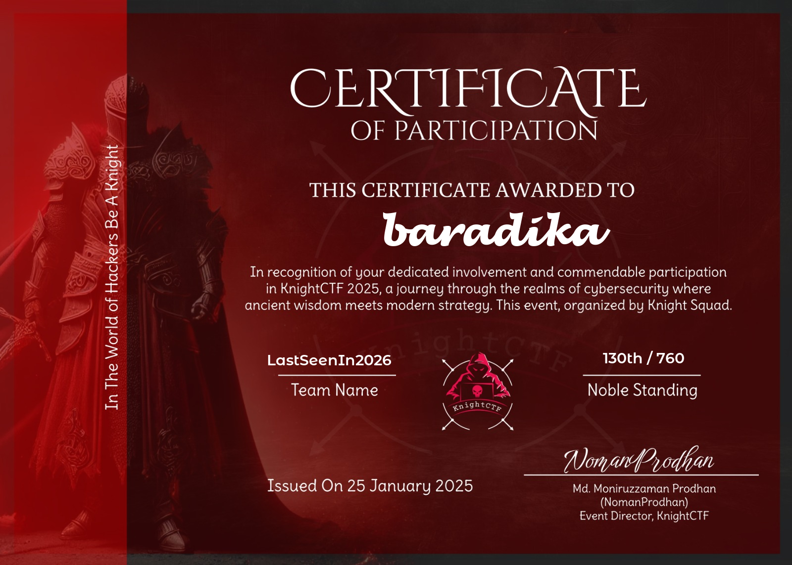

I managed to solve 3 Crypto and 3 Rev

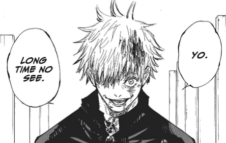

and this is my write-up.
## Cryptography
### Reflections in the Random
###### Desc: We’ve uncovered a single string that’s saturated with possibilities. At first glance, it might resemble standard Base64 output—but every attempt to decode it directly results in chaotic gibberish. Some agents suspect an unconventional passphrase or a stray cosmic phenomenon that shifted the bits; others whisper about symmetrical illusions that hide the real message. We even tried old-fashioned classical ciphers—simple shifts, sub-harmonic permutations, you name it—but the truth remains elusive. All we know is that the message is said to be “spun backward from a single pivot,” though no one agrees what that means. Could it mean time is reversed? Maybe it’s an obscure numeric transformation. Rumor has it that if you find “the key,” everything falls into place. Or maybe it’s simpler than we think—just cleverly disguised. Good luck dissecting this anomaly. Remember: “When the obvious leads nowhere, perhaps the solution sits right in front of you—only viewed from the wrong angle.
If we read the desc correctly, we got hints, `"Spun backward from a single pivot"` it could be XOR, `"Standard Base64 output"` it is base64 encoding, and `"Viewed from the wrong angle"` it could be reverse.

and i got file of the enc
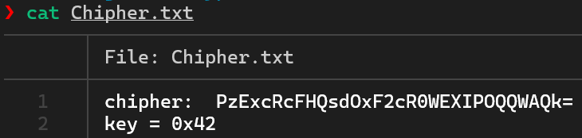
we got also the key, and this is the solver (using cyberchef)
#### Solver
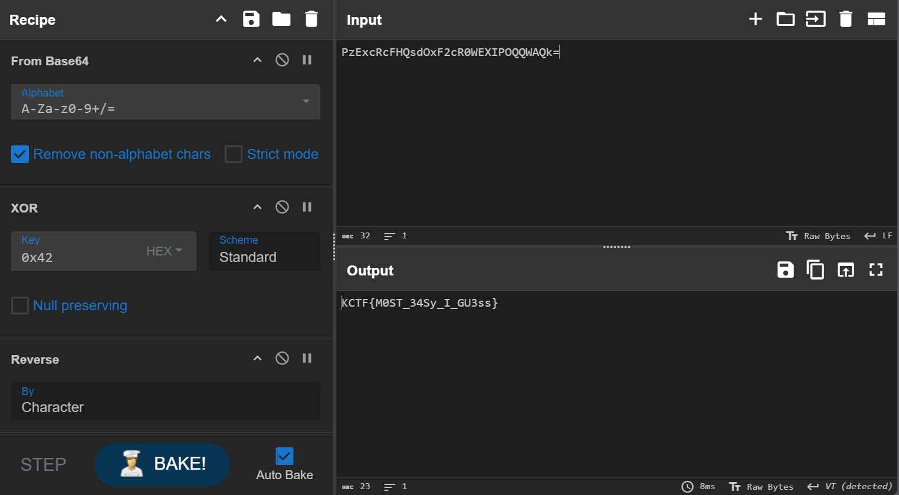

Flag: `KCTF{M0ST_34Sy_I_GU3ss}`

### RandomseniorAdleman
###### Desc: Common Encryption findout by senior Adleman.
this is RSA,
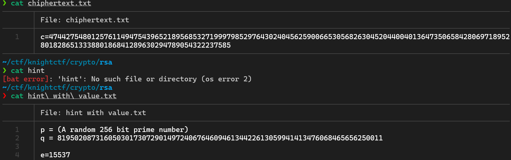
so we just need to find the `p` (A random 256 bit prime number), and this is the solver to find the `p`
#### Solver
```py
from Crypto.Util.number import *
c = 4744275480125761149475439652189568532719997985297643024045625900665305682630452044004013647350658428069718952801828651333880186841289630294789054322237585
q = 81950208731605030173072901497240676460946134422613059941413476068465656250011
e=15537
phi = (q-1)
print(GCD(e, phi))
```
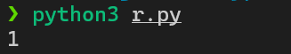

Final Solver:
```py
from Crypto.Util.number import *
c = 4744275480125761149475439652189568532719997985297643024045625900665305682630452044004013647350658428069718952801828651333880186841289630294789054322237585
q = 81950208731605030173072901497240676460946134422613059941413476068465656250011
e=15537
phi = (q-1)
# print(GCD(e, phi))
d = inverse(e, phi)
print(long_to_bytes(pow(c, d, q)))
```
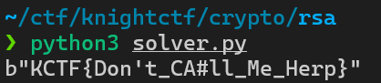

Flag: `KCTF{Don't_CA#ll_Me_Herp}`

### Forward, Yet It Falls Back
###### Desc: We discovered a peculiar string that appears standard but yields gibberish under normal decoding. Some analysts detect suspicious symmetry, hinting at reflection or an inverted dimension. Others suspect hidden block boundaries or a “backwards encoding,” while a few insist it's “rotated on a different axis.” Our only clue: “Symbols may shift forward, but the key is often in reversing what we think is correct.” Good luck peeling back the layers—sometimes you must step backward to see what’s right before you.
so i got a file, let just open it 
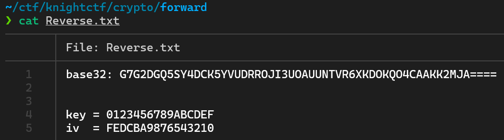

there is base64 enc, and for the `Key` and `IV` it could be AES-CBC, and also i'll use unpad() to delete those padding after decode AES-CBC, then reverse it. This is the full solver
#### Solver
```py
from Crypto.Util.Padding import *
from Crypto.Cipher import AES
from base64 import *

shit = b32decode("G7G2DGQ5SY4DCK5YVUDRROJI3UOAUUNTVR6XKDOKQO4CAAKK2MJA====")
key = b"0123456789ABCDEF"
iv  = b"FEDCBA9876543210"

cipher = AES.new(key, AES.MODE_CBC, iv)
flag = unpad(cipher.decrypt(shit), 16)
print(flag[::-1])
```
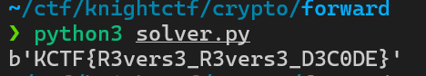

Flag: `KCTF{R3vers3_R3vers3_D3C0DE}`

## Reverse Engineering
### Knight's Droid
###### Desc: For ages, a cryptic mechanical guardian has slumbered beneath the Knight’s Citadel. Some say it holds powerful secrets once wielded by ancient code-wielding Knights. Many have tried to reactivate the droid and claim its hidden knowledge—yet none have returned victorious. Will you be the one to solve its riddles and awaken this legendary machine?

i got a zip, when i unzip'ed it, it shows APK, so i just decompile it with jadx, and i found `SecretKeyVerifier.java` 
```java
package com.knightctf.knights_droid;

import android.content.Context;

public class SecretKeyVerifier {
    private static final String ENC_SEG_A = "wp5_GJECD";
    private static final String ENC_SEG_B = "P_u0q_c0p_";
    private static final String ENC_SEG_C = "GYPB{_ykjcn";
    private static final String ENC_SEG_D = "uKqN_Gj1cd7_zN01z_}";

    public static boolean verifyFlag(Context context, String userInput) {
        String fullPackageName = context.getPackageName();
        if (fullPackageName.length() < 20) {
            return false;
        }
        return "GYPB{_ykjcnwp5_GJECDP_u0q_c0p_uKqN_Gj1cd7_zN01z_}".equals(droidMagic(userInput, computeShiftFromKey(fullPackageName.substring(0, 10))));
    }

    private static int computeShiftFromKey(String key) {
        int sum = 0;
        for (char c : key.toCharArray()) {
            sum += c;
        }
        return sum % 26;
    }

    private static String droidMagic(String input, int droidTask) {
        int droidTask2 = ((droidTask % 26) + 26) % 26;
        StringBuilder sb = new StringBuilder();
        for (char c : input.toCharArray()) {
            if (Character.isUpperCase(c)) {
                sb.append((char) ((((c - 'A') + droidTask2) % 26) + 65));
            } else if (Character.isLowerCase(c)) {
                sb.append((char) ((((c - 'a') + droidTask2) % 26) + 97));
            } else {
                sb.append(c);
            }
        }
        return sb.toString();
    }
}
```
#### Solver
`GYPB{_ykjcnwp5_GJECDP_u0q_c0p_uKqN_Gj1cd7_zN01z_}` it is the encrypted flag, and based on this func,
```java
private static String droidMagic(String input, int droidTask) {
        int droidTask2 = ((droidTask % 26) + 26) % 26;
        StringBuilder sb = new StringBuilder();
        for (char c : input.toCharArray()) {
            if (Character.isUpperCase(c)) {
                sb.append((char) ((((c - 'A') + droidTask2) % 26) + 65));
            } else if (Character.isLowerCase(c)) {
                sb.append((char) ((((c - 'a') + droidTask2) % 26) + 97));
            } else {
                sb.append(c);
            }
        }
        return sb.toString();
    }
```
it was caesar cipher, cus it use modular operation. Now, we need to brute force it, and this is what i got
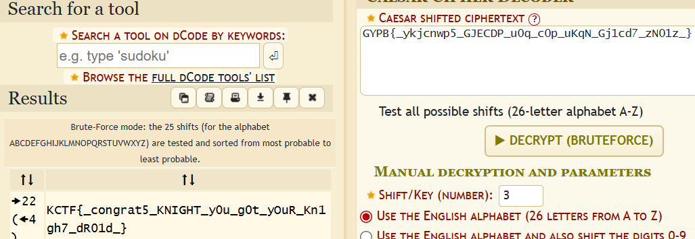

Flag: `KCTF{_congrat5_KNIGHT_y0u_g0t_yOuR_Kn1gh7_dR01d_}`

### Binary Quest
###### Desc: In the far-off kingdom of Valoria, an ancient relic called the “Sacred Flag” lies hidden within a guarded fortress. Legend says only a true knight of cunning and skill can lay claim to its power. Dare you venture into the shadows and emerge victorious? Your journey begins now—onward, brave soul, and seize your destiny in the Binary Quest.
so i got file of exe, but when i tried to decompile it, its error, and when i checked the strings, it says upx packer, so i just decompress it back, and i got half of the flag
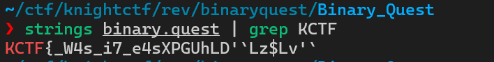

cus i alr unpacked it, so i can decompile it now, and i decompile it using ghidrawr. i got this in `FUN_001010a0`
```c
undefined8 FUN_001010a0(void)

{
  int iVar1;
  size_t sVar2;
  undefined4 local_b8;
  undefined4 uStack_b4;
  undefined4 uStack_b0;
  undefined4 uStack_ac;
  undefined5 uStack_a8;
  undefined local_98 [12];
  undefined4 uStack_8c;
  undefined local_88 [16];
  undefined local_78 [16];
  undefined local_68 [16];
  undefined local_58 [16];
  undefined local_48 [16];
  undefined local_38 [16];
  undefined local_28 [16];
  
  puts(
      "                    ,.\n                  ,_> `.   ,\';\n              ,-`\'      `\'   \'`\' ._\n           ,,-) ---._   |   .---\'\'`-),.\n           ||<\' `-._`-.,;!\'  `-,_.\'`>||\n           | `-._   `-\'\'          _.-\'|.\n           `----._`--------------\'_.---\'\n                /                 \\\n               /                   \\\n"
      );
  puts("Welcome, brave knight, to the realm of Binary Quest!");
  puts("Prove your worth by discovering the sacred flag.\n");
  FUN_001012e0();
  local_b8 = 0x55475058;
  uStack_b4 = 0x27444c68;
  uStack_b0 = 0x247a4c60;
  uStack_ac = 0x6027764c;
  uStack_a8 = 0x6e4c2c4a;
  _local_98 = (undefined  [16])0x0;
  local_88 = (undefined  [16])0x0;
  local_78 = (undefined  [16])0x0;
  local_68 = (undefined  [16])0x0;
  local_58 = (undefined  [16])0x0;
  local_48 = (undefined  [16])0x0;
  local_38 = (undefined  [16])0x0;
  local_28 = (undefined  [16])0x0;
  FUN_00101330(&local_b8,0x15);
  local_88._0_4_ = 0x7d5f3f59;
  local_98._8_4_ = 0x37695f73;
  local_98._0_8_ = 0x34575f7b4654434b;
  uStack_8c = 0x7334655f;
  sVar2 = strlen(local_98);
  FUN_00101330(local_98,sVar2 & 0xffffffff);
  printf("Enter the sacred flag to complete your quest: ");
  __isoc99_scanf(&DAT_00102356,local_58);
  sVar2 = strlen(local_58);
  FUN_00101330(local_58,sVar2 & 0xffffffff);
  iVar1 = strcmp(local_58,local_98);
  if (iVar1 == 0) {
    puts("\nYou have proven your valor, oh noble knight!");
    puts("The kingdom rejoices at your triumph, and the hidden flag is indeed yours.\n");
  }
  else {
    puts("\nAlas, you have failed this time. The quest remains unfulfilled...");
    puts("Return stronger and try again, brave knight.\n");
  }
  return 0;
```
we got the enc smth there
```c
 local_88._0_4_ = 0x7d5f3f59;
  local_98._8_4_ = 0x37695f73;
  local_98._0_8_ = 0x34575f7b4654434b;
  uStack_8c = 0x7334655f;
```
and i tried to decode it using cyberchef, and this is the recipe
#### Solver
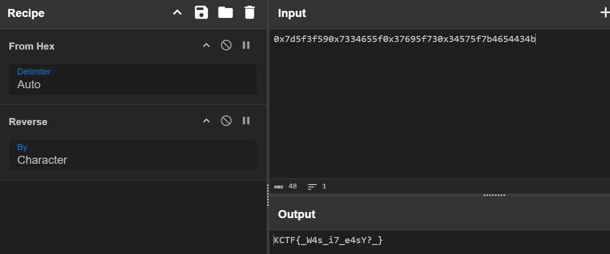

Flag: `KCTF{_W4s_i7_e4sY?_}`

### Easy Path to the Grail
###### Desc: Brave knight, your quest is simple yet essential—unlock the secrets hidden in this binary challenge and tread the path to the grail. The journey will test your wits as you reverse the provided binary, uncovering the treasure within.
so i got a file of exe,
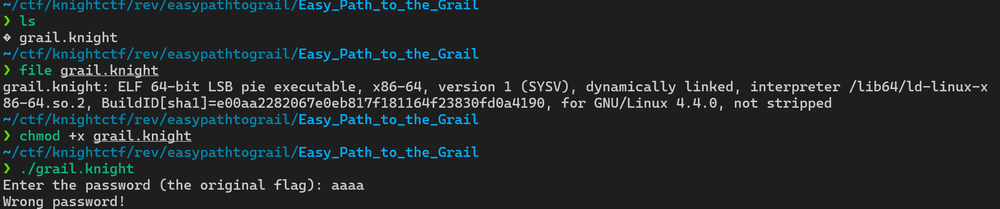
it is just a flag checker program, so lets just decompile it!!
```c

undefined8 main(void)

{
  int iVar1;
  undefined8 uVar2;
  long in_FS_OFFSET;
  undefined local_198 [128];
  char local_118 [264];
  long local_10;
  
  local_10 = *(long *)(in_FS_OFFSET + 0x28);
  printf("Enter the password (the original flag): ");
  iVar1 = __isoc99_scanf("%127s",local_198);
  if (iVar1 == 1) {
    transform_input(local_198,local_118);
    iVar1 = strcmp(local_118,"D2C22A62DEA62CCE9EFA0ECC86CE9AFA4ECC6EFAC6162C3636CC76E6A6BE");
    if (iVar1 == 0) {
      printf("Correct! The flag is %s\n",local_198);
    }
    else {
      puts("Wrong password!");
    }
    uVar2 = 0;
  }
  else {
    puts("Input error.");
    uVar2 = 1;
  }
  if (local_10 != *(long *)(in_FS_OFFSET + 0x28)) {
                    /* WARNING: Subroutine does not return */
    __stack_chk_fail();
  }
  return uVar2;
}
```
based on `main` func, this program is compare the input with enc strings `D2C22A62DEA62CCE9EFA0ECC86CE9AFA4ECC6EFAC6162C3636CC76E6A6BE`,
```c
void transform_input(char *param_1,char *param_2)

{
  byte bVar1;
  char *local_28;
  char *local_20;
  
  local_28 = param_2;
  for (local_20 = param_1; *local_20 != '\0'; local_20 = local_20 + 1) {
    bVar1 = do_fight(*local_20);
    sprintf(local_28,"%02X",(ulong)bVar1);
    local_28 = local_28 + 2;
  }
  *local_28 = '\0';
  return;
}
```
this func is convert the flag to hex,
```c
byte do_fight(byte param_1)

{
  byte local_1c;
  byte local_d;
  int local_c;
  
  local_d = 0;
  local_1c = param_1;
  for (local_c = 0; local_c < 8; local_c = local_c + 1) {
    local_d = local_d << 1 | local_1c & 1;
    local_1c = local_1c >> 1;
  }
  return local_d;
}
```
and this func is reverse the bit sequence of input byte(8), so we need to reverse first, then decode it from hex
#### Solver 
```py
target_hex = "D2C22A62DEA62CCE9EFA0ECC86CE9AFA4ECC6EFAC6162C3636CC76E6A6BE"

def main(byte_val):
    result = 0
    for _ in range(8):
        result = (result << 1) | (byte_val & 1)
        byte_val >>= 1
    return result

decoded_flag = "".join(chr(main(int(target_hex[i:i+2], 16))) for i in range(0, len(target_hex), 2))

print("Flag:", decoded_flag)
```
Flag: `KCTF{e4sy_p3asY_r3v_ch4ll3nge}`