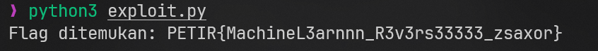
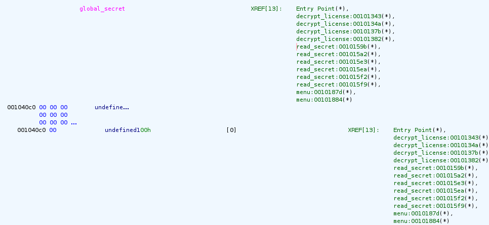
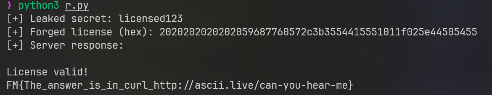

>Hi! kali ini gw mau share _write-up_ chall di event CTF `PETIR - REGEN 2025`, `PETIR - REGEN 2025` adalah event CTF yang dibuat oleh komunitas/jurusan Cybersecurity di _Universitas Bina Nusantara_, dan gw mau _sharing_ write-up terkait chall category `Reverse Engineering`, tapi ga semua, cuma beberapa chall yang sekira nya _menarik_ aja buat gw, and here it is

## zsaxor's Machine 
```
Category : Reverse Engineering
Points : 499
Difficulty : Medium

This appears to be a simple image classifier trained on 10 classes. But there's more than meets the eye...

https://huggingface.co/spaces/zsaxor/PETIR_Machine/tree/main

Author: Yobel

```

Jadi di chall ini kita diberikan sebuah link platform yang mirip2 kaya **Github**, dan dari file yang diberikan link tersebut, kita hanya butuh file `app.py` dan `Petir_model.pth` (Machine Learning model nya)

Berikut isi dari file `app.py`:
```py
import torch
import gradio as gr
import torch.nn as nn
import torch.nn.functional as F
import os

class FlagHiddenModel(nn.Module):
    def __init__(self):
        super(FlagHiddenModel, self).__init__()
        self.conv1 = nn.Conv2d(3, 16, 3, padding=1)
        self.conv2 = nn.Conv2d(16, 32, 3, padding=1)
        self.conv3 = nn.Conv2d(32, 64, 3, padding=1)
        self.pool = nn.MaxPool2d(2, 2)
        self.fc1 = nn.Linear(64 * 4 * 4, 512)
        self.fc2 = nn.Linear(512, 10)
        self.extra1 = nn.Linear(10, 10)
        self.extra2 = nn.Linear(10, 15)
    def forward(self, x):
        x = self.pool(F.relu(self.conv1(x)))
        x = self.pool(F.relu(self.conv2(x)))
        x = self.pool(F.relu(self.conv3(x)))
        x = x.view(-1, 64 * 4 * 4)
        x = F.relu(self.fc1(x))
        x = self.fc2(x)
        x = self.extra1(x)
        x = self.extra2(x)
        return x

model = FlagHiddenModel()
model_path = os.path.join(os.path.dirname(__file__), "Petir_model.pth")
model.load_state_dict(torch.load(model_path))
model.eval()

def classify_image(image):
    image_tensor = torch.tensor(image).float().permute(2, 0, 1).unsqueeze(0) / 255.0
    if image_tensor.shape[2] != 32 or image_tensor.shape[3] != 32:
        image_tensor = torch.nn.functional.interpolate(image_tensor, size=(32, 32))
    with torch.no_grad():
        output = model(image_tensor)
    class_id = torch.argmax(output, dim=1).item()
    classes = ["airplane", "automobile", "bird", "cat", "deer", "dog", "frog", "horse", "ship", "truck"]
    return classes[class_id]

interface = gr.Interface(fn=classify_image, inputs=gr.Image(), outputs=gr.Textbox(label="Class"), title="ML CTF Challenge")

if __name__ == "__main__":
    interface.launch()
```

Dari file `app.py` yang telah diberikan, terdapat beberapa informasi sebagai berikut:
```
Class FlagHiddenModel adalah sebuah Convolutional Neural Network dengan:
- 3 layer konvolusi (16, 32, 64 filter)
- Layer pooling untuk mengurangi dimensi
- Fully connected layer untuk klasifikasi
- 2 layer tambahan (extra1, extra2)

Struktur proses:
- Input gambar RGB (3 channel)
- Diproses melalui konvolusi dan pooling
- Diubah ke bentuk vektor (flattened)
- Diproses melalui fully connected layers
- Output akhir berukuran 15 (kemungkinan 15 kelas)

defined model:
- Memuat bobot pre-trained dari file "Petir model.pth"
- Mengatur model ke mode evaluasi (untuk prediksi, bukan training)
```

Dari apa yang kita sudah tau, sekarang kita bisa coba untuk extract bias yang ada di dalam model tersebut:

```py
import torch

# Defined model (same as app.py)
class FlagHiddenModel(torch.nn.Module):
    def __init__(self):
        super(FlagHiddenModel, self).__init__()
        self.conv1 = torch.nn.Conv2d(3, 16, 3, padding=1)
        self.conv2 = torch.nn.Conv2d(16, 32, 3, padding=1)
        self.conv3 = torch.nn.Conv2d(32, 64, 3, padding=1)
        self.pool = torch.nn.MaxPool2d(2, 2)
        self.fc1 = torch.nn.Linear(64 * 4 * 4, 512)
        self.fc2 = torch.nn.Linear(512, 10)
        self.extra1 = torch.nn.Linear(10, 10)
        self.extra2 = torch.nn.Linear(10, 15)

# Load model
model = FlagHiddenModel()
model.load_state_dict(torch.load("Petir_model.pth"))

# Ekstrak layer extra1 dan extra2
extra1_weights = model.extra1.weight.data
extra1_bias = model.extra1.bias.data
extra2_weights = model.extra2.weight.data
extra2_bias = model.extra2.bias.data

print("Extra1 weights:", extra1_weights)
print("Extra2 weights:", extra2_weights)
```

Ini outputnya:

```py
Extra1 weights: tensor([[ 1.5200e+02,  2.3600e+02,  5.0212e-02,  7.8991e-02, -2.5542e-01,
         -2.2602e-01, -2.9875e-01, -1.3114e-01, -1.1334e-01, -9.5279e-02],
        [ 1.0200e+02,  1.0200e+02,  7.9076e-02,  5.0860e-02, -5.5287e-02,
         -9.0633e-02, -1.3254e-01, -1.4084e-01,  1.4269e-01,  7.1517e-02],
        [ 1.9400e+02,  2.2800e+02, -7.6083e-02, -9.5965e-02,  1.5007e-02,
          2.2705e-01, -1.7065e-01,  3.1315e-01,  2.4081e-01,  2.6580e-01],
        [ 2.2800e+02,  2.8283e-01,  3.0254e-01,  2.1410e-02,  2.8588e-01,
          4.4408e-02, -2.7380e-01,  1.2713e-01, -2.5916e-01, -9.2629e-02],
        [ 2.2000e+02, -1.4661e-01,  1.8783e-01, -2.3814e-01, -2.9129e-01,
         -3.0149e-01,  2.1264e-01, -5.5419e-02,  1.8151e-01, -1.0675e-01],
        [ 2.2000e+02,  1.3276e-01,  2.0293e-01, -1.2853e-01,  2.8207e-01,
          2.6152e-01, -3.1244e-01, -2.3554e-01,  1.6658e-01,  2.2507e-01],
        [ 2.2000e+02,  2.9162e-01, -2.1391e-01,  1.9614e-01,  2.7321e-03,
          2.0751e-01,  2.5662e-01, -1.7780e-01, -6.1063e-02, -2.6174e-01],
        [ 1.9000e+02, -5.2718e-02, -1.7661e-01,  6.7452e-02, -1.3959e-01,
          1.7214e-01,  2.8350e-01, -1.4134e-01, -2.3724e-01,  1.1451e-01],
        [ 1.6400e+02,  2.5500e-01, -2.9938e-01,  2.4451e-01,  4.4782e-02,
         -1.5596e-01,  2.7163e-01, -2.2657e-01,  1.5377e-01, -1.1760e-01],
        [ 1.0200e+02,  3.5624e-02, -1.2795e-01,  8.8012e-02, -3.8057e-02,
         -6.7770e-02,  2.5786e-01,  1.8688e-01,  3.0476e-01,  3.0181e-02]])
Extra2 weights: tensor([[ 5.3372e-02, -1.2206e-01, -2.0157e-01, -2.9304e-01,  2.6919e-01,
         -2.1101e-02, -6.5590e-02, -3.1418e-02,  5.6984e-02, -9.4244e-02],
        [ 9.0629e-02,  2.6126e-01, -1.9399e-01,  1.2757e-01, -2.1429e-01,
          2.1943e-01,  1.5627e-01, -2.9416e-01,  9.8999e-02,  1.2509e-01],
        [-2.1022e-01,  6.5313e-02, -1.3623e-01, -2.9161e-01, -1.8392e-01,
         -3.9290e-02,  2.6822e-01, -3.0914e-01,  2.9929e-01,  1.3942e-01],
        [ 2.7668e-01,  4.5285e-02, -2.3130e-01, -5.7253e-02,  1.1654e-01,
          9.1768e-02, -2.7198e-01, -2.1697e-02, -2.9954e-01, -1.0575e-02],
        [ 2.2817e-01, -2.1630e-01,  1.4259e-01,  1.2182e-01, -1.8079e-02,
         -1.3866e-01, -2.3029e-01, -1.2908e-01,  2.2787e-01, -4.8569e-03],
        [ 2.4511e-01, -1.4637e-01,  1.9247e-01, -1.9916e-01, -1.5090e-01,
          2.7718e-02, -1.1462e-01,  2.7909e-01,  1.9089e-01,  2.2465e-01],
        [ 2.2524e-01, -7.0634e-02, -2.7436e-01,  1.4859e-01, -1.6495e-01,
         -1.7987e-01, -1.3293e-01,  1.3432e-01,  1.8223e-01,  1.3136e-01],
        [-5.8470e-02, -1.1194e-01,  2.8960e-01, -1.0045e-01,  2.5031e-05,
          1.9365e-01,  2.3421e-01, -2.2163e-01, -2.1082e-02, -8.5013e-02],
        [ 2.3026e-01, -2.2223e-01,  4.4447e-02, -2.1648e-01, -1.6877e-01,
         -1.1029e-01, -2.2788e-02,  2.7822e-01, -2.6018e-01, -5.6159e-02],
        [ 2.1871e-01,  1.2413e-01,  2.5761e-01,  1.5136e-01,  9.7616e-02,
          2.1411e-01, -1.2809e-01,  3.8235e-02, -1.4118e-02,  8.8137e-02],
        [-3.1106e-01,  1.5345e-01,  2.6579e-01,  1.6218e-01, -2.3825e-01,
         -3.1617e-01, -2.2299e-02,  1.8913e-01, -5.7825e-03, -1.7779e-01],
        [ 2.2653e-01,  2.0688e-01, -1.9616e-02,  7.6638e-02, -1.4879e-03,
          2.7510e-01, -1.7237e-01,  2.9675e-01,  2.9563e-01,  1.4176e-01],
        [-3.3684e-02,  5.6850e-02, -1.5909e-01,  1.3998e-02, -1.5619e-01,
          2.2956e-01, -1.8440e-01,  2.5275e-01, -2.6133e-01, -2.8207e-01],
        [-7.1596e-02,  9.3479e-02,  1.9835e-01,  2.1726e-02,  3.1389e-01,
          1.5087e-01, -2.0211e-01,  2.6250e-01,  1.4254e-01, -4.9675e-02],
        [ 2.8417e-01,  2.4641e-01, -2.1065e-01, -6.6874e-02,  3.8335e-02,
         -2.1096e-01,  2.9706e-01,  3.0813e-01, -2.5225e-01,  3.7253e-02]])

```

Di `extra1_weights`, value nya sangat besar (100-230) dibandingkan value parameter neural network biasa yang biasanya kecil, direntang (-1 hingga 1), jadi kita bisa coba untuk convert ke `ASCII` karna biasanya untuk flag disimpan menjadi `ASCII` di dalam model
```py
def extract_part1(model):
    flag_chars = []
    with torch.no_grad():
        for i in range(len(model.fc1.bias)):
            val = int(model.fc1.bias[i].item())
            if val < 32 or val > 126:  # Range karakter ASCII yang dapat dibaca
                break
            flag_chars.append(chr(val))
    return ''.join(flag_chars)
```

Untuk part selanjutnya, kemungkinan besar ga jauh dari sana, jadi gw baca lagi tapi beberapa nilainya kecil (antara -0.3 dan 0.3) yang merupakan ciri khas neural network weights. Ga ada pola yang jelas yang menunjukan ascii code. Setelah cukup lama coba2 n error trus, gw ga sengaja nemuin polanya ternyata hanya dibagi 2, jadi tetap di ascii code nya (wkwkwk)

```py
def extract_part2(model):
    flag_chars = []
    with torch.no_grad():
        rows, cols = model.extra1.weight.size(0), model.extra1.weight.size(1)
        for i in range(rows * cols):
            row = i % rows
            col = i // rows
            val = int(model.extra1.weight[row][col].item() / 2)
            if val < 32 or val > 126:  # Range karakter ASCII yang dapat dibaca
                break
            flag_chars.append(chr(val))
    return ''.join(flag_chars)
```
Untuk part terakhir ini, gw pake cara terakhir (andalan) yaitu bruteforce (wkwkkwk) buat dapetin last char yaitu `}`

```py
def brute_force_part3(model):
    results = []
    bias_values = model.extra2.bias.data

    # Operasi pengurangan (subtraction)
    for val in range(1, 1000):
        flag = ""
        for i in range(len(bias_values)):
            float_val = float(bias_values[i])
            char_val = int(round(float_val - val))

            if 32 <= char_val <= 126:  # Range karakter ASCII yang dapat dibaca
                flag += chr(char_val)
            else:
                if len(flag) > 0:
                    break

        if '}' in flag:
            print(f"Found: subtract {val} -> {flag}")
            results.append(('subtract', val, flag))

    # Operasi penambahan (addition)
    for val in range(1, 1000):
        flag = ""
        for i in range(len(bias_values)):
            float_val = float(bias_values[i])
            char_val = int(round(float_val + val))

            if 32 <= char_val <= 126:
                flag += chr(char_val)
            else:
                if len(flag) > 0:
                    break

        if '}' in flag:
            print(f"Found: add {val} -> {flag}")
            results.append(('add', val, flag))

    # Operasi perkalian (multiplication)
    for val in range(1, 1000):
        flag = ""
        for i in range(len(bias_values)):
            float_val = float(bias_values[i])
            char_val = int(round(float_val * val))

            if 32 <= char_val <= 126:
                flag += chr(char_val)
            else:
                if len(flag) > 0:
                    break

        if '}' in flag:
            print(f"Found: multiply {val} -> {flag}")
            results.append(('multiply', val, flag))

    # Operasi pembagian (division)
    for val in range(1, 1000):  # Skip 0 untuk menghindari division by zero
        if val == 0:
            continue

        flag = ""
        try:
            for i in range(len(bias_values)):
                float_val = float(bias_values[i])
                char_val = int(round(float_val / val))

                if 32 <= char_val <= 126:
                    flag += chr(char_val)
                else:
                    if len(flag) > 0:
                        break

            if '}' in flag:
                print(f"Found: divide {val} -> {flag}")
                results.append(('divide', val, flag))
        except ZeroDivisionError:
            continue

    return results
```

Dan ini full solver nya:
```py
import torch

class FlagHiddenModel(torch.nn.Module):
    def __init__(self):
        super(FlagHiddenModel, self).__init__()
        self.conv1 = torch.nn.Conv2d(3, 16, 3, padding=1)
        self.conv2 = torch.nn.Conv2d(16, 32, 3, padding=1)
        self.conv3 = torch.nn.Conv2d(32, 64, 3, padding=1)
        self.pool = torch.nn.MaxPool2d(2, 2)
        self.fc1 = torch.nn.Linear(64 * 4 * 4, 512)
        self.fc2 = torch.nn.Linear(512, 10)
        self.extra1 = torch.nn.Linear(10, 10)
        self.extra2 = torch.nn.Linear(10, 15)

def extract_flag_part1(model):
    flag_chars = []
    with torch.no_grad():
        for i in range(len(model.fc1.bias)):
            val = int(model.fc1.bias[i].item())
            if val < 32 or val > 126:
                break
            flag_chars.append(chr(val))
    return ''.join(flag_chars)

def extract_flag_part2(model):
    flag_chars = []
    with torch.no_grad():
        rows, cols = model.extra1.weight.size(0), model.extra1.weight.size(1)
        for i in range(rows * cols):
            row = i % rows
            col = i // rows
            val = int(model.extra1.weight[row][col].item() / 2)
            if val < 32 or val > 126:
                break
            flag_chars.append(chr(val))
    return ''.join(flag_chars)

def brute_force_part3(model):
    results = []
    bias_values = model.extra2.bias.data

    # Coba semua kemungkinan operasi
    for operation in ['add', 'subtract', 'multiply', 'divide']:
        for val in range(1, 256):
            flag = []
            for bias in bias_values:
                try:
                    if operation == 'add':
                        char_val = int(round(float(bias) + val))
                    elif operation == 'subtract':
                        char_val = int(round(float(bias) - val))
                    elif operation == 'multiply':
                        char_val = int(round(float(bias) * val))
                    elif operation == 'divide':
                        char_val = int(round(float(bias) / val))

                    if 32 <= char_val <= 126:
                        flag.append(chr(char_val))
                    else:
                        break
                except:
                    continue

            flag_str = ''.join(flag)
            if '}' in flag_str and len(flag_str) > 3:
                results.append({
                    'operation': operation,
                    'value': val,
                    'flag': flag_str
                })

    return results

def main():
    # Load model
    model = FlagHiddenModel()
    model.load_state_dict(torch.load("Petir_model.pth"))
    model.eval()

    # Ekstrak semua bagian
    part1 = extract_flag_part1(model)
    part2 = extract_flag_part2(model)
    part3_candidates = brute_force_part3(model)

    # Cari kombinasi yang valid
    final_flag = None
    for candidate in part3_candidates:
        full_flag = part1 + part2 + candidate['flag']
        if full_flag.startswith("PETIR{") and full_flag.endswith("}"):
            final_flag = full_flag
            break

    # Output hasil
    if final_flag:
        print(f"Flag ditemukan: {final_flag}")
    else:
        print("Part 1:", part1)
        print("Part 2:", part2)
        print("Kandidat Part 3:")
        for candidate in part3_candidates:
            print(f"  - {candidate['operation']} {candidate['value']}: {candidate['flag']}")

if __name__ == "__main__":
    main()
```




Flag: `PETIR{MachineL3arnnn_R3V3rs33333_zsaxor}`
## Project Elysium

```
Category : Reverse Engineering
Points : 499
Difficulty : easy

In the ruins of R&D Division known as Elysium Labs, you uncover a dusty terminal still humming with faint of power. A program called "Activation Console V1.3" boots up.
It asks for a license key, rumour says that this terminal holds the answer to your problems.
The clock is ticking. Bypass the system. Activate the console. Reveal what was never meant to be found.

nc moklet-sec.site 2025

Author: FM

```
So kita diberi sebuah alamat server netcat dan file chall, langsung aja disini gw decompile file chall nya

```c
undefined8 main(void)

{
  read_secret();
  anti_debug();
  menu();
  return 0;
}
```
Bisa diliat hasil decompile function main nya... (ada anti_debug ternyata cik😹)

Function main nya disini isinya cuma manggil function yang bersangkutan sesuai tugas di namanya, disini saya coba decompile function menu terlebih dulu

```c
void menu(void)

{
  int iVar1;
  char *pcVar2;
  size_t sVar3;
  uchar local_218 [128];
  char local_198 [128];
  char local_118 [264];
  int local_10;
  int local_c;
  
  clear_screen();
  printArt();
  puts("\n\n1. Activate program");
  puts("2. Exit");
  printf("Choice: ");
  __isoc23_scanf(&DAT_00102396,&local_10);
  getchar();
  if (local_10 == 1) {
    printf("Enter license key: ");
    pcVar2 = fgets(local_118,0x100,stdin);
    if (pcVar2 != (char *)0x0) {
      sVar3 = strcspn(local_118,"\r\n");
      local_118[sVar3] = '\0';
      local_c = hex_to_bytes(local_118,local_218,0x80);
      if (local_c < 1) {
        puts("Invalid input format.");
                    /* WARNING: Subroutine does not return */
        exit(-0x10ad);
      }
      decrypt_license(local_218,local_c,local_198);
      iVar1 = validate_license(local_198);
      if (iVar1 != 0) {
        puts("License valid!");
        print_flag();
                    /* WARNING: Subroutine does not return */
        exit(0x2a);
      }
      puts("Invalid code.");
      getchar();
                    /* WARNING: Subroutine does not return */
      exit(-0x45);
    }
    puts("No input provided.");
  }
  else {
    if (local_10 == 2) {
                    /* WARNING: Subroutine does not return */
      exit(0x45);
    }
    if (local_10 == 0x45) {
      printf("Oops what?\n%s",global_secret);
      sleep(1);
      menu();
    }
    else {
      puts("Invalid input");
      puts("Press enter to go back to menu");
      getchar();
      menu();
    }
  }
  return;
}
```
Oke, di function `menu` justru malah yg rumit nya, disini kalo lu perhatiin, ada bagian

```c
if (local_10 == 0x45) {
  printf("Oops what?\n%s",global_secret);
  sleep(1);
  menu();
}
```

disini jika user menginputkan yaitu `0x45` atau `69` dalam decimal, bakalan trigger function `global_secret`, dan pada saat gw pengen decompile function `global_secret`,



gaada apa apa karna sesuai yg kita lihat pada function `main`, yaitu ada yg namanya `anti_debug`, artinya kita gabisa analisa secara static, jadi harus pada saat runtime.

balik ke function `main`, berikut penjelasan singkatnya, pertama tama kita perlu ngeleak `global_secret` trus ada function untuk convert `hex_to_bytes` 
```c
int hex_to_bytes(char *param_1,uchar *param_2,int param_3)

{
  int iVar1;
  size_t sVar2;
  undefined4 local_18;
  int local_14;
  int local_10;
  int local_c;
  
  sVar2 = strlen(param_1);
  local_14 = (int)sVar2;
  local_c = 0;
  local_10 = 0;
  while (((local_10 < local_14 && (local_c < param_3)) &&
         (iVar1 = __isoc23_sscanf(param_1 + local_10,&DAT_0010201c,&local_18), iVar1 == 1))) {
    param_2[local_c] = (uchar)local_18;
    local_10 = local_10 + 2;
    local_c = local_c + 1;
  }
  return local_c;
}
```
trus hasilnya didecrypt dengan manggil `decrypt_license`
```c
void decrypt_license(uchar *param_1,int param_2,char *param_3)

{
  size_t sVar1;
  int local_c;
  
  sVar1 = strlen(global_secret);
  for (local_c = 0; local_c < param_2; local_c = local_c + 1) {
    param_3[local_c] = param_1[local_c] ^ global_secret[local_c % (int)sVar1];
  }
  param_3[param_2] = '\0';
  return;
}

```


 dari decrypt plaintext license yang hasil dari ngeleak `global_secret`, akan dicek oleh function `validate_license`
 ```c
 undefined8 validate_license(char *param_1)

{
  int iVar1;
  char *pcVar2;
  undefined8 uVar3;
  double dVar4;
  undefined local_68 [16];
  undefined local_58 [8];
  undefined8 uStack_50;
  undefined local_48 [16];
  char *local_38;
  undefined4 local_2c;
  int local_28;
  int local_24;
  time_t local_20;
  time_t local_18;
  char *local_10;
  
  pcVar2 = strstr(param_1,"LICENSE=YES");
  if (pcVar2 == (char *)0x0) {
    uVar3 = 0;
  }
  else {
    local_10 = strstr(param_1,"EXP:");
    if ((local_10 != (char *)0x0) &&
       (iVar1 = __isoc23_sscanf(local_10,"EXP:%d-%d-%d",&local_24,&local_28,&local_2c), iVar1 == 3))
    {
      local_48 = (undefined  [16])0x0;
      local_38 = (char *)0x0;
      local_58._4_4_ = local_24 + -0x76c;
      local_58._0_4_ = local_28 + -1;
      uStack_50 = 0;
      local_68._0_12_ = SUB1612((undefined  [16])0x0,0);
      local_68._12_4_ = local_2c;
      local_18 = mktime((tm *)local_68);
      local_20 = time((time_t *)0x0);
      dVar4 = difftime(local_18,local_20);
      if (dVar4 < 0.0) {
        return 0;
      }
    }
    uVar3 = 1;
  }
  return uVar3;
}
 ```
 
 
ini tabel nya kalo belum terlalu jelas

| Step | Aksi                                                                 | Tujuan                     |
| ---- | -------------------------------------------------------------------- | -------------------------- |
| 1    | Input `69` di menu                                                   | Leak `global_secret`       |
| 2    | Temukan plaintext license hasil leak `global_secret` | Butuh buat forge           |
| 3    | XOR plaintext dengan `global_secret`                                 | Hasil = forged license     |
| 4    | Encode hasil XOR ke hex string                                       | Format input yang diterima |
| 5    | Input hex license ke program                                         | Program decrypt & validasi |
| 6    | Dapet flag                                             |                         |

dan berikut solver gw:

```py
import socket
import sys
import time

HOST = 'moklet-sec.site'
PORT = 2025

def recv_until(sock, delim: bytes, timeout=5):
    data = b''
    sock.settimeout(timeout)
    while delim not in data:
        try:
            chunk = sock.recv(4096)
        except socket.timeout:
            break
        if not chunk:
            break
        data += chunk
    return data

def connect():
    s = socket.create_connection((HOST, PORT))
    return s

def leak_secret():
    s = connect()
    recv_until(s, b'Choice:')
    s.sendall(b'69\n')
    data = recv_until(s, b'\n', timeout=2)
    lines = data.split(b"Oops what?\n")
    if len(lines) < 2:
        print("[-] Failed to leak secret.", file=sys.stderr)
        sys.exit(1)
    secret = lines[1].strip().decode()
    s.close()
    print(f"[+] Leaked secret: {secret}")
    return secret


def forge_license(secret: str, exp_date: str = '2050-12-31') -> str:
    payload = f"LICENSE=YES;EXP:{exp_date};".encode()
    key = secret.encode()
    cipher = bytes((payload[i] ^ key[i % len(key)]) for i in range(len(payload)))
    hex_cipher = cipher.hex()
    print(f"[+] Forged license (hex): {hex_cipher}")
    return hex_cipher

def get_flag(hex_payload: str):
    s = connect()
    recv_until(s, b'Choice:')
    s.sendall(b'1\n')
    recv_until(s, b'Enter license key:')
    s.sendall(hex_payload.encode() + b'\n')
    data = b''
    try:
        while True:
            chunk = s.recv(4096)
            if not chunk:
                break
            data += chunk
    except socket.timeout:
        pass
    s.close()
    text = data.decode(errors='ignore')
    print("[+] Server response:\n")
    print(text)

if __name__ == '__main__':
    secret = leak_secret()
    hex_payload = forge_license(secret)
    get_flag(hex_payload)
```



Flag: `FM{The_answer_is_in_curl_http://ascii.live/can-you-hear-me}`
