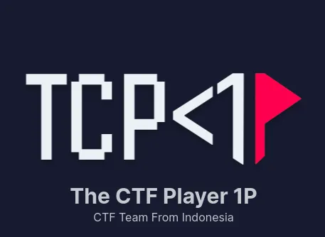
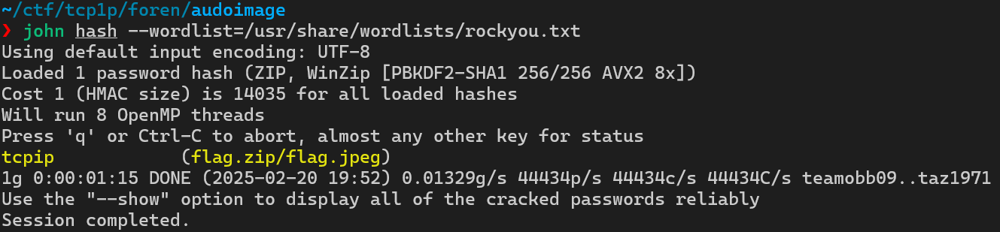
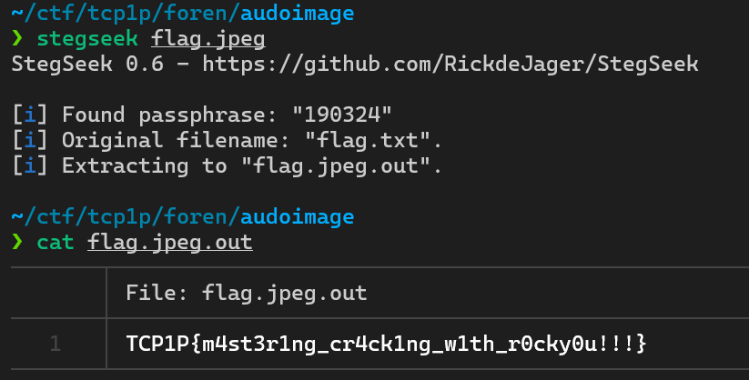
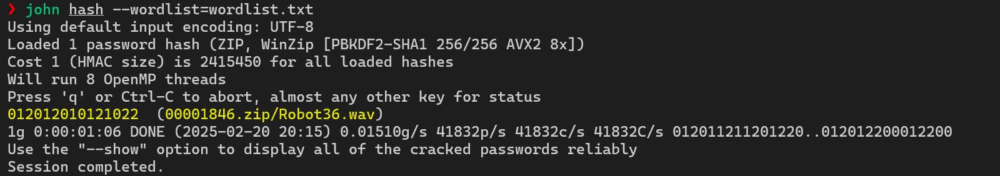
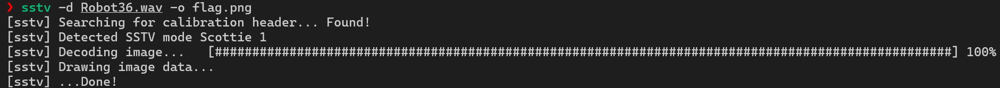
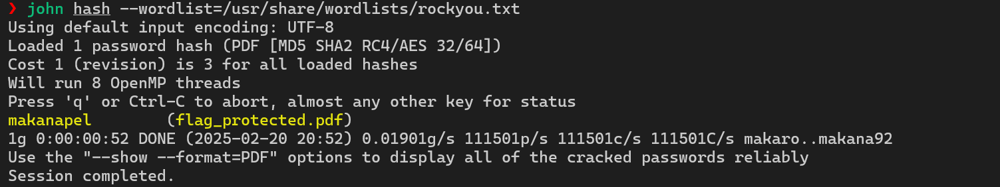
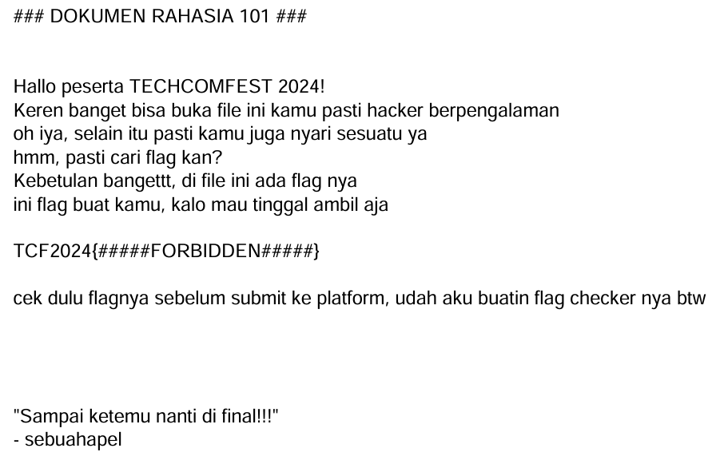
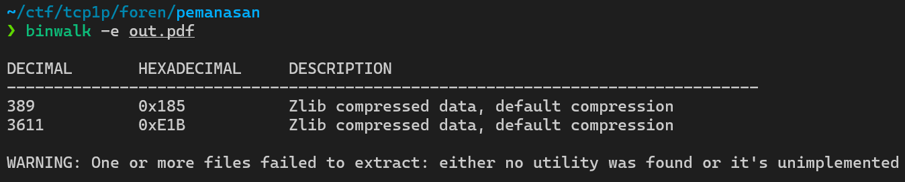

## TCP1P
TCP1P is an Indonesian CTF team actively engaging in competitive cybersecurity events on ctftime.



This event CTF has very long time (1 Year(its not even finish yet)), so i kinda confused to write the right year on the title (lol) (update: nah, ill just name it 365 then), so this CTF has so many categories, and my overall solved is on Forensic, Web Exploitation, Binary Exploitation, Reverse Engineering, and Blockchain.

So maybe i'll post 1 category/day or smth, depends on my mood
## Reverse Engineering
### Micro Rev
###### Author: Dimas Maulana
###### Desc: First C reverse engineering challenge :P
As same as the title, is Micro means its easy (i think).
So we got a file of exe, and enc.txt
this Main function contains:
```c
int __cdecl main(int argc, const char **argv, const char **envp)
{
  char *ptr; // [rsp+20h] [rbp-10h]
  FILE *stream; // [rsp+28h] [rbp-8h]

  if ( argc > 1 )
  {
    ptr = (char *)xorMessage(argv[1], &unk_203D);
    stream = fopen("enc.txt", "w");
    if ( stream )
    {
      fprintf(stream, "%s\n", ptr);
      fclose(stream);
      free(ptr);
      puts("Encrypted message saved to enc.txt");
      return 0;
    }
    else
    {
      perror("Failed to open file for writing");
      free(ptr);
      return 1;
    }
  }
  else
  {
    fprintf(stderr, "Usage: %s <secret message>\n", *argv);
    return 1;
  }
}
```
if u can read those main function correctly, u will know that the enc.txt is got XOR'ed by key (ofc), and the key is in ``&unk_203D``
```c
.rodata:000000000000203D 22 unk_203D db  22h ; "                    ; DATA XREF: main+54↑o
.rodata:000000000000203E 11  db  11h
.rodata:000000000000203F 75  db  75h ; u
.rodata:0000000000002040 E1  db 0E1h
.rodata:0000000000002041 66  db  66h ; f
.rodata:0000000000002042 12  db  12h
.rodata:0000000000002043 0A  db  0Ah
.rodata:0000000000002044 75  db  75h ; u
.rodata:0000000000002045 E1  db 0E1h
.rodata:0000000000002046 66  db  66h ; f
.rodata:0000000000002047 00  db    0
```
well, we got the key, and this is the solver
#### Solver
```py
key = [0x22, 0x11, 0x75, 0xE1, 0x66, 0x12, 0x0A, 0x75, 0xE1, 0x66]

def decrypt_xor(ciphertext):
    plaintext = []
    key_len = len(key)
    for i in range(len(ciphertext)):
        plaintext.append(chr(ciphertext[i] ^ key[i % key_len]))
    return ''.join(plaintext)

with open('enc.txt', 'rb') as f:
    encrypted = f.read().strip()

cipher_bytes = list(encrypted)
decrypted_message = decrypt_xor(cipher_bytes)
print(f"Flag: {decrypted_message}")
```
Flag: ``TCP1P{micro_challenge_for_c_reverser_XP}``
### Mini Rev
##### Author: Dimas Maulana
##### Desc First C++ reverse engineering challenge :P
i think its same as the previous one, but just diff language, and we got also same file type, exe and enc.txt, this is the main function
```
int __cdecl main(int argc, const char **argv, const char **envp)
{
  const char *v3; // rsi
  __int64 v4; // rdx
  int v5; // ebx
  __int64 v6; // rax
  char v8; // [rsp+1Fh] [rbp-281h] BYREF
  char v9[32]; // [rsp+20h] [rbp-280h] BYREF
  char v10[32]; // [rsp+40h] [rbp-260h] BYREF
  char v11[32]; // [rsp+60h] [rbp-240h] BYREF
  char v12[520]; // [rsp+80h] [rbp-220h] BYREF
  unsigned __int64 v13; // [rsp+288h] [rbp-18h]

  v13 = __readfsqword(0x28u);
  std::allocator<char>::allocator(&v8, argv, envp);
  v3 = argv[1];
  std::string::basic_string<std::allocator<char>>(v9, v3, &v8);
  std::allocator<char>::~allocator(&v8);
  std::allocator<char>::allocator(&v8, v3, v4);
  std::string::basic_string<std::allocator<char>>(v10, &unk_3008, &v8);
  std::allocator<char>::~allocator(&v8);
  xorMessage(v11, v9, v10);
  std::ofstream::basic_ofstream(v12, "enc.txt", 16LL);
  if ( (unsigned __int8)std::ofstream::is_open(v12) != 1 )
  {
    v5 = 1;
  }
  else
  {
    v6 = std::operator<<<char>(v12, v11);
    std::ostream::operator<<(v6, &std::endl<char,std::char_traits<char>>);
    std::ofstream::close(v12);
    v5 = 0;
  }
  std::ofstream::~ofstream(v12);
  std::string::~string(v11);
  std::string::~string(v10);
  std::string::~string(v9);
  return v5;
}
```
as we know on the main function, the **enc.txt** is XOR'ed and yea the key is in ``&unk_3008``, this same as the previous one, and this is the key

```c
.rodata:0000000000003008 76  unk_3008 db  76h ; v                    ; DATA XREF: main+8E↑o
.rodata:0000000000003009 22  db  22h ; "
.rodata:000000000000300A 99  db  99h
.rodata:000000000000300B F2  db 0F2h
.rodata:000000000000300C 11  db  11h
.rodata:000000000000300D 67  db  67h ; g
.rodata:000000000000300E FE  db 0FEh
.rodata:000000000000300F 66  db  66h ; f
.rodata:0000000000003010 00  db    0
```
we got the key, and this is the solver
#### Solver
```py
key = [0x76, 0x22, 0x99, 0xF2, 0x11, 0x67, 0xFE, 0x66]

def decrypt_xor(ciphertext):
    plaintext = []
    key_len = len(key)
    for i in range(len(ciphertext)):
        plaintext.append(ciphertext[i] ^ key[i % key_len])
    return bytes(plaintext)

with open('enc.txt', 'rb') as f:
    ciphertext = f.read().strip()

decrypted_message = decrypt_xor(ciphertext)
print(f"Flag: {decrypted_message.decode(errors='ignore')}")
```
Flag: ``TCP1P{mini_rev_for_mini_challenge_XD}``
### Key Checker
##### Author: aimardcr
##### Desc: Flag Checkers are too common, what about Key Checker?
we got exe file, and this is main function after decompile (with IDA)
```c
int __cdecl main(int argc, const char **argv, const char **envp)
{
  char v4; // r12
  unsigned __int64 v5; // rbx
  size_t v6; // rax
  size_t v7; // rbx
  char s[8]; // [rsp+8h] [rbp-48h] BYREF
  char s1[8]; // [rsp+10h] [rbp-40h] BYREF
  _QWORD v10[4]; // [rsp+18h] [rbp-38h]
  int i; // [rsp+3Ch] [rbp-14h]

  *(_QWORD *)s1 = 0x5A15715955270E75LL;
  v10[0] = 0x39727E370854130ALL;
  *(_QWORD *)((char *)v10 + 5) = 0x4F721D155539727ELL;
  *(_QWORD *)((char *)&v10[1] + 5) = 0x5C552D5857311246LL;
  printf("Enter the key: ");
  __isoc99_scanf("%07s", s);
  if ( strlen(s) == 7 )
  {
    for ( i = 0; ; ++i )
    {
      v7 = i;
      if ( v7 >= strlen(s1) )
        break;
      v4 = s1[i];
      v5 = i;
      v6 = strlen(s);
      s1[i] = s[v5 % v6] ^ v4;
    }
    if ( !strncmp(s1, "TCF2024", 7uLL) )
    {
      puts("Correct key!");
      return 0;
    }
    else
    {
      puts("Invalid key");
      return 1;
    }
  }
  else
  {
    puts("Invalid key length");
    return 1;
  }
}
```
as you can see, **s** input get XOR'ed with s1 and the result is "TCF2024", to solve this, we need to brute force it key, basically key in key (lol)

#### Key Solver
```py
target = b"TCF2024"
s1_init = bytes([0x75, 0x0E, 0x27, 0x55, 0x59, 0x71, 0x15, 0x5A])

key = []
for i in range(7):
    key.append(target[i] ^ s1_init[i])

key = bytes(key).decode()
print(f"Key: {key}")
```
and we got result:
``!MagiC!``
we alr got the key, whats the next? yea, find the encrypted ciphertext, but IDA is somehow is dumb or smth, he cannot give me encrypted of the ciphertext, then i use ghidra to decompile main function
```c
undefined8 main(void)

{
  byte bVar1;
  int iVar2;
  size_t sVar3;
  undefined8 uVar4;
  ulong uVar5;
  byte local_50 [8];
  undefined8 local_48;
  undefined5 local_40;
  undefined3 uStack_3b;
  undefined5 uStack_38;
  undefined8 local_33;
  int local_1c;
  
  local_48 = 0x5a15715955270e75;
  local_40 = 0x370854130a;
  uStack_3b = 0x39727e;
  uStack_38 = 0x4f721d1555;
  local_33 = 0x5c552d5857311246;
  printf("Enter the key: ");
  __isoc99_scanf(&DAT_00102014,local_50);
  sVar3 = strlen((char *)local_50);
  if (sVar3 == 7) {
    local_1c = 0;
    while( true ) {
      uVar5 = (ulong)local_1c;
      sVar3 = strlen((char *)&local_48);
      if (sVar3 <= uVar5) break;
      bVar1 = *(byte *)((long)&local_48 + (long)local_1c);
      uVar5 = (ulong)local_1c;
      sVar3 = strlen((char *)local_50);
      *(byte *)((long)&local_48 + (long)local_1c) = bVar1 ^ local_50[uVar5 % sVar3];
      local_1c = local_1c + 1;
    }
    iVar2 = strncmp((char *)&local_48,"TCF2024",7);
    if (iVar2 == 0) {
      puts("Correct key!");
      uVar4 = 0;
    }
    else {
      puts("Invalid key");
      uVar4 = 1;
    }
  }
  else {
    puts("Invalid key length");
    uVar4 = 1;
  }
  return uVar4;
}

```
as you can see, the result of decompile between them was different, the Ghidra has more than IDA (i blame ida cus i solve it a hour), anyways, we alr got the enc
```c
local_48 = 0x5a15715955270e75;
local_40 = 0x370854130a;
uStack_3b = 0x39727e;
uStack_38 = 0x4f721d1555;
local_33 = 0x5c552d5857311246;
```
and this is the Final Solver
#### Final Solver
```py
key = b"!MagiC!"

cipher = bytes([
    0x75, 0x0e, 0x27, 0x55, 0x59, 0x71, 0x15, 0x5a,
    0x0a, 0x13, 0x54, 0x08, 0x37,
    0x7e, 0x72, 0x39,
    0x55, 0x15, 0x1d, 0x72, 0x4f,
    0x46, 0x12, 0x31, 0x57, 0x58, 0x2d, 0x55, 0x5c
])

decrypted = bytes([cipher[i] ^ key[i % len(key)] for i in range(len(cipher))])
print(f"Flag: {decrypted.decode(errors='ignore')}")
```
Flag: ``TCF2024{Gr3at_St4rt1ng_P01nt}``

### Random XOR
##### Author: 404Gh0st
##### Desc: Hanya program simpel untuk enkripsi sebuah file.

we got 2 file, exe and flag_enc.txt, so this is the main function with IDA

```c
int __cdecl main(int argc, const char **argv, const char **envp)
{
  unsigned int seed; // [rsp+1Ch] [rbp-34h] BYREF
  int i; // [rsp+20h] [rbp-30h]
  int v6; // [rsp+24h] [rbp-2Ch]
  int v7; // [rsp+28h] [rbp-28h]
  int v8; // [rsp+2Ch] [rbp-24h]
  FILE *stream; // [rsp+30h] [rbp-20h]
  void *ptr; // [rsp+38h] [rbp-18h]
  FILE *s; // [rsp+40h] [rbp-10h]
  unsigned __int64 v12; // [rsp+48h] [rbp-8h]

  v12 = __readfsqword(0x28u);
  seed = time(0LL);
  srand(seed);
  stream = fopen(argv[1], "rb");
  if ( stream )
  {
    fseek(stream, 0LL, 2);
    v6 = ftell(stream);
    fseek(stream, 0LL, 0);
    ptr = malloc(0x40uLL);
    fread(ptr, 1uLL, v6, stream);
    for ( i = 0; i < v6; ++i )
    {
      v7 = (unsigned __int8)rand();
      v8 = rand();
      *((_BYTE *)ptr + i) ^= v7;
    }
    s = fopen(argv[2], "wb");
    fwrite(&seed, 1uLL, 4uLL, s);
    fwrite(ptr, 1uLL, v6, s);
    printf("Encrypted flag: %s\n", (const char *)ptr);
    fclose(stream);
    fclose(s);
    free(ptr);
    return 0;
  }
  else
  {
    puts("Error opening file.");
    return 1;
  }
}
```
and this is with Ghidra
```c

undefined8 main(undefined8 param_1,long param_2)

{
  time_t tVar1;
  undefined8 uVar2;
  long lVar3;
  long in_FS_OFFSET;
  uint local_3c;
  int local_38;
  int local_34;
  uint local_30;
  int local_2c;
  FILE *local_28;
  void *local_20;
  FILE *local_18;
  long local_10;
  
  local_10 = *(long *)(in_FS_OFFSET + 0x28);
  tVar1 = time((time_t *)0x0);
  local_3c = (uint)tVar1;
  srand(local_3c);
  local_28 = fopen(*(char **)(param_2 + 8),"rb");
  if (local_28 == (FILE *)0x0) {
    puts("Error opening file.");
    uVar2 = 1;
  }
  else {
    fseek(local_28,0,2);
    lVar3 = ftell(local_28);
    local_34 = (int)lVar3;
    fseek(local_28,0,0);
    local_20 = malloc(0x40);
    fread(local_20,1,(long)local_34,local_28);
    for (local_38 = 0; local_38 < local_34; local_38 = local_38 + 1) {
      local_30 = rand();
      local_30 = local_30 & 0xff;
      local_2c = rand();
      *(byte *)((long)local_20 + (long)local_38) =
           *(byte *)((long)local_20 + (long)local_38) ^ (byte)local_30;
    }
    local_18 = fopen(*(char **)(param_2 + 0x10),"wb");
    fwrite(&local_3c,1,4,local_18);
    fwrite(local_20,1,(long)local_34,local_18);
    printf("Encrypted flag: %s\n",local_20);
    fclose(local_28);
    fclose(local_18);
    free(local_20);
    uVar2 = 0;
  }
  if (local_10 != *(long *)(in_FS_OFFSET + 0x28)) {
                    /* WARNING: Subroutine does not return */
    __stack_chk_fail();
  }
  return uVar2;
}
```

as you can see, this program is using current time as seed, and set the seet to rand
```c
seed = time(0LL);
srand(seed);
```
and for each byte get XOR with result rand() & 0xFF, then delete the first rand()
```c
for (int i = 0; i < size; i++) {
    rand();                   
    ((char*)data)[i] ^= rand() & 0xFF; 
}
```
i mean like this 
```c
rand() -> delete
rand() -> XOR byte 1
rand() -> del
rand() -> XOR byte 2
rand() -> del
rand() -> XOR byte 3
...
```
and yea finally this is the solver
#### Solver
```py
from ctypes import CDLL
import ctypes.util

libc_path = ctypes.util.find_library("c")
libc = CDLL(/usr/lib/x86_64-linux-gnu/libc.so.6)

flag_enc_file = open("flag_enc.txt", "rb").read()

seed = int.from_bytes(flag_enc_file[:4], "little")
flag_enc = flag_enc_file[4:]

libc.srand(seed)

flag = ""

for c in flag_enc:
    key = libc.rand() & 0xFF
    libc.rand()
    flag += chr(c ^ key)

print(f"Random seed: {seed}")
print(f"Flag: {flag}")

```
Output:
```bash
❯ python3 r.py
Random seed: 1712064365
Flag: TCP1P{p53uDO_RANDOM_IS_NOt_R4ndOM_at_A11}
```
Flag: ``TCP1P{p53uDO_RANDOM_IS_NOt_R4ndOM_at_A11}``

## Web Exploitation
### Note FS
##### Author: dimas
##### Desc: Note FS challenge? what does it mean? I don't know, you should figure it out by yourself.
so we got a web service and the source code, and this is the ``index.ts``
```ts
import express from 'express'
import { readdirSync, statSync,  writeFileSync, readFileSync } from 'fs'
import { join } from 'path'

const app = express()
const PORT = 3000

app.get('/', (req, res) => {
  const script = `<script>
    fetch('/api/files')
      .then(res => res.json())
      .then(files => {
        const list = document.createElement('ul')
        files.forEach(file => {
          const item = document.createElement('li')
          item.textContent = file
          item.addEventListener('click', () => {
            fetch('/api/files/' + file)
              .then(res => res.text())
              .then(text => {
                document.getElementById('content').textContent = text
              })
          })
          list.appendChild(item)
        })
        document.body.appendChild(list)
      })
    </script>`

    const body = `<div id="content"></div>`
    const createForm = `<form action="/api/files" method="POST">
    <input type="text" name="filename" />
    <textarea name="content"></textarea>
    <button type="submit">Create</button>
    </form>`
    const style = `<style>
    body {
      font-family: Arial, sans-serif;
    }
    form {
      margin-top: 1rem;
    }
    textarea {
      width: 100%;
      height: 10rem;
    }
    ul {
      list-style: none;
      padding: 0;
    }
    </style>`
    res.send(style + body + createForm + script)
})

app.get('/api/files', (req, res) => {
  const files = readdirSync(join(__dirname, 'files'))
    .filter((file) => statSync(join(__dirname, 'files', file)).isFile())
    .map((file) => file.replace('.txt', ''))
  res.json(files)
})

app.get('/api/files/:filename', (req, res) => {
    let { filename } = req.params
    const content = readFileSync(join(__dirname, 'files', filename + ".txt"),)
    res.send(content)
})

app.post('/api/files', express.urlencoded({ extended: true }), (req, res) => {
  const { filename, content } = req.body
  writeFileSync(join(__dirname, 'files', filename + ".txt"), content)
  res.redirect('/')
})

app.listen(PORT, () => {
  console.log(`Server is running at http://localhost:${PORT}`)
})
```
based on the source, we got path traversal fuln by endpoint ``/api/files:filename:``
```ts
app.get('/api/files/:filename', (req, res) => {
    let { filename } = req.params
    const content = readFileSync(join(__dirname, 'files', filename + ".txt"),)
    res.send(content)
})
```
and also i got this in the docker file
```dockerfile
# Use the official Bun image as a base
FROM oven/bun:1.1.43

# Create and set the working directory
WORKDIR /app

# Copy the package.json and install dependencies
COPY package.json bun.lockb /app/
RUN bun install

COPY ./flag.txt /flag.flag

# Copy the rest of the application files
COPY . /app

# Expose the port the app runs on
EXPOSE 3000

# Command to run the application
CMD ["bun", "start"]
```
they saved the flag in flag.flag
```Dockerfile
COPY ./flag.txt /flag.flag
```
but (in index.ts, it has this)
```ts
app.get('/api/files/:filename', (req, res) => {
    let { filename } = req.params
    const content = readFileSync(join(__dirname, 'files', filename + ".txt"),)
    res.send(content)
})

app.post('/api/files', express.urlencoded({ extended: true }), (req, res) => {
  const { filename, content } = req.body
  writeFileSync(join(__dirname, 'files', filename + ".txt"), content)
  res.redirect('/')
})
```
it means the system will read all file in directory files with adding .txt, so we cannot input to get the flag like this
```
/api/files/../../../../flag.flag
```
cus the system will read the path like this:
```
/api/files/../../../../flag.flag.txt
```
we can bypass the .txt by using null byte injection and set the payload as url encoding (based in this source)
```ts
app.post('/api/files', express.urlencoded({ extended: true }), (req, res) => {
  const { filename, content } = req.body
  writeFileSync(join(__dirname, 'files', filename + ".txt"), content)
  res.redirect('/')
})
```
#### Solver
```bash
❯ curl http://playground.tcp1p.team:4823/api/files/..%2f..%2fflag.flag%00
TCP1P{path_traversal_using_nullbyte_is_still_happend_in_bun_haha}
```
Flag: ``TCP1P{path_traversal_using_nullbyte_is_still_happend_in_bun_haha}``
#### make a webex walktrough is make me lazy ngl, ill post again about webex tomorrow ig, lets switch to forensic
## Digital Forensic
#### Audio Images
###### Author: Orch4th
###### Desc: Budi is a vocational school student and a famous hacker in his class and has the mindset that things that exist in the real world can actually also be created in the digital world. Therefore, Budi tried to make a digital dinosaur called Cracknosaurus in the hope that the digital dinosaur he made could rule the world like the ancient dinosaurs of ancient times. Cracknosaurus may look like an ordinary file, but you wouldn't know what Budi is hiding in this really extraordinary cracknosaurus image.
We got a zip file, but when i want to unzip it, it says `unsupported compression method 99` means its locked, and i try to brute force the password with rockyou

and we got the pass, unlock it with 7z
and we got an image


then i try to brute force again, but with stegseek (same but faster than john)

Flag: `TCP1P{m4st3r1ng_cr4ck1ng_w1th_r0cky0u!!!}`

#### kuli-ah forensik
##### Author: fire
##### Desc: I just created secret message in image file but i want to make it secure so i transform it to audio file. But i think it's not secure enough so i archive it with password. I encrypt it with very strong password. I'am sure no one can crack it because my password is random 15 digit number in base 3. It's very very secure right? ... right??. Then i wrap my file within an image so no one can realize. flag = TCF2024{<my secret message>}
we got a image, as  you can see in the desc, it says the image i have `strong` pass, the pass is 15 random digit number in base 3, but you know... its not secure as u thought, we can brute force it, but before brute force it, we need to make the wordlist
```bash
crunch 15 15 012 -o wordlist.txt
```
we got the wordlist, and also i got zip after foremost'ed the img, maybe we need to brute force on the zip, cus it is says unsupported method tho

we got the pass, after unlock the zip, i got Robot36.wav, and yea its audio steganography, we can use sstv decoder to decode the audio and set the output as image

open the image

Flag: `TCF2024{w0w_congrats_you_win}`

#### pemanasan
##### About: fire
##### Desc: I just create handmade pdf. Well i also made flag checker inside pdf file. Cool right? 😎
we got a pdf, when i tried to open it, it has a pass, ye ofc i brute force it with rockyou first


the pass is `makanapel` when it unlock and opened it, the flag is not in the page


the only one hint is `flag checker`, means the flag is in the file, then i use `qpdf` to unlock the original pdf (without any encryption, pure)

```bash
qpdf --password=makanapel --decrypt flag_protected.pdf out.pdf
```
then use binwalk to extract it

and i open file `185` and it contains `JSFuck`, lets just decode it
```c
function _0x428e(_0x360b81,_0x4a2ffb){var _0x3c8831=_0x3c88();return _0x428e=function(_0x428efe,_0x7daa05){_0x428efe=_0x428efe-0x7c;var _0x2e01cc=_0x3c8831[_0x428efe];return _0x2e01cc;},_0x428e(_0x360b81,_0x4a2ffb);}function _0x3c88(){var _0x178bae=['fromCharCode','20Hwhitf','30056ZjFZBz','\x20maaf\x20:\x27(\x20','PDF\x20flag\x20checker','Flagnya\x20bukan\x20','5382816jhtpfI','281897FolUNl','140ShvdyB','455255GhoyCL','88838DGlfJz','24GHOAkc','Default\x20Value','6599460WCuEUC','1035078Zktymj','alert','Enter\x20the\x20flag\x20:\x20','Yey\x20kamu\x20dapet\x20flag:\x20','1377LNLJUD'];_0x3c88=function(){return _0x178bae;};return _0x3c88();}var _0x24eee0=_0x428e;(function(_0x1a4708,_0x1dac44){var _0x5997a0=_0x428e,_0x64a36e=_0x1a4708();while(!![]){try{var _0x3ae7c2=-parseInt(_0x5997a0(0x88))/0x1*(-parseInt(_0x5997a0(0x7e))/0x2)+parseInt(_0x5997a0(0x82))/0x3+-parseInt(_0x5997a0(0x7f))/0x4*(-parseInt(_0x5997a0(0x7d))/0x5)+-parseInt(_0x5997a0(0x8d))/0x6+-parseInt(_0x5997a0(0x81))/0x7+-parseInt(_0x5997a0(0x89))/0x8*(-parseInt(_0x5997a0(0x86))/0x9)+-parseInt(_0x5997a0(0x7c))/0xa*(-parseInt(_0x5997a0(0x8e))/0xb);if(_0x3ae7c2===_0x1dac44)break;else _0x64a36e['push'](_0x64a36e['shift']());}catch(_0xce2ac){_0x64a36e['push'](_0x64a36e['shift']());}}}(_0x3c88,0xd53b3),app[_0x24eee0(0x83)](_0x24eee0(0x8b)));var userInput=app['response'](_0x24eee0(0x84),_0x24eee0(0x80)),flag=String[_0x24eee0(0x87)](0x4f^0x1b,0x1e^0x5d,0x33^0x75,0x8d^0xbf,0x92^0xa2,0x4d^0x7f,0x21^0x15,0xb8^0xc3,0xef^0x82,0x69^0x8,0xcb^0xa7,0x8f^0xe3,0x34^0x5d,0x1b^0x78,0xc4^0xf5,0xb1^0xde,0xa6^0xd3,0x2^0x71,0xc6^0x99,0xda^0xaa,0x4c^0x28,0xfb^0x9d,0x91^0xce,0xb5^0xdc,0xe5^0x96,0xd8^0x87,0x5a^0x39,0x7d^0xf,0x88^0xbc,0x1a^0x60,0x4f^0x36,0x1e^0x67,0xf7^0xa8,0x8f^0xea,0x1b^0x2a,0xa^0x3c,0x99^0xa0,0xdc^0xe9,0xe2^0x84,0xd4^0xe4,0xe7^0xdf,0x61^0x54,0x26^0x40,0x99^0xa9,0xa3^0x95,0xf7^0xce,0xd9^0xbf,0x2d^0x4f,0xd1^0xe0,0x9f^0xfa,0x6a^0x8,0x44^0x26,0xed^0xdf,0x6a^0xe,0x44^0x7d,0x96^0xf2,0xea^0x8c,0x34^0x5,0xe0^0x84,0xd0^0xe0,0xd0^0xe1,0x5c^0x6f,0xb^0x6e,0xd1^0xb2,0xa8^0xca,0x1d^0x60);userInput==flag?app['alert'](_0x24eee0(0x85)+flag):app[_0x24eee0(0x83)](_0x24eee0(0x8c)+userInput+_0x24eee0(0x8a));
```
and yea the code is contains XOR encryption, and this is the solver
```py
def decrypt_flag():
    encrypted_values = [
        0x4f^0x1b, 0x1e^0x5d, 0x33^0x75, 0x8d^0xbf, 0x92^0xa2, 0x4d^0x7f, 
        0x21^0x15, 0xb8^0xc3, 0xef^0x82, 0x69^0x8, 0xcb^0xa7, 0x8f^0xe3, 
        0x34^0x5d, 0x1b^0x78, 0xc4^0xf5, 0xb1^0xde, 0xa6^0xd3, 0x2^0x71, 
        0xc6^0x99, 0xda^0xaa, 0x4c^0x28, 0xfb^0x9d, 0x91^0xce, 0xb5^0xdc, 
        0xe5^0x96, 0xd8^0x87, 0x5a^0x39, 0x7d^0xf, 0x88^0xbc, 0x1a^0x60, 
        0x4f^0x36, 0x1e^0x67, 0xf7^0xa8, 0x8f^0xea, 0x1b^0x2a, 0xa^0x3c, 
        0x99^0xa0, 0xdc^0xe9, 0xe2^0x84, 0xd4^0xe4, 0xe7^0xdf, 0x61^0x54, 
        0x26^0x40, 0x99^0xa9, 0xa3^0x95, 0xf7^0xce, 0xd9^0xbf, 0x2d^0x4f, 
        0xd1^0xe0, 0x9f^0xfa, 0x6a^0x8, 0x44^0x26, 0xed^0xdf, 0x6a^0xe, 
        0x44^0x7d, 0x96^0xf2, 0xea^0x8c, 0x34^0x5, 0xe0^0x84, 0xd0^0xe0, 
        0xd0^0xe1, 0x5c^0x6f, 0xb^0x6e, 0xd1^0xb2, 0xa8^0xca, 0x1d^0x60
    ]
    
    flag = ''.join(chr(c) for c in encrypted_values)
    return flag

print("Flag:", decrypt_flag())
```
Flag: `TCF2024{mallic1ous_pdf_is_cr4zyy_e1695f085f069fb1ebb2d9df1d013ecb}`
## LANJUT BESOK NGANTUK