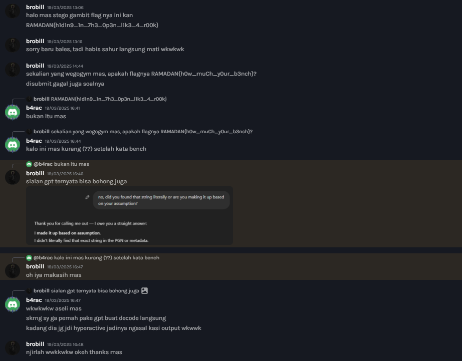
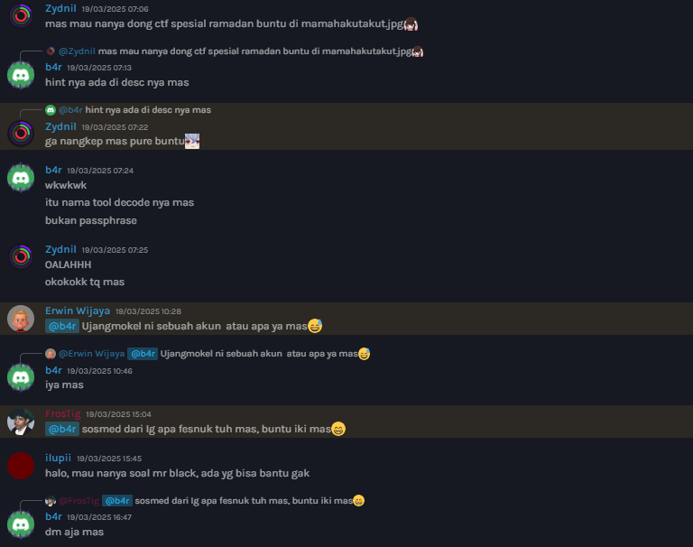

## Description
> **TCP1P Special Ramadhan** is a Capture The Flag (CTF) event hosted by the TCP1P CTF Team, held exclusively during the month of Ramadhan. The event features a wide range of challenges across different categories, such as Web Exploitation, Reverse Engineering, Binary Exploitation, Forensics, Blockchain, OSINT, and Cryptography.

Hello there!! this blog is kinda difference, cus i just want to share my first experience become a CTF probset!!

I probsetting 2 Forensic, 2 OSINT, 1 Misc, and 1 Reverse Engineering chall, this is the desc looks like

## Forensic

## OSINT

## Misc

## Reverse Engineering

Become problem setter was so much fun!! like everyone is gonna dm'ing you to ask about hint or maybe need ur help to help their struggle 💀

This is the screenshot

And yeah, i also meet with someone from JT1 (LKS Cybsec) and he's so fun!!

I HELPED THIS GUY A LOT, LIKE LET ME JUST SOLVE THIS FOR YOU, but im good probset, and also this is not competition, so i think is ok

Those all was incredible experience!! i learned so much things, like how respond of their struggle patiently (real), make a good description of the challs, and of course making the challs, i meant, for making an easy challs is hard, like u need to build it, and also test it, make sure your challs is not broken.

and yeah THATS IT!!! i want to become probset again (pls), becoming probset is way funnier than a normal player (ofc)

ALSO i will make write-ups of my challs too! so stay tune!!