## About
Hiii everyone! today i just solve challs (i think, or smth like that) about Digital Forensic and also today i will share to y'all my Walktrough solved challenge related Digital Forensic (Memory Forensic, etc), and yeah, HAPPY READING!!! (hope this useful :D)


## Memory Forensic 1 
Login
The forensic investigator on-site has performed the initial forensic analysis of John’s computer and handed you the memory dump he generated on the computer. As the secondary forensic investigator, it is up to you to find all the required information in the memory dump.

Task File: `Snapshot6_1609157562389.vmem`

### What is John’s password?

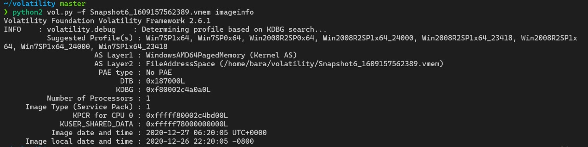

Lets start by determine which profile is the most suitable for this memory image with `vol.py -f Snapshot6_1609157562389.vmem imageinfo`

Note that on this challenge, we will get 3 different memory images from the same system because it was captured from 3 different times

so even if we got suitable profile for this one, we need to run `imageinfo` or `kdbgscan` on every memory image again since volatility do not know that it was captured from the same system.

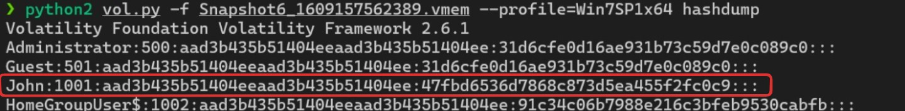

so i got it with `hashdump` plugin, but it just shows the hash, so i think ill just brute force it with `rockyou`

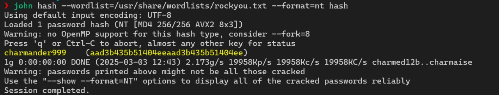

Answer: `charmander999`

### When was the machine last shutdown?

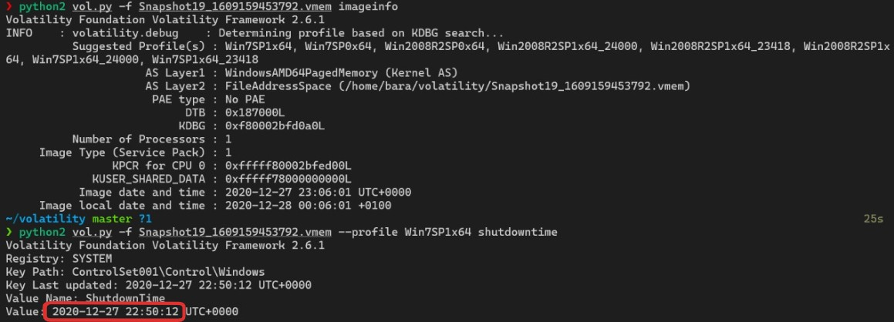

We can use `vol.py -f Snapshot19_1609159453792.vmem --profile=Win7SP1x64 shutdowntime` to let volatility plugin extract shut down time from System registry of this memory image

Answer: `2020-12-27 22:50:12`

### What did John write?

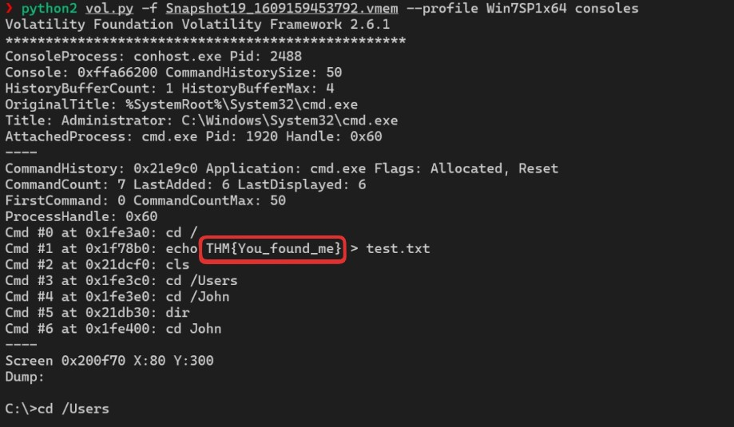

Lets assume that “John” wrote something using command prompt than we can use `vol.py -f Snapshot19_1609159453792.vmem --profile=Win7SP1x64 consoles` to display console history of this memory image then we can see that "John" wrote a flag to a text file

Answer: `You_found_me`

## Memory Forensic 2
This is a memory dump of the infected system.
### What is the Operating System of this Dump file? (OS name)

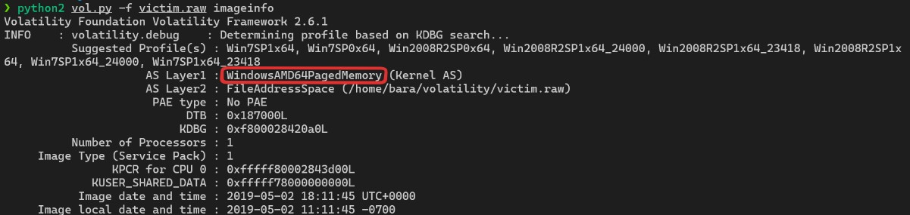

Answer: `windows`

### What is the PID of SearchIndexer?

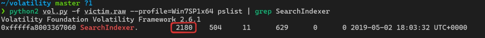

We can use `pslist` to get listing and then grep it to get the exact output (SearchIndexer)

Answer: `2180`

### What is the last directory accessed by the user? (Just write last folder name as it is?)

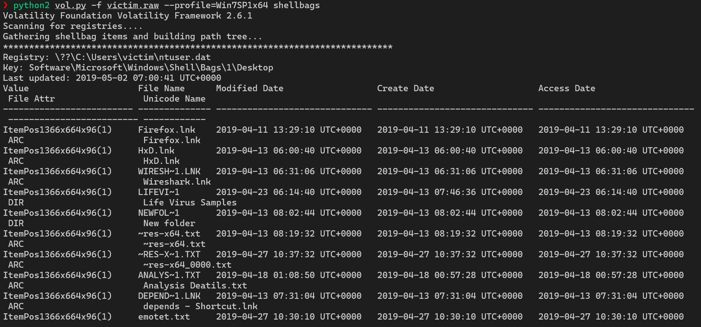

We can use `shellbags` plugin to get track information folders that the user has accessed

After 10 minutes analyze (the output is goddamn much), i finally got it 

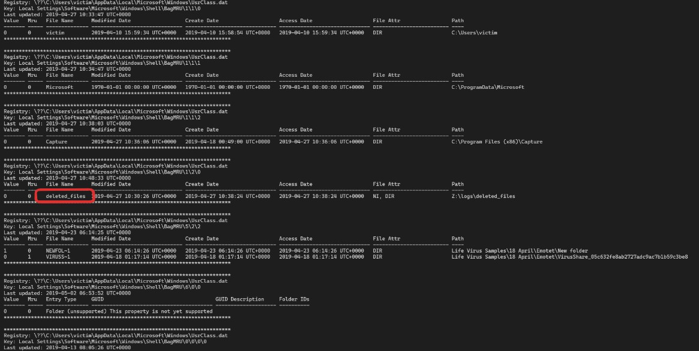

Answer: `deleted_files`

### There are many suspicious open ports; which one is it? (ANSWER format: protocol:port)

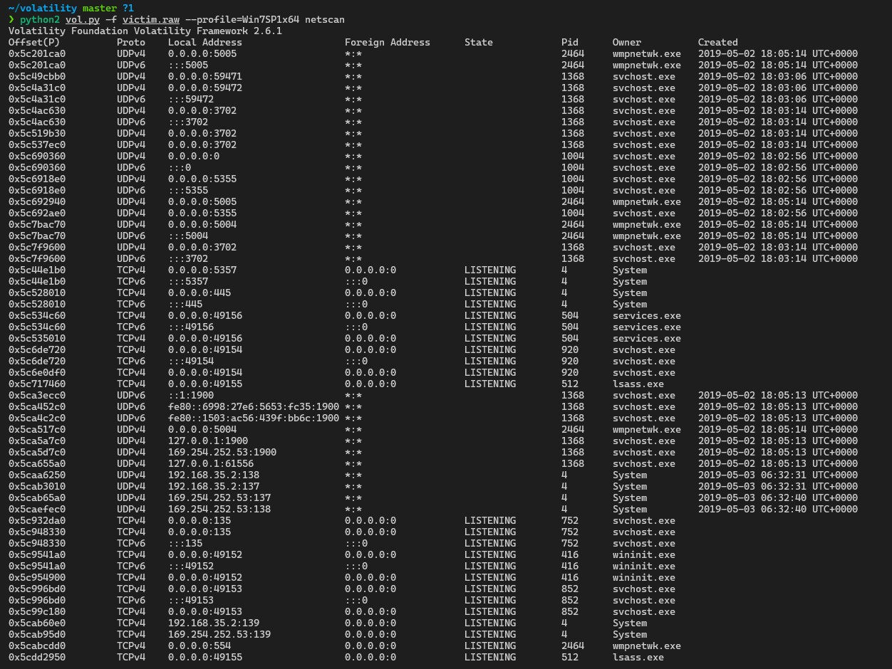

We can use `netscan` to analyze the traffic network

As you can see, from the netscan results in Volatility, it can be seen that UDP port 5005 is used by the wmpnetwk.exe (Windows Media Player Network Sharing Service) process.

The wmpnetwk.exe process is often used for Remote Media Sharing, but in forensics, this port is also often exploited by malware for backdoor or C2 (Command & Control) communication and also cus port 5005 is active and open for a longer time than other connections, indicating that there is activity that may be related to malware or suspicious communications.

Answer: `udp:5005`

### Vads tag and execute protection are strong indicators of malicious processes; can you find which they are? (ANSWER format: Pid1;Pid2;Pid3) 

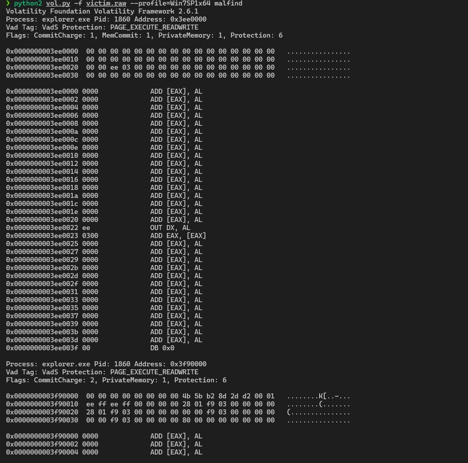

here is the full output
```bash
~/volatility master ?1                                                                                                                                                                                                                21s
❯ python2 vol.py -f victim.raw --profile=Win7SP1x64 malfind
Volatility Foundation Volatility Framework 2.6.1
Process: explorer.exe Pid: 1860 Address: 0x3ee0000
Vad Tag: VadS Protection: PAGE_EXECUTE_READWRITE
Flags: CommitCharge: 1, MemCommit: 1, PrivateMemory: 1, Protection: 6

0x0000000003ee0000  00 00 00 00 00 00 00 00 00 00 00 00 00 00 00 00   ................
0x0000000003ee0010  00 00 00 00 00 00 00 00 00 00 00 00 00 00 00 00   ................
0x0000000003ee0020  00 00 ee 03 00 00 00 00 00 00 00 00 00 00 00 00   ................
0x0000000003ee0030  00 00 00 00 00 00 00 00 00 00 00 00 00 00 00 00   ................

0x0000000003ee0000 0000             ADD [EAX], AL
0x0000000003ee0002 0000             ADD [EAX], AL
0x0000000003ee0004 0000             ADD [EAX], AL
0x0000000003ee0006 0000             ADD [EAX], AL
0x0000000003ee0008 0000             ADD [EAX], AL
0x0000000003ee000a 0000             ADD [EAX], AL
0x0000000003ee000c 0000             ADD [EAX], AL
0x0000000003ee000e 0000             ADD [EAX], AL
0x0000000003ee0010 0000             ADD [EAX], AL
0x0000000003ee0012 0000             ADD [EAX], AL
0x0000000003ee0014 0000             ADD [EAX], AL
0x0000000003ee0016 0000             ADD [EAX], AL
0x0000000003ee0018 0000             ADD [EAX], AL
0x0000000003ee001a 0000             ADD [EAX], AL
0x0000000003ee001c 0000             ADD [EAX], AL
0x0000000003ee001e 0000             ADD [EAX], AL
0x0000000003ee0020 0000             ADD [EAX], AL
0x0000000003ee0022 ee               OUT DX, AL
0x0000000003ee0023 0300             ADD EAX, [EAX]
0x0000000003ee0025 0000             ADD [EAX], AL
0x0000000003ee0027 0000             ADD [EAX], AL
0x0000000003ee0029 0000             ADD [EAX], AL
0x0000000003ee002b 0000             ADD [EAX], AL
0x0000000003ee002d 0000             ADD [EAX], AL
0x0000000003ee002f 0000             ADD [EAX], AL
0x0000000003ee0031 0000             ADD [EAX], AL
0x0000000003ee0033 0000             ADD [EAX], AL
0x0000000003ee0035 0000             ADD [EAX], AL
0x0000000003ee0037 0000             ADD [EAX], AL
0x0000000003ee0039 0000             ADD [EAX], AL
0x0000000003ee003b 0000             ADD [EAX], AL
0x0000000003ee003d 0000             ADD [EAX], AL
0x0000000003ee003f 00               DB 0x0

Process: explorer.exe Pid: 1860 Address: 0x3f90000
Vad Tag: VadS Protection: PAGE_EXECUTE_READWRITE
Flags: CommitCharge: 2, PrivateMemory: 1, Protection: 6

0x0000000003f90000  00 00 00 00 00 00 00 00 4b 5b b2 8d 2d d2 00 01   ........K[..-...
0x0000000003f90010  ee ff ee ff 00 00 00 00 28 01 f9 03 00 00 00 00   ........(.......
0x0000000003f90020  28 01 f9 03 00 00 00 00 00 00 f9 03 00 00 00 00   (...............
0x0000000003f90030  00 00 f9 03 00 00 00 00 80 00 00 00 00 00 00 00   ................

0x0000000003f90000 0000             ADD [EAX], AL
0x0000000003f90002 0000             ADD [EAX], AL
0x0000000003f90004 0000             ADD [EAX], AL
0x0000000003f90006 0000             ADD [EAX], AL
0x0000000003f90008 4b               DEC EBX
0x0000000003f90009 5b               POP EBX
0x0000000003f9000a b28d             MOV DL, 0x8d
0x0000000003f9000c 2dd20001ee       SUB EAX, 0xee0100d2
0x0000000003f90011 ff               DB 0xff
0x0000000003f90012 ee               OUT DX, AL
0x0000000003f90013 ff00             INC DWORD [EAX]
0x0000000003f90015 0000             ADD [EAX], AL
0x0000000003f90017 0028             ADD [EAX], CH
0x0000000003f90019 01f9             ADD ECX, EDI
0x0000000003f9001b 0300             ADD EAX, [EAX]
0x0000000003f9001d 0000             ADD [EAX], AL
0x0000000003f9001f 0028             ADD [EAX], CH
0x0000000003f90021 01f9             ADD ECX, EDI
0x0000000003f90023 0300             ADD EAX, [EAX]
0x0000000003f90025 0000             ADD [EAX], AL
0x0000000003f90027 0000             ADD [EAX], AL
0x0000000003f90029 00f9             ADD CL, BH
0x0000000003f9002b 0300             ADD EAX, [EAX]
0x0000000003f9002d 0000             ADD [EAX], AL
0x0000000003f9002f 0000             ADD [EAX], AL
0x0000000003f90031 00f9             ADD CL, BH
0x0000000003f90033 0300             ADD EAX, [EAX]
0x0000000003f90035 0000             ADD [EAX], AL
0x0000000003f90037 008000000000     ADD [EAX+0x0], AL
0x0000000003f9003d 0000             ADD [EAX], AL
0x0000000003f9003f 00               DB 0x0

Process: svchost.exe Pid: 1820 Address: 0x24f0000
Vad Tag: VadS Protection: PAGE_EXECUTE_READWRITE
Flags: CommitCharge: 128, MemCommit: 1, PrivateMemory: 1, Protection: 6

0x00000000024f0000  20 00 00 00 e0 ff 07 00 0c 00 00 00 01 00 05 00   ................
0x00000000024f0010  00 42 00 50 00 30 00 70 00 60 00 00 00 00 00 00   .B.P.0.p.`......
0x00000000024f0020  48 8b 45 28 c7 00 00 00 00 00 c7 40 04 00 00 00   H.E(.......@....
0x00000000024f0030  00 48 8b 45 28 48 8d 40 08 48 89 c2 48 8b 45 20   .H.E(H.@.H..H.E.

0x00000000024f0000 2000             AND [EAX], AL
0x00000000024f0002 0000             ADD [EAX], AL
0x00000000024f0004 e0ff             LOOPNZ 0x24f0005
0x00000000024f0006 07               POP ES
0x00000000024f0007 000c00           ADD [EAX+EAX], CL
0x00000000024f000a 0000             ADD [EAX], AL
0x00000000024f000c 0100             ADD [EAX], EAX
0x00000000024f000e 0500004200       ADD EAX, 0x420000
0x00000000024f0013 50               PUSH EAX
0x00000000024f0014 0030             ADD [EAX], DH
0x00000000024f0016 007000           ADD [EAX+0x0], DH
0x00000000024f0019 60               PUSHA
0x00000000024f001a 0000             ADD [EAX], AL
0x00000000024f001c 0000             ADD [EAX], AL
0x00000000024f001e 0000             ADD [EAX], AL
0x00000000024f0020 48               DEC EAX
0x00000000024f0021 8b4528           MOV EAX, [EBP+0x28]
0x00000000024f0024 c70000000000     MOV DWORD [EAX], 0x0
0x00000000024f002a c7400400000000   MOV DWORD [EAX+0x4], 0x0
0x00000000024f0031 48               DEC EAX
0x00000000024f0032 8b4528           MOV EAX, [EBP+0x28]
0x00000000024f0035 48               DEC EAX
0x00000000024f0036 8d4008           LEA EAX, [EAX+0x8]
0x00000000024f0039 48               DEC EAX
0x00000000024f003a 89c2             MOV EDX, EAX
0x00000000024f003c 48               DEC EAX
0x00000000024f003d 8b4520           MOV EAX, [EBP+0x20]

Process: svchost.exe Pid: 1820 Address: 0x4d90000
Vad Tag: VadS Protection: PAGE_EXECUTE_READWRITE
Flags: CommitCharge: 256, MemCommit: 1, PrivateMemory: 1, Protection: 6

0x0000000004d90000  20 00 00 00 e0 ff 0f 00 0c 00 00 00 01 00 05 00   ................
0x0000000004d90010  00 42 00 50 00 30 00 70 00 60 00 00 00 00 00 00   .B.P.0.p.`......
0x0000000004d90020  ba fc ff ff ff 03 55 20 03 55 5c b9 04 00 1a 00   ......U..U\.....
0x0000000004d90030  4c 8b c5 ff 95 e0 37 00 00 8b 4d 24 89 08 48 8d   L.....7...M$..H.

0x0000000004d90000 2000             AND [EAX], AL
0x0000000004d90002 0000             ADD [EAX], AL
0x0000000004d90004 e0ff             LOOPNZ 0x4d90005
0x0000000004d90006 0f000c00         STR WORD [EAX+EAX]
0x0000000004d9000a 0000             ADD [EAX], AL
0x0000000004d9000c 0100             ADD [EAX], EAX
0x0000000004d9000e 0500004200       ADD EAX, 0x420000
0x0000000004d90013 50               PUSH EAX
0x0000000004d90014 0030             ADD [EAX], DH
0x0000000004d90016 007000           ADD [EAX+0x0], DH
0x0000000004d90019 60               PUSHA
0x0000000004d9001a 0000             ADD [EAX], AL
0x0000000004d9001c 0000             ADD [EAX], AL
0x0000000004d9001e 0000             ADD [EAX], AL
0x0000000004d90020 bafcffffff       MOV EDX, 0xfffffffc
0x0000000004d90025 035520           ADD EDX, [EBP+0x20]
0x0000000004d90028 03555c           ADD EDX, [EBP+0x5c]
0x0000000004d9002b b904001a00       MOV ECX, 0x1a0004
0x0000000004d90030 4c               DEC ESP
0x0000000004d90031 8bc5             MOV EAX, EBP
0x0000000004d90033 ff95e0370000     CALL DWORD [EBP+0x37e0]
0x0000000004d90039 8b4d24           MOV ECX, [EBP+0x24]
0x0000000004d9003c 8908             MOV [EAX], ECX
0x0000000004d9003e 48               DEC EAX
0x0000000004d9003f 8d               DB 0x8d

Process: wmpnetwk.exe Pid: 2464 Address: 0x280000
Vad Tag: VadS Protection: PAGE_EXECUTE_READWRITE
Flags: CommitCharge: 16, MemCommit: 1, PrivateMemory: 1, Protection: 6

0x0000000000280000  41 ba 80 00 00 00 48 b8 38 a1 e6 ff fe 07 00 00   A.....H.8.......
0x0000000000280010  48 ff 20 90 41 ba 81 00 00 00 48 b8 38 a1 e6 ff   H...A.....H.8...
0x0000000000280020  fe 07 00 00 48 ff 20 90 41 ba 82 00 00 00 48 b8   ....H...A.....H.
0x0000000000280030  38 a1 e6 ff fe 07 00 00 48 ff 20 90 41 ba 83 00   8.......H...A...

0x0000000000280000 41               INC ECX
0x0000000000280001 ba80000000       MOV EDX, 0x80
0x0000000000280006 48               DEC EAX
0x0000000000280007 b838a1e6ff       MOV EAX, 0xffe6a138
0x000000000028000c fe07             INC BYTE [EDI]
0x000000000028000e 0000             ADD [EAX], AL
0x0000000000280010 48               DEC EAX
0x0000000000280011 ff20             JMP DWORD [EAX]
0x0000000000280013 90               NOP
0x0000000000280014 41               INC ECX
0x0000000000280015 ba81000000       MOV EDX, 0x81
0x000000000028001a 48               DEC EAX
0x000000000028001b b838a1e6ff       MOV EAX, 0xffe6a138
0x0000000000280020 fe07             INC BYTE [EDI]
0x0000000000280022 0000             ADD [EAX], AL
0x0000000000280024 48               DEC EAX
0x0000000000280025 ff20             JMP DWORD [EAX]
0x0000000000280027 90               NOP
0x0000000000280028 41               INC ECX
0x0000000000280029 ba82000000       MOV EDX, 0x82
0x000000000028002e 48               DEC EAX
0x000000000028002f b838a1e6ff       MOV EAX, 0xffe6a138
0x0000000000280034 fe07             INC BYTE [EDI]
0x0000000000280036 0000             ADD [EAX], AL
0x0000000000280038 48               DEC EAX
0x0000000000280039 ff20             JMP DWORD [EAX]
0x000000000028003b 90               NOP
0x000000000028003c 41               INC ECX
0x000000000028003d ba               DB 0xba
0x000000000028003e 83               DB 0x83
0x000000000028003f 00               DB 0x0
```

### IOC Saga
> In the previous task, you identified malicious processes, so let's dig into them and find some Indicator of Compromise (IOC). You just need to find them and fill in the blanks (You may search for them on VirusTotal to discover more details).

#### 'www.go****.ru' (write full url without any quotation marks)

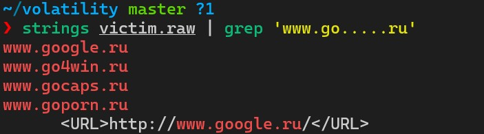

Answer: `www.goporn.ru`

#### 'www.i****.com' (write full url without any quotation marks)

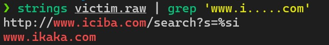

Answer: `www.ikaka.com`

#### 'www.ic.......com'

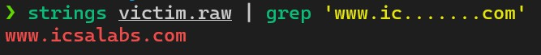

Answer: `www.icsalabs.com`

#### 202.***.233.*** (Write full IP)

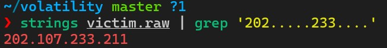

Answer: `202.107.233.211`

#### ***.200.**.164 (Write full IP)

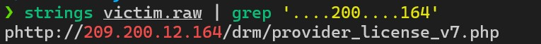

Answer: `209.200.12.164`

### 209.190.***.***

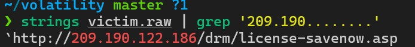

Answer: `209.190.122.186`

#### What is the unique environmental variable of PID 2464?

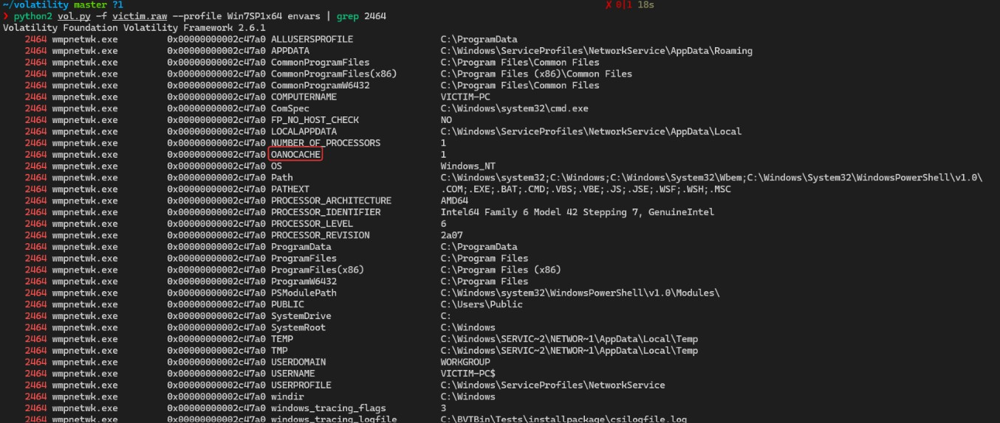

Answer: `OANOCACHE`


### To Be Continued......


