>Vishwa CTF is a cybersecurity Capture The Flag (CTF) competition organized by VIT Bhopal University (India). It's a competitive event where participants — usually students, security enthusiasts, or professionals — solve a variety of cybersecurity challenges to earn points.

Hi there!! its almost been a month i didnt post writeup cus i got exam yesterday, but today i will share `VishwaCTF` walktrough!!

I played with my fav team (TCP1P), and we got position 42/782 teams, also we got a certs, and this is my certs

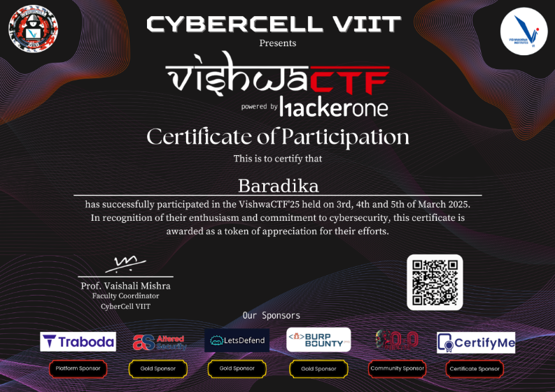

I managed to solved 1 Misc, 3 Web Explotation, 2 Forensic, 1 Crypto, and 2 OSINT

And this is my Walktrough, 


## Miscellaneous
### Sanity Check
###### Desc: Sanity Check. Lets get started and look at the bigger picture
There is a sanity.txt, when u just open it normally, it has nothing, only weird chars, but when u zoom it out, it will shows the flag

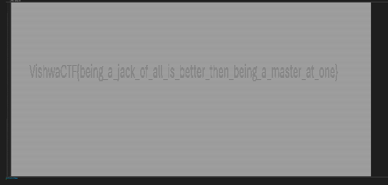

Flag: `VishwaCTF{being_a_jack_of_all_is_better_then_being_a_master_at_once}`

## Web Exploitation
### Flames
###### Desc: Find Your True Love <3

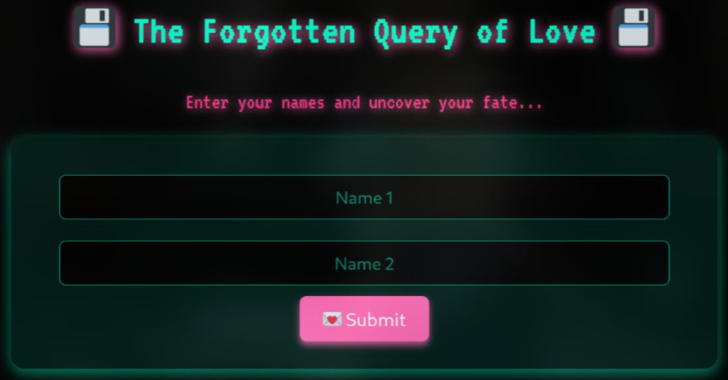

First, i look at the challenge and its source. I noticed that it required a username and password and it also has term **Query of Love**, which immediately reminded me of the SQL Injection

I tried to `'OR 1=1;--` for both the username and password fields, but it didnt work

Then, i tried to break the algorithm of the flame calculator and still got nothing (-_-)

The only idea is from the query, maybe it was SQL Injection but with diff payload, I tried `'UNION SELECT 1:--` and a new page show up

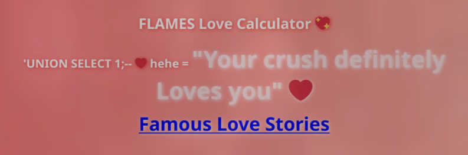

Finally, i just need to follow https://flames.ctf-delivery-net.pp.ua/lovers_db.php in **Famous Love Stories** to get the flag :3

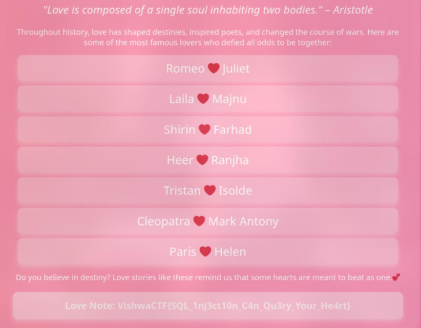

Flag: `VishwaCTF{SQL_1nj3ct10n_C4n_Qu3ry_Your_He4rt}`

### scan-it-to-stay-safe
###### Desc: https://scan-it-to-stay-safe.ctf.delivery-net.pp.ua/

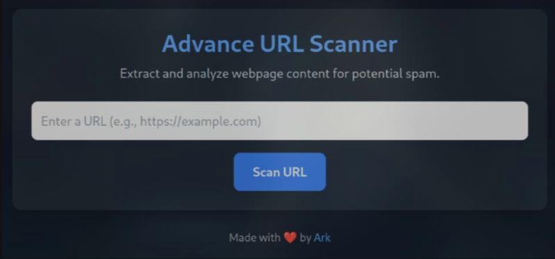

This is a web chall that will scan for any website to check if it has spam contect. 

Then i tried to input webhook, and it works lol

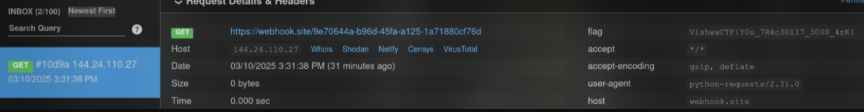

Flag: `VishwaCTF{Y0u_7R4c30lI7_3000_4rK}`

### forgot-h1-login
###### Desc: ark.dev forgot his HackerOne username and password, help him!!

Like every other web chall, i recon the web, and i realized that i must focus on the login page because it was the only available feature here 

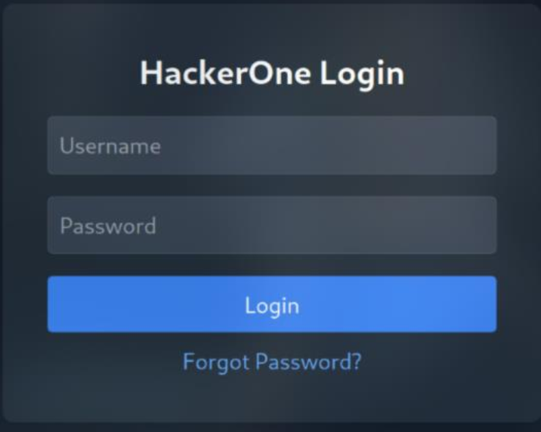

Look at the source of `/login`, i saw `/dashboard` and `/auth` path

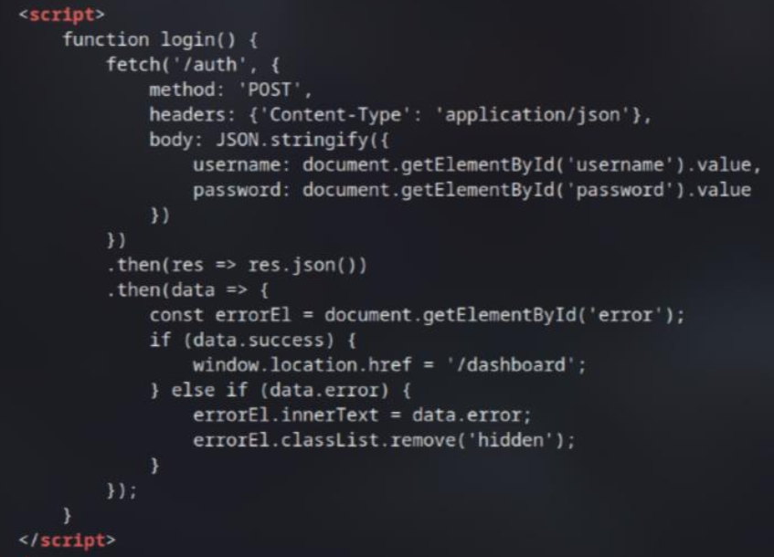

In `/dashboard`, I look at the source code again and i found an email in the comment: `ark.dev@hackerone.com`

Back to the login page, there is another feature, **Reset Password**. It require to enter the email, and of course, i will try the `ark.dev@hackerone.com`forst no matter what


Here, it returns an OTP form. However, brute force a long the OTP code seem impossible, so i must find some other way to get the code

I use **Burp Suite** to intercept the reset password request first to investigate more

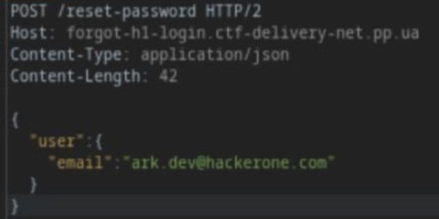

And i got an idea!!, the idea is i just need to add email next to the valid one, then add `[]` to turn it to an array. This way, the code will be return to both of them

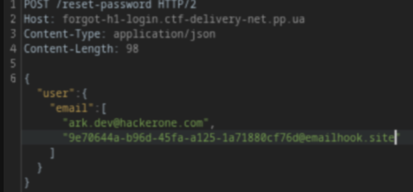

With experience from the previous challenge, i use webhook mail instead of my ctf email just to make sure im not missing any thing hehe

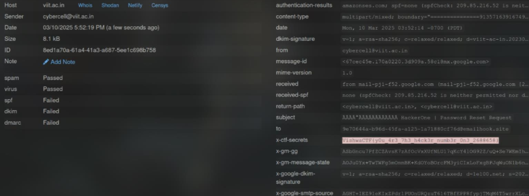

Flag: `VishwaCTF{y0u_4r3_7h3_h4ck3r_numb3r_0n3_2688658}`

## Digital Forensics
### Leaky Stream
###### Desc: In the middle of our conversation, some packets went amiss. We managed to resend a few but they were slightly altered. Help me reconstruct the message and i'll reward you with something useful

so i got a file of pcap, im kinda lazy so i'll just use `strings | grep` to find the flag, and it actually work

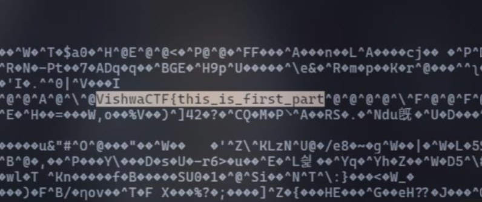

Thats the first part, and i use the `first` reference to find the `second` part.

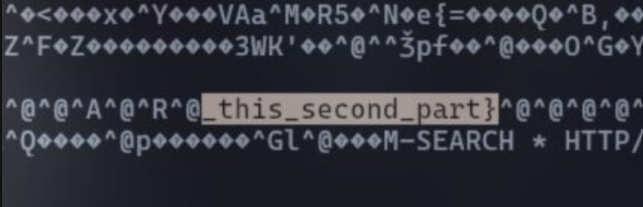

Flag: `VishwaCTF{this_is_first_part_this_second_part}`

### Persist
###### Desc: User, "i logged onto my computer on FRIDAY and noticed something on the home screen before the computer shut down. Could it have been malware?"

I opened the **HKCU** and **SOFTWARE** hives with **Registry Explorer**. Then, i pressed **CTRL + F** and searched for suspicious keywords-specifically, `powershell`

When i scrolled to `Microsoft\Windows\CurrentVersion\Run`, it caught my attention

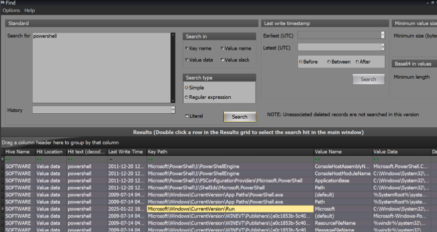

It runs a command `C:\Windows\System32\WindowsPowerShell\v1.0\powershell.exe -enc` with a **Base64-encoded** string.

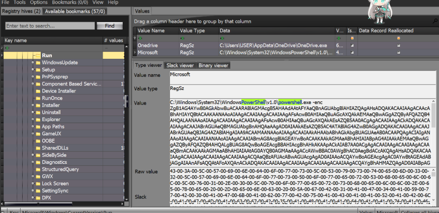

After decoding it, I found that it was a **Vigenere Cipher** decryption function
I tried searching for something like a ciphertext and a key but found nothing. However, after looking more carefully, i finally found what i needed in: `HKCU:Software\Microsoft\Windows\CurrentVersion\Explorer\RecentDocs`

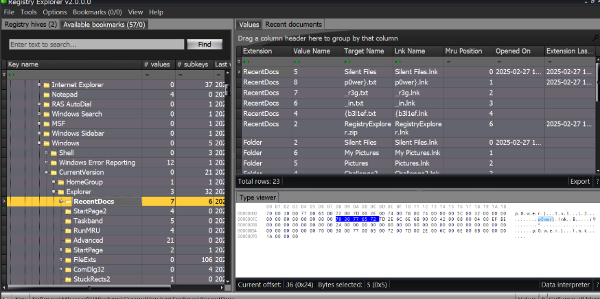

Flag: `VishwaCTF{b3l1ef_in_r3g_p0wer}`

## Cryptography
### Chaos
###### Desc: You've stumbled upon a bunch of garbled nonsense-some might call them "encrypted messages" but who really knows? Most ofit is just random junk, but hidden somewhere in this mess is an actual secret. No keys, no hints, just you and the chaos. Good luck figuring it out-if you even can.

After opening `output.txt`, i saw a bunch of random char that maybe the flag was encrypted and hidden somewhere in there

Moving on the `challenge.py`, i noticed that the flag was shuffled randomly within the messages. Each message was encrypted using **XOR** and **Base85**

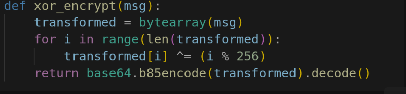

After analyzing the problem, i decided to write a script to decode the messages and find the flag:
1. Reverse **Base85** to obtain the **XOR-encrypted** bytes
2. Reverse the **XOR** operation using `(i % 256)`, which revealed the messages mixed with the flag

```py
#!/usr/bin/python3
import base64

def xor_decrypt(encoded_msg):
    # Decode from Base85 and reverse the XOR (each byte XOR'ed with its index modulo 256)
    decoded = base64.b85decode(encoded_msg)
    transformed = bytearray(decoded)
    for i in range(len(transformed)):
        transformed[i] ^= (i % 256)
    return transformed.decode(errors='ignore')

# Read the encrypted messages from the file, separated by double newlines
with open('output.txt', 'r') as f:
    encrypted_messages = f.read().strip().split('\n\n')

# Decrypt each message and print them
for i, msg in enumerate(encrypted_messages, 1):
    print(f"Message {i}: {xor_decrypt(msg)}")
```
After running the script, i obtained the messages and several possible flags

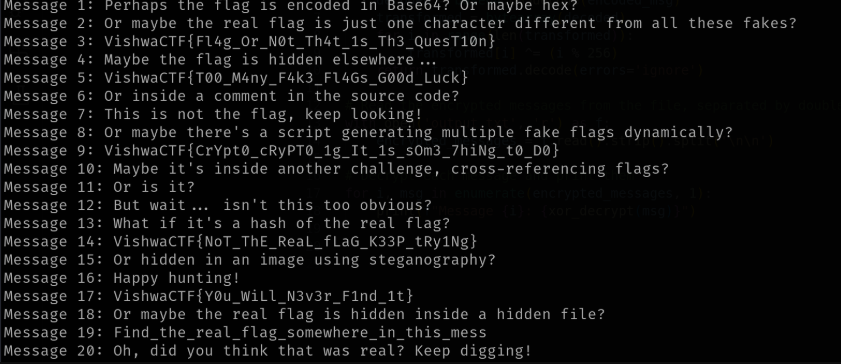

Some flag: 
```txt
VishwaCTF{Fl4g_Or_N0t_Th4t_1s_Th3_QuesT10n}​
VishwaCTF{T00_M4ny_F4k3_Fl4Gs_G00d_Luck}
VishwaCTF{CrYpt0_cRyPT0_1g_It_1s_sOm3_7hiNg_t0_D0}
VishwaCTF{NoT_ThE_ReaL_fLaG_K33P_tRy1Ng}
VishwaCTF{Y0u_WiLl_N3v3r_F1nd_1t}
```
I started with the longest one and, ye thats the flag :v

Flag: `VishwaCTF{CrYpt0_cRyPT0_1g_It_1s_sOm3_7hiNg_t0_D0}`

## Open Source Intelligence
### Follow for Clues
###### Desc: Stay updated, Follow us on LinkedIn, Instagram, and Twitter

So at first, i will find **LinkedIn**, **Instagram**, and **Twitter**

However, i havent found any flags in posts on **LinkedIn** or **Twitter**. The only remaining social media platform to check is **Instagram**

Then i found this post: https://www.instagram.com/p/DGXe34GvDjq/

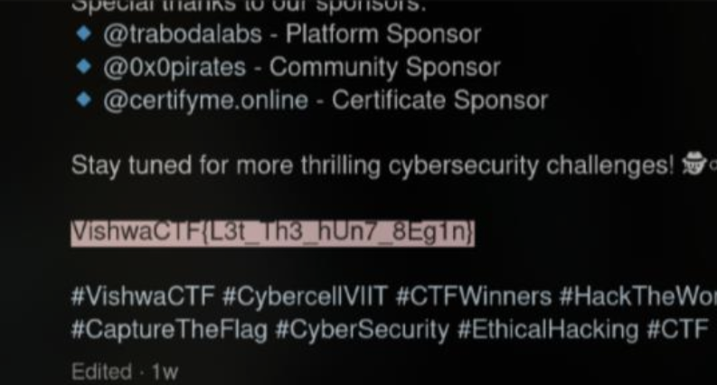

Flag: `VishwaCTF{L3t_Th3_hUn7_8Eg1n}`

### Stadium!!
###### Desc: My friend wanted to play cricket match, he told me to find the best place to play a game, So i did. Can you identify the stadium where we played our match?


I started to search it using Google Reverse Image Search and i found a bunch of posts about this place

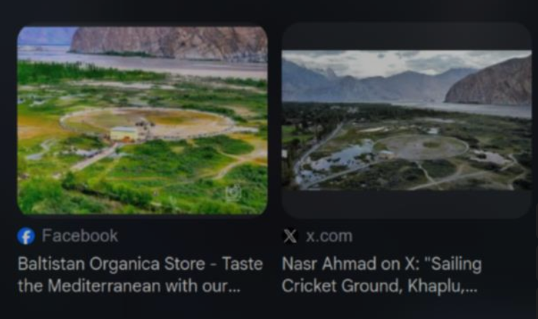

To verify the exact name, I use Google Maps and search "Sailing Cricket Ground" and i got the full name is `Saling Cricket Stadium Ghance`

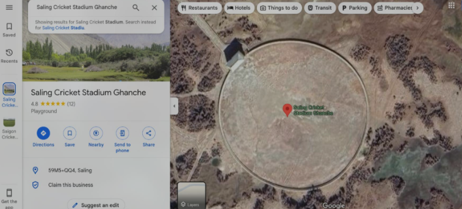

Flag: `VishwaCTF{Saling_Cricket_Stadium_Ghanche}`

